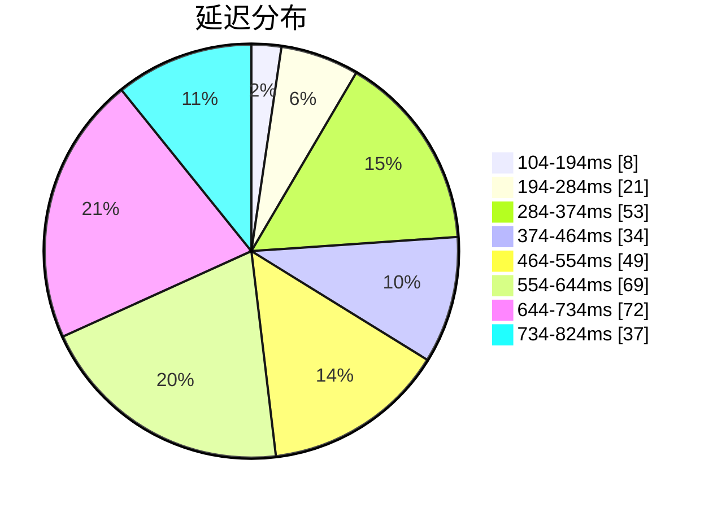
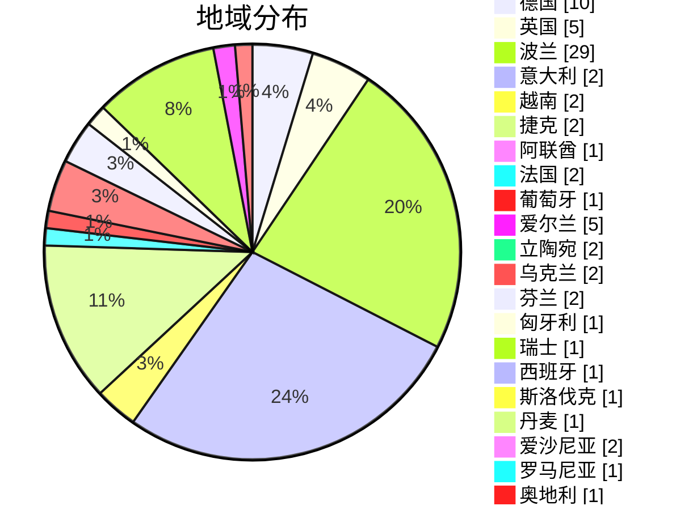
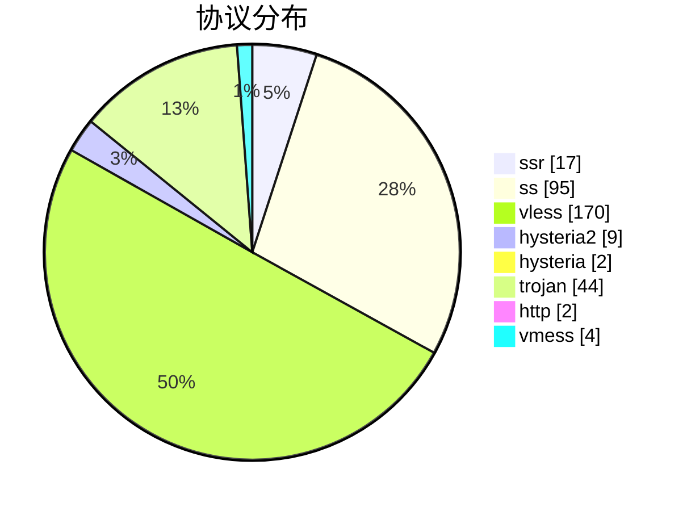

```mermaid
pie showData
title 延迟分布
"104-194ms" : 8
"194-284ms" : 21
"284-374ms" : 53
"374-464ms" : 34
"464-554ms" : 49
"554-644ms" : 69
"644-734ms" : 72
"734-824ms" : 37
```

```mermaid
pie showData
title 地域分布
"日本" : 14
"香港" : 14
"未知" : 69
"台湾" : 81
"新加坡" : 10
"美国" : 37
"Cloudflare" : 3
"荷兰" : 4
"印度" : 4
"孟加拉国" : 3
"俄罗斯" : 2
"韩国" : 12
"德国" : 10
"英国" : 5
"波兰" : 29
"意大利" : 2
"越南" : 2
"捷克" : 2
"阿联酋" : 1
"法国" : 2
"葡萄牙" : 1
"爱尔兰" : 5
"立陶宛" : 2
"乌克兰" : 2
"芬兰" : 2
"匈牙利" : 1
"瑞士" : 1
"西班牙" : 1
"斯洛伐克" : 1
"丹麦" : 1
"爱沙尼亚" : 2
"罗马尼亚" : 1
"奥地利" : 1
"土耳其" : 1
"秘鲁" : 1
"瑞典" : 4
"加拿大" : 2
"保加利亚" : 1
"冰岛" : 1
"希腊" : 1
"澳大利亚" : 1
"哥伦比亚" : 1
"厄瓜多尔" : 1
"摩尔多瓦" : 1
"拉脱维亚" : 1
```

```mermaid
pie showData
title 协议分布
"ssr" : 17
"ss" : 95
"vless" : 170
"hysteria2" : 9
"hysteria" : 2
"trojan" : 44
"http" : 2
"vmess" : 4
```