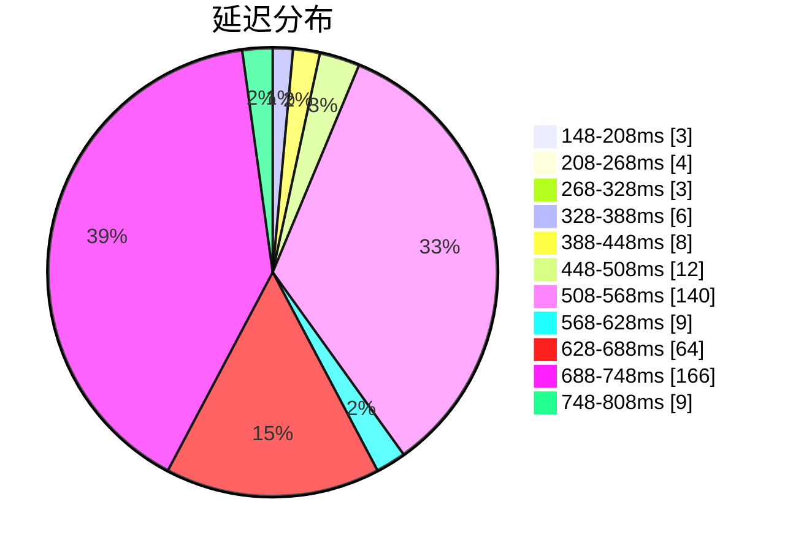
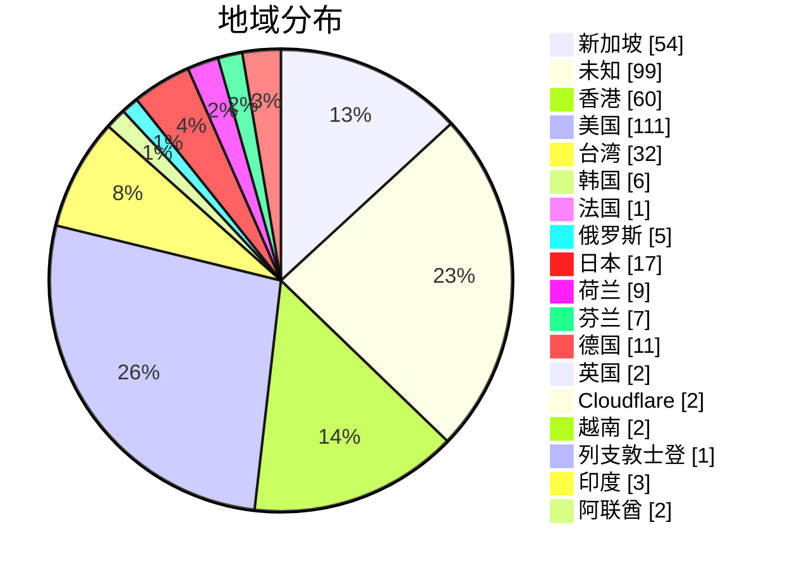
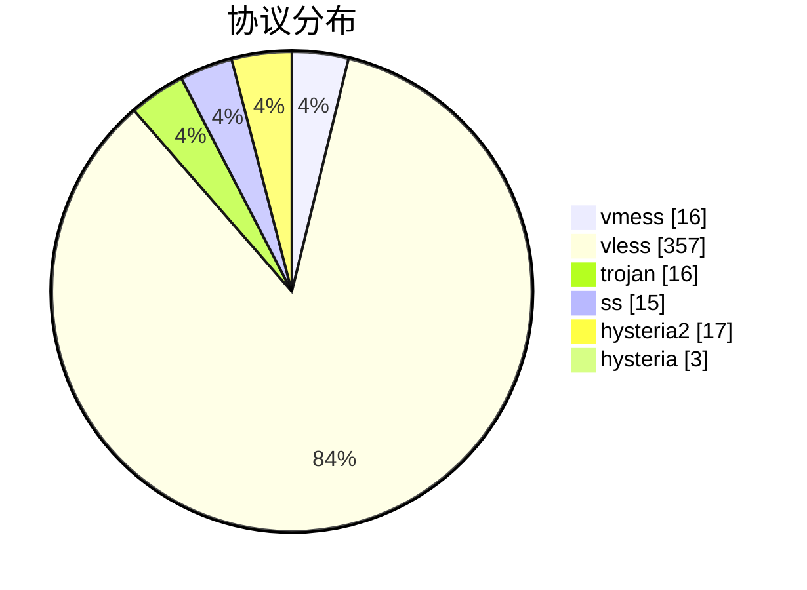

```mermaid
pie showData
title 延迟分布
"148-208ms" : 3
"208-268ms" : 4
"268-328ms" : 3
"328-388ms" : 6
"388-448ms" : 8
"448-508ms" : 12
"508-568ms" : 140
"568-628ms" : 9
"628-688ms" : 64
"688-748ms" : 166
"748-808ms" : 9
```

```mermaid
pie showData
title 地域分布
"新加坡" : 54
"未知" : 99
"香港" : 60
"美国" : 111
"台湾" : 32
"韩国" : 6
"法国" : 1
"俄罗斯" : 5
"日本" : 17
"荷兰" : 9
"芬兰" : 7
"德国" : 11
"英国" : 2
"Cloudflare" : 2
"越南" : 2
"列支敦士登" : 1
"印度" : 3
"阿联酋" : 2
```

```mermaid
pie showData
title 协议分布
"vmess" : 16
"vless" : 357
"trojan" : 16
"ss" : 15
"hysteria2" : 17
"hysteria" : 3
```