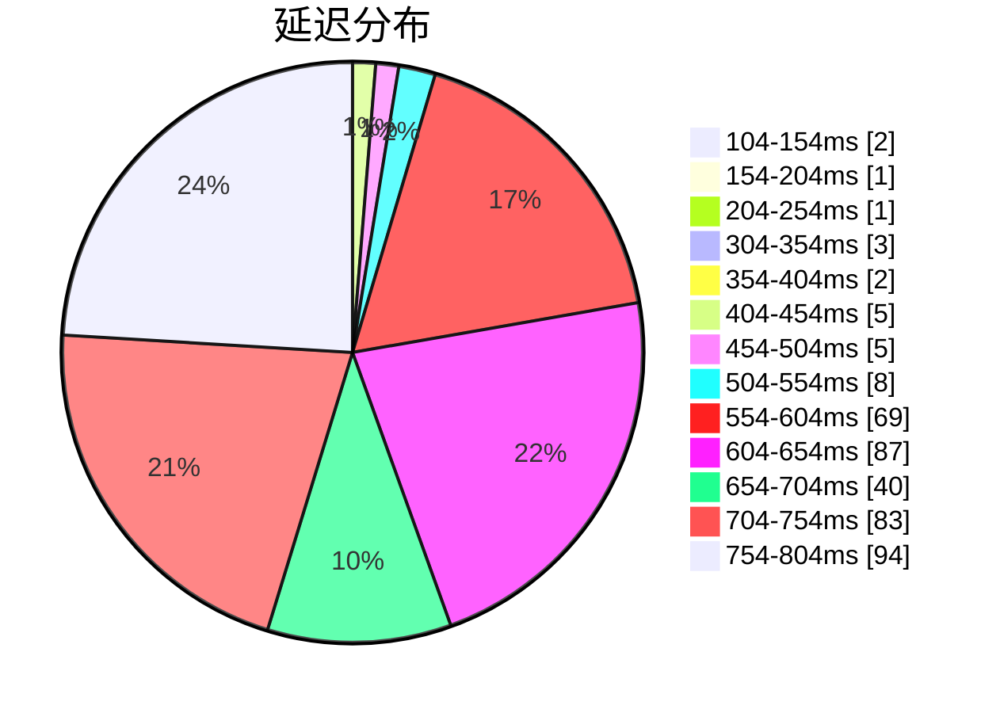
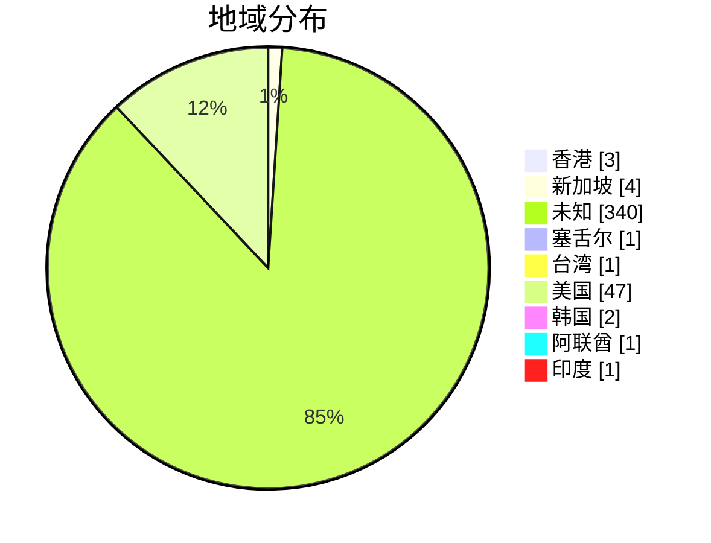
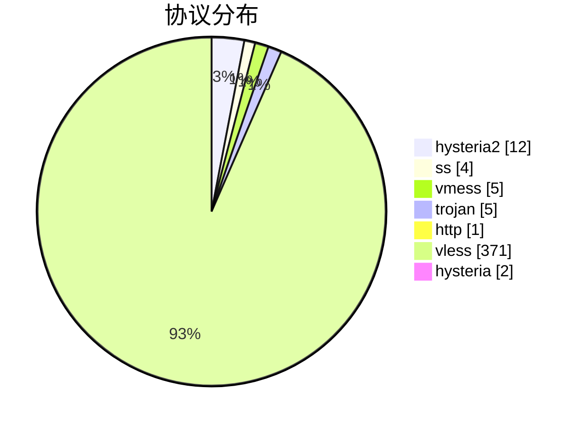

```mermaid
pie showData
title 延迟分布
"104-154ms" : 2
"154-204ms" : 1
"204-254ms" : 1
"304-354ms" : 3
"354-404ms" : 2
"404-454ms" : 5
"454-504ms" : 5
"504-554ms" : 8
"554-604ms" : 69
"604-654ms" : 87
"654-704ms" : 40
"704-754ms" : 83
"754-804ms" : 94
```

```mermaid
pie showData
title 地域分布
"香港" : 3
"新加坡" : 4
"未知" : 340
"塞舌尔" : 1
"台湾" : 1
"美国" : 47
"韩国" : 2
"阿联酋" : 1
"印度" : 1
```

```mermaid
pie showData
title 协议分布
"hysteria2" : 12
"ss" : 4
"vmess" : 5
"trojan" : 5
"http" : 1
"vless" : 371
"hysteria" : 2
```