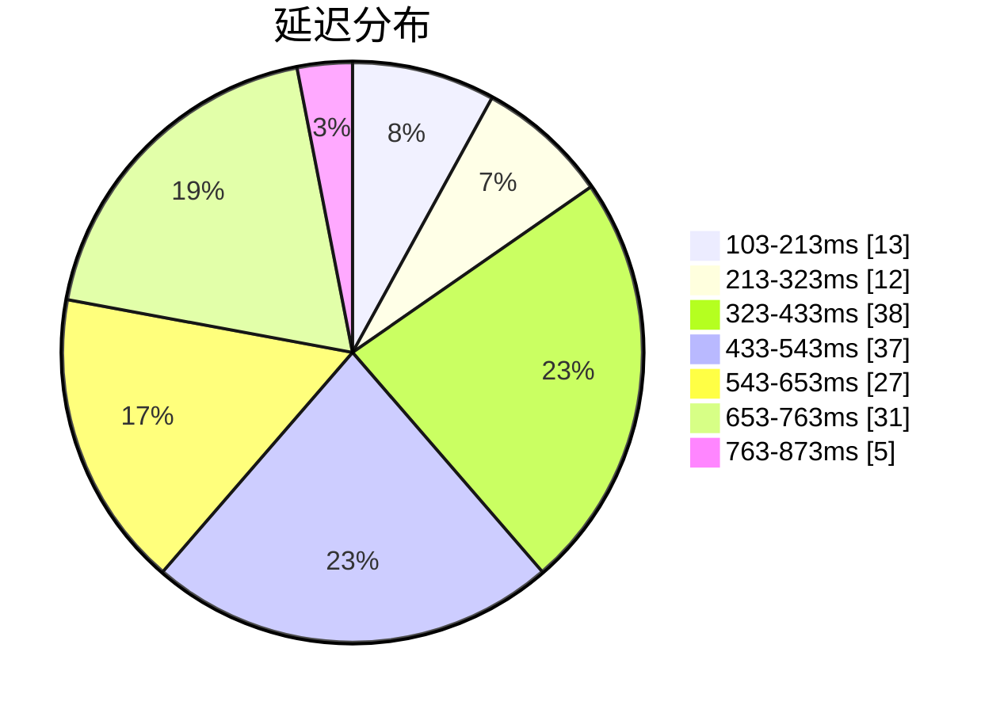
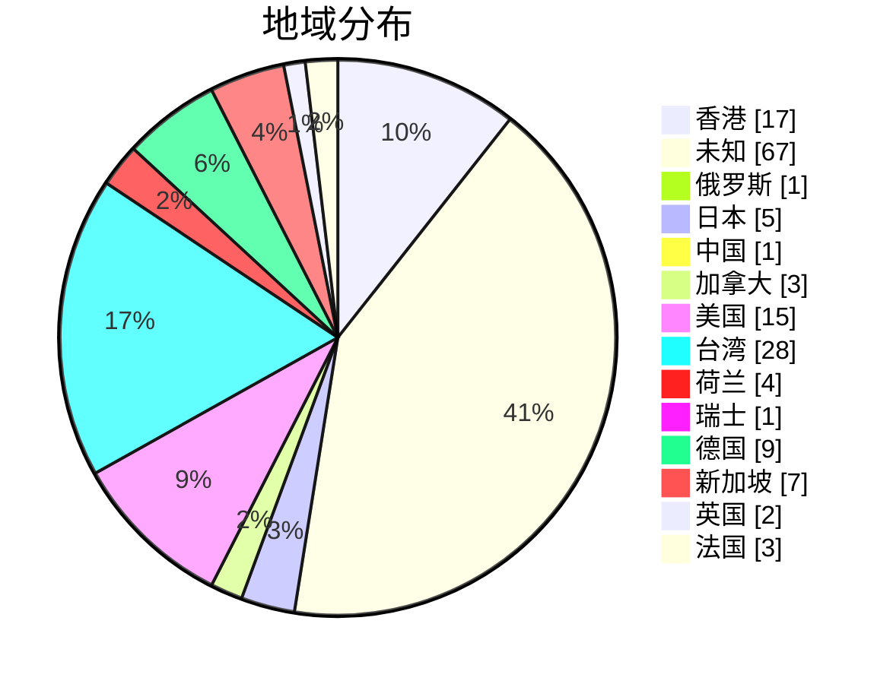
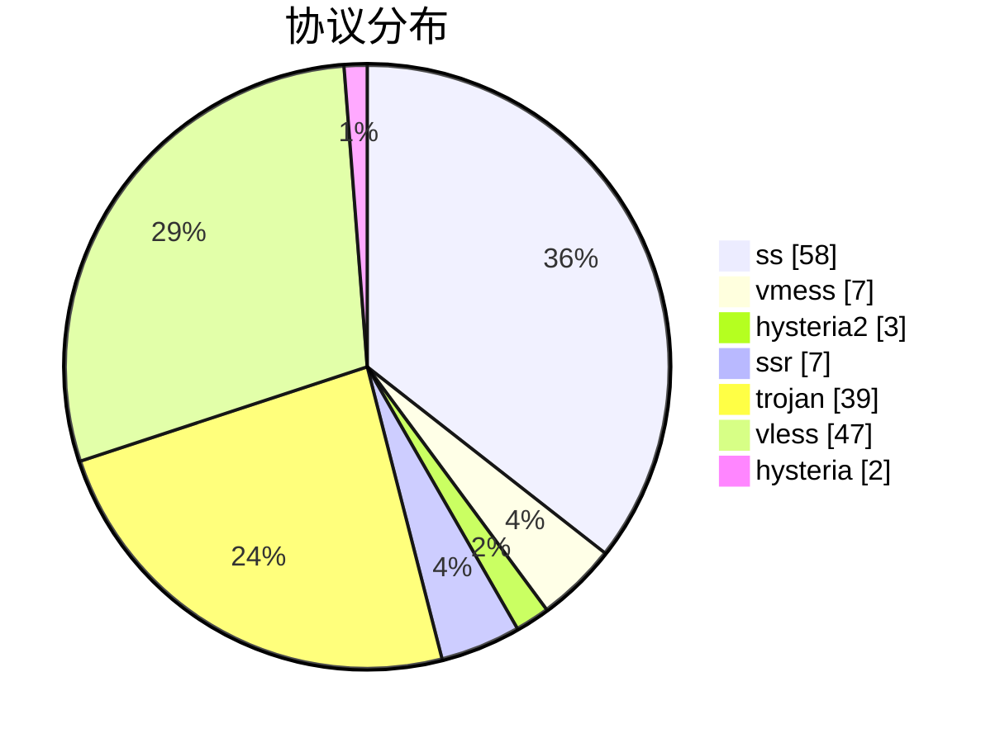

```mermaid
pie showData
title 延迟分布
"103-213ms" : 13
"213-323ms" : 12
"323-433ms" : 38
"433-543ms" : 37
"543-653ms" : 27
"653-763ms" : 31
"763-873ms" : 5
```

```mermaid
pie showData
title 地域分布
"香港" : 17
"未知" : 67
"俄罗斯" : 1
"日本" : 5
"中国" : 1
"加拿大" : 3
"美国" : 15
"台湾" : 28
"荷兰" : 4
"瑞士" : 1
"德国" : 9
"新加坡" : 7
"英国" : 2
"法国" : 3
```

```mermaid
pie showData
title 协议分布
"ss" : 58
"vmess" : 7
"hysteria2" : 3
"ssr" : 7
"trojan" : 39
"vless" : 47
"hysteria" : 2
```