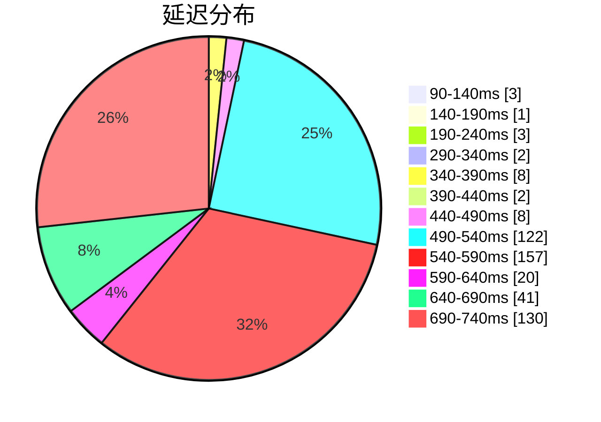
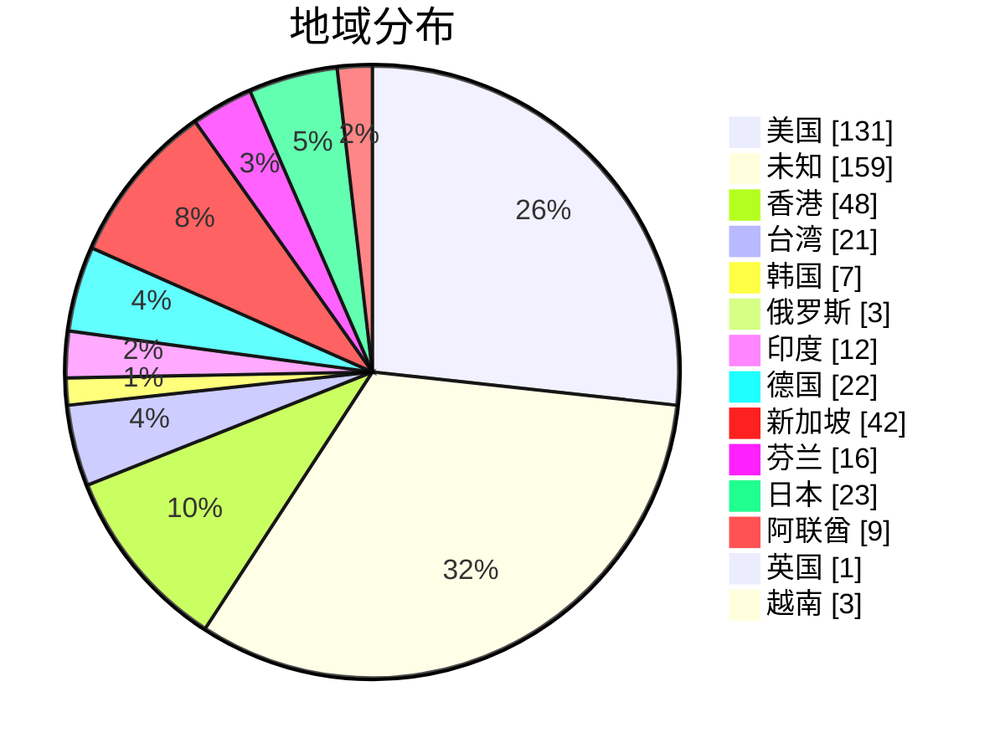
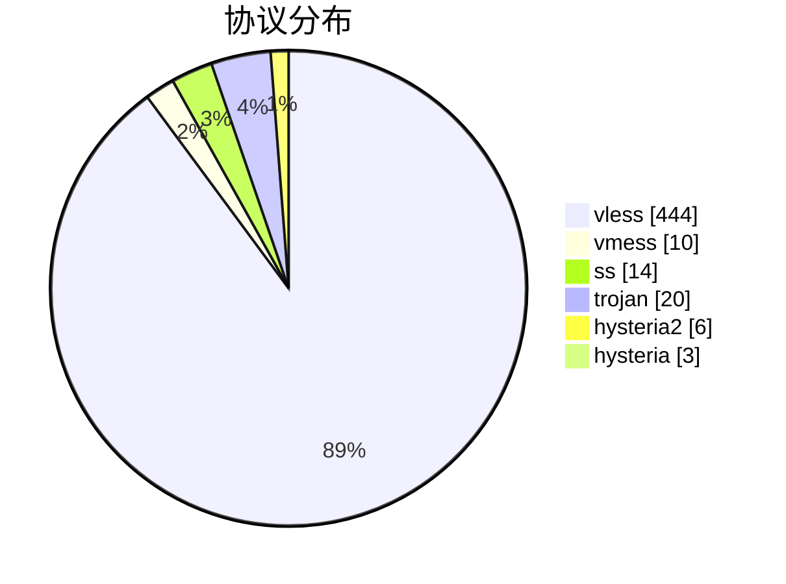

```mermaid
pie showData
title 延迟分布
"90-140ms" : 3
"140-190ms" : 1
"190-240ms" : 3
"290-340ms" : 2
"340-390ms" : 8
"390-440ms" : 2
"440-490ms" : 8
"490-540ms" : 122
"540-590ms" : 157
"590-640ms" : 20
"640-690ms" : 41
"690-740ms" : 130
```

```mermaid
pie showData
title 地域分布
"美国" : 131
"未知" : 159
"香港" : 48
"台湾" : 21
"韩国" : 7
"俄罗斯" : 3
"印度" : 12
"德国" : 22
"新加坡" : 42
"芬兰" : 16
"日本" : 23
"阿联酋" : 9
"英国" : 1
"越南" : 3
```

```mermaid
pie showData
title 协议分布
"vless" : 444
"vmess" : 10
"ss" : 14
"trojan" : 20
"hysteria2" : 6
"hysteria" : 3
```