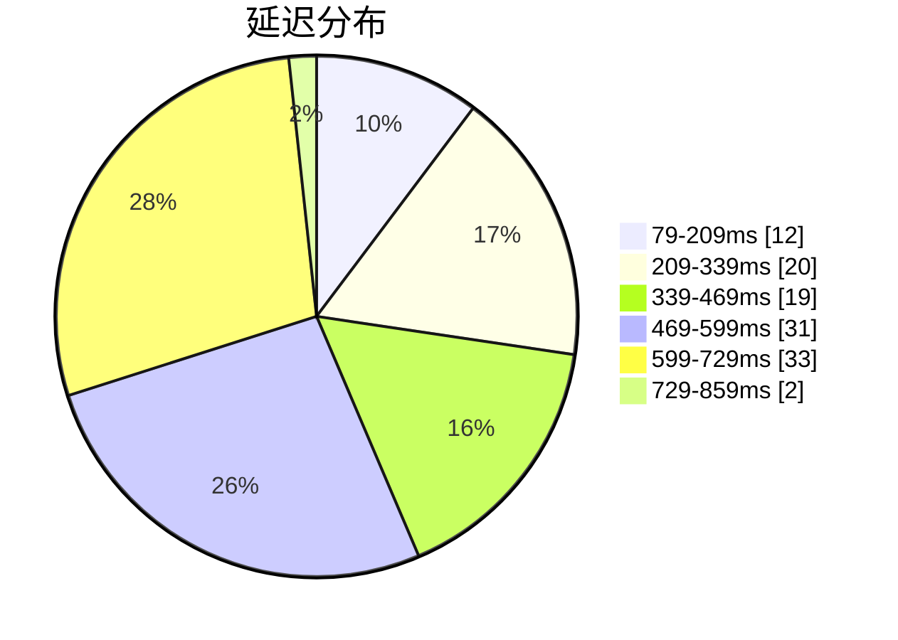
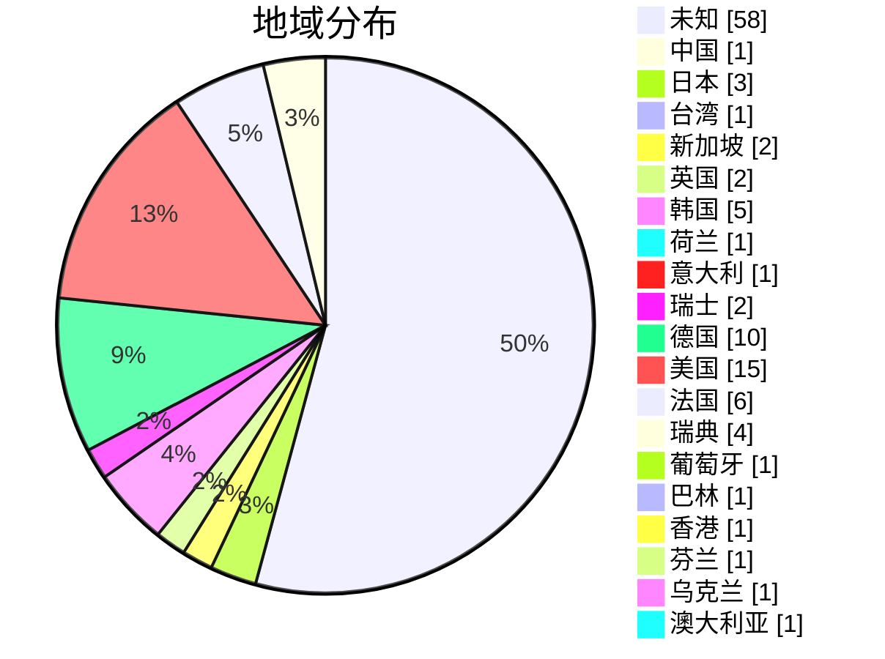
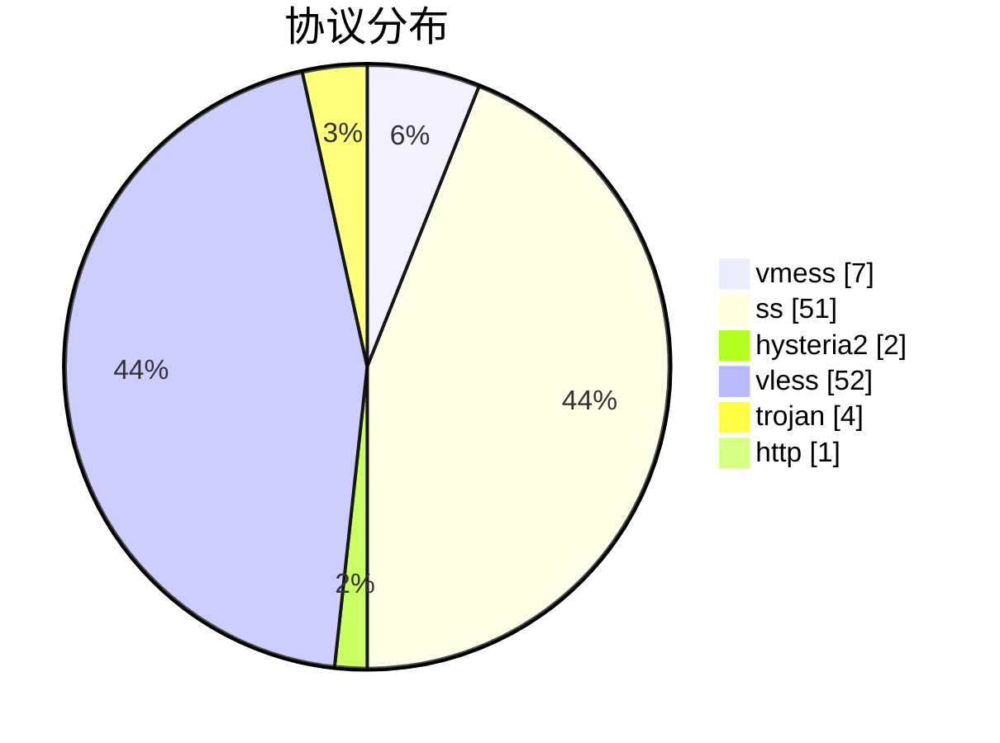

```mermaid
pie showData
title 延迟分布
"79-209ms" : 12
"209-339ms" : 20
"339-469ms" : 19
"469-599ms" : 31
"599-729ms" : 33
"729-859ms" : 2
```

```mermaid
pie showData
title 地域分布
"未知" : 58
"中国" : 1
"日本" : 3
"台湾" : 1
"新加坡" : 2
"英国" : 2
"韩国" : 5
"荷兰" : 1
"意大利" : 1
"瑞士" : 2
"德国" : 10
"美国" : 15
"法国" : 6
"瑞典" : 4
"葡萄牙" : 1
"巴林" : 1
"香港" : 1
"芬兰" : 1
"乌克兰" : 1
"澳大利亚" : 1
```

```mermaid
pie showData
title 协议分布
"vmess" : 7
"ss" : 51
"hysteria2" : 2
"vless" : 52
"trojan" : 4
"http" : 1
```