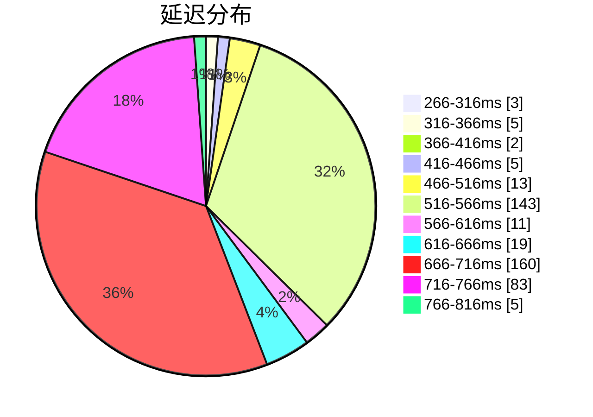
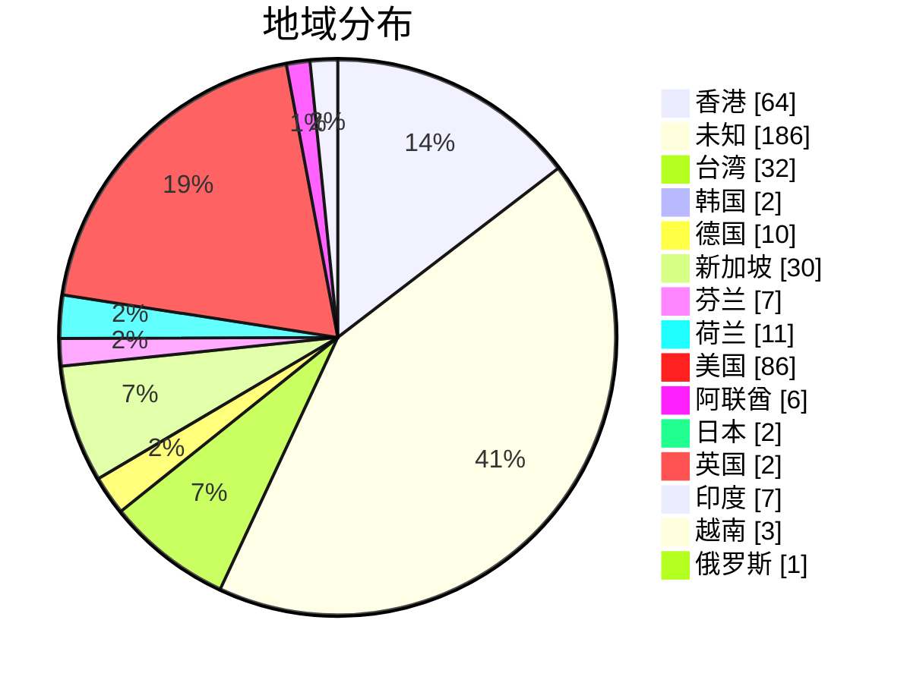
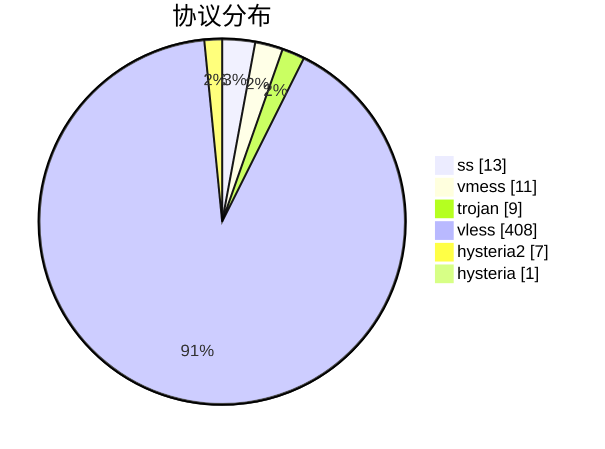

```mermaid
pie showData
title 延迟分布
"266-316ms" : 3
"316-366ms" : 5
"366-416ms" : 2
"416-466ms" : 5
"466-516ms" : 13
"516-566ms" : 143
"566-616ms" : 11
"616-666ms" : 19
"666-716ms" : 160
"716-766ms" : 83
"766-816ms" : 5
```

```mermaid
pie showData
title 地域分布
"香港" : 64
"未知" : 186
"台湾" : 32
"韩国" : 2
"德国" : 10
"新加坡" : 30
"芬兰" : 7
"荷兰" : 11
"美国" : 86
"阿联酋" : 6
"日本" : 2
"英国" : 2
"印度" : 7
"越南" : 3
"俄罗斯" : 1
```

```mermaid
pie showData
title 协议分布
"ss" : 13
"vmess" : 11
"trojan" : 9
"vless" : 408
"hysteria2" : 7
"hysteria" : 1
```