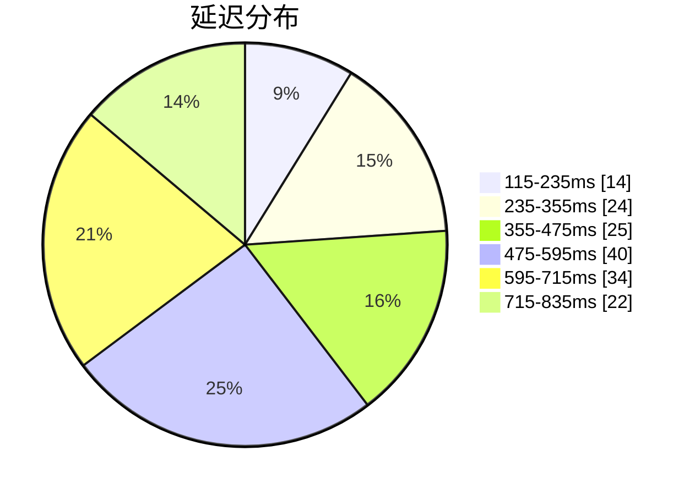
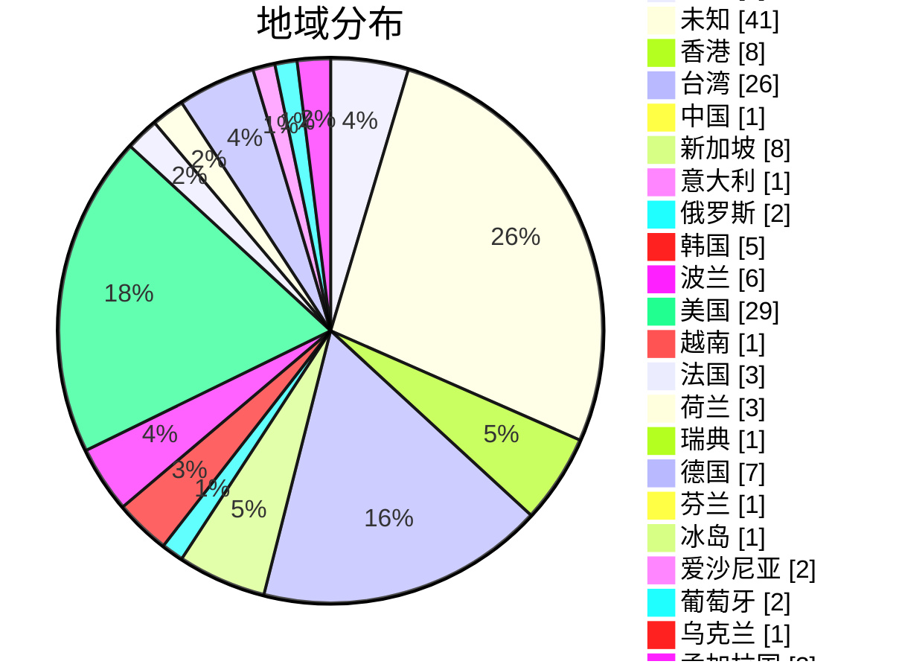
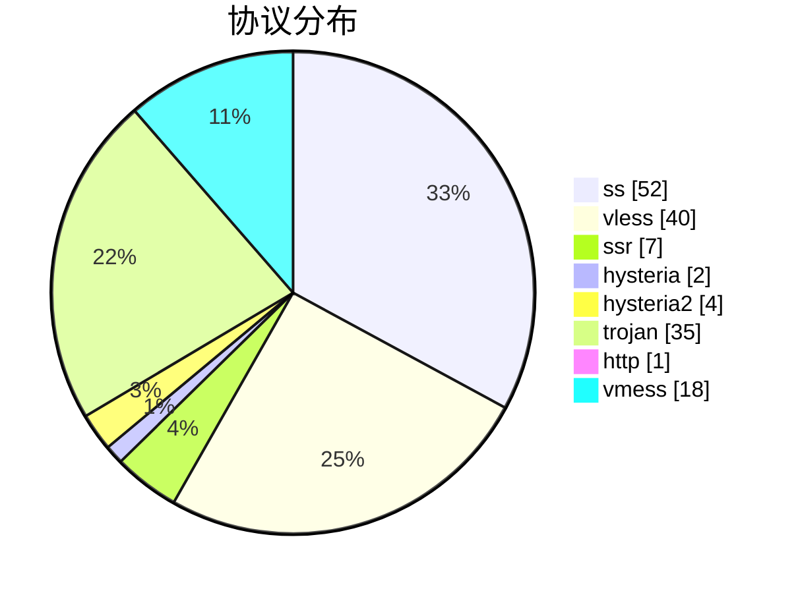

```mermaid
pie showData
title 延迟分布
"115-235ms" : 14
"235-355ms" : 24
"355-475ms" : 25
"475-595ms" : 40
"595-715ms" : 34
"715-835ms" : 22
```

```mermaid
pie showData
title 地域分布
"日本" : 7
"未知" : 41
"香港" : 8
"台湾" : 26
"中国" : 1
"新加坡" : 8
"意大利" : 1
"俄罗斯" : 2
"韩国" : 5
"波兰" : 6
"美国" : 29
"越南" : 1
"法国" : 3
"荷兰" : 3
"瑞典" : 1
"德国" : 7
"芬兰" : 1
"冰岛" : 1
"爱沙尼亚" : 2
"葡萄牙" : 2
"乌克兰" : 1
"孟加拉国" : 3
```

```mermaid
pie showData
title 协议分布
"ss" : 52
"vless" : 40
"ssr" : 7
"hysteria" : 2
"hysteria2" : 4
"trojan" : 35
"http" : 1
"vmess" : 18
```