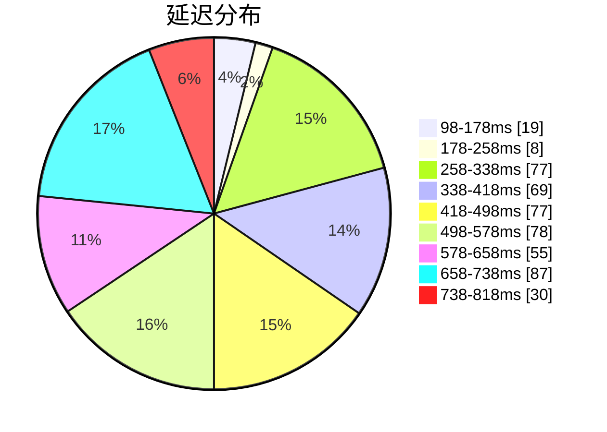
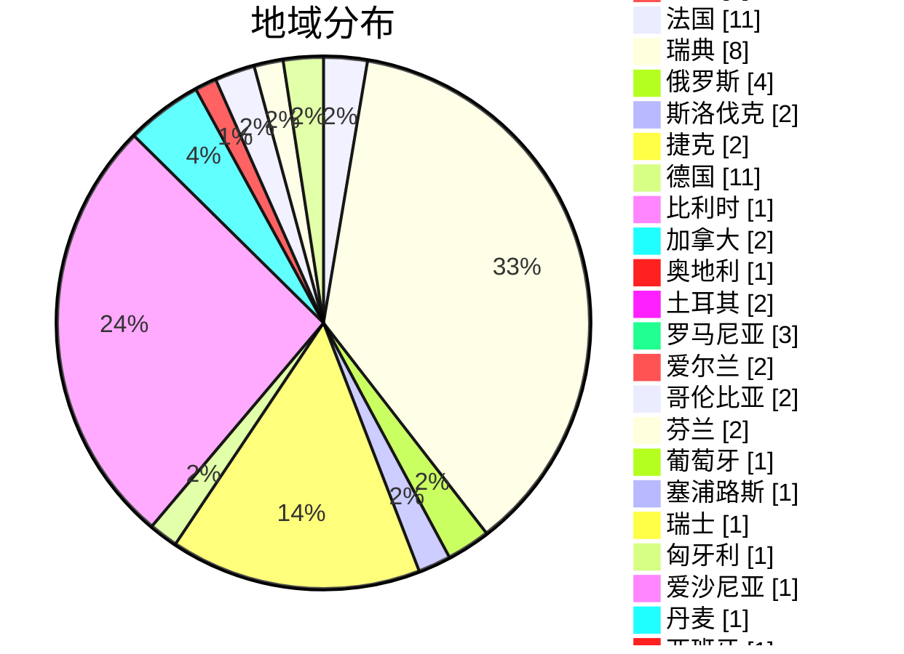
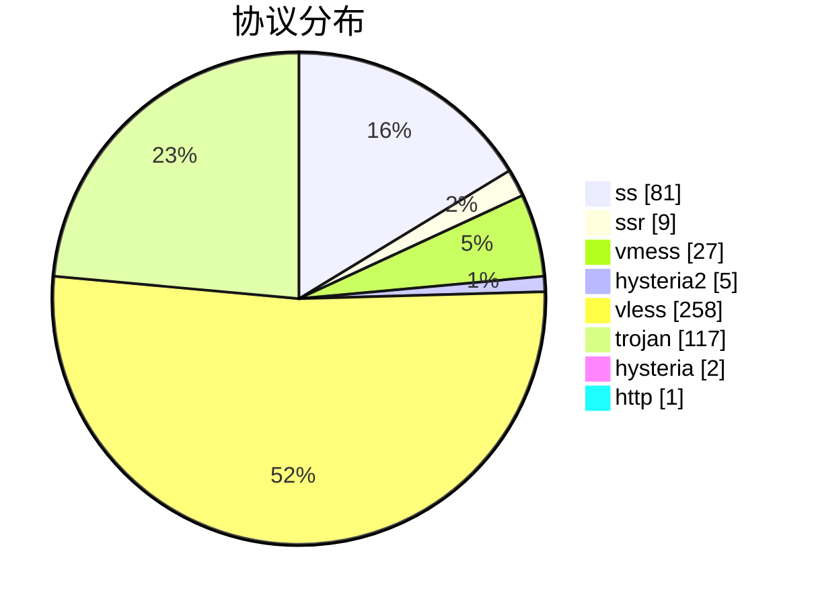

```mermaid
pie showData
title 延迟分布
"98-178ms" : 19
"178-258ms" : 8
"258-338ms" : 77
"338-418ms" : 69
"418-498ms" : 77
"498-578ms" : 78
"578-658ms" : 55
"658-738ms" : 87
"738-818ms" : 30
```

```mermaid
pie showData
title 地域分布
"香港" : 12
"未知" : 167
"日本" : 12
"新加坡" : 9
"台湾" : 69
"英国" : 8
"美国" : 119
"波兰" : 21
"荷兰" : 6
"泰国" : 1
"中国" : 1
"韩国" : 4
"法国" : 11
"瑞典" : 8
"俄罗斯" : 4
"斯洛伐克" : 2
"捷克" : 2
"德国" : 11
"比利时" : 1
"加拿大" : 2
"奥地利" : 1
"土耳其" : 2
"罗马尼亚" : 3
"爱尔兰" : 2
"哥伦比亚" : 2
"芬兰" : 2
"葡萄牙" : 1
"塞浦路斯" : 1
"瑞士" : 1
"匈牙利" : 1
"爱沙尼亚" : 1
"丹麦" : 1
"西班牙" : 1
"墨西哥" : 1
"保加利亚" : 1
"冰岛" : 1
"乌克兰" : 1
"希腊" : 1
"摩尔多瓦" : 1
"哈萨克斯坦" : 1
"挪威" : 1
"拉脱维亚" : 1
"孟加拉国" : 1
"印度" : 1
```

```mermaid
pie showData
title 协议分布
"ss" : 81
"ssr" : 9
"vmess" : 27
"hysteria2" : 5
"vless" : 258
"trojan" : 117
"hysteria" : 2
"http" : 1
```