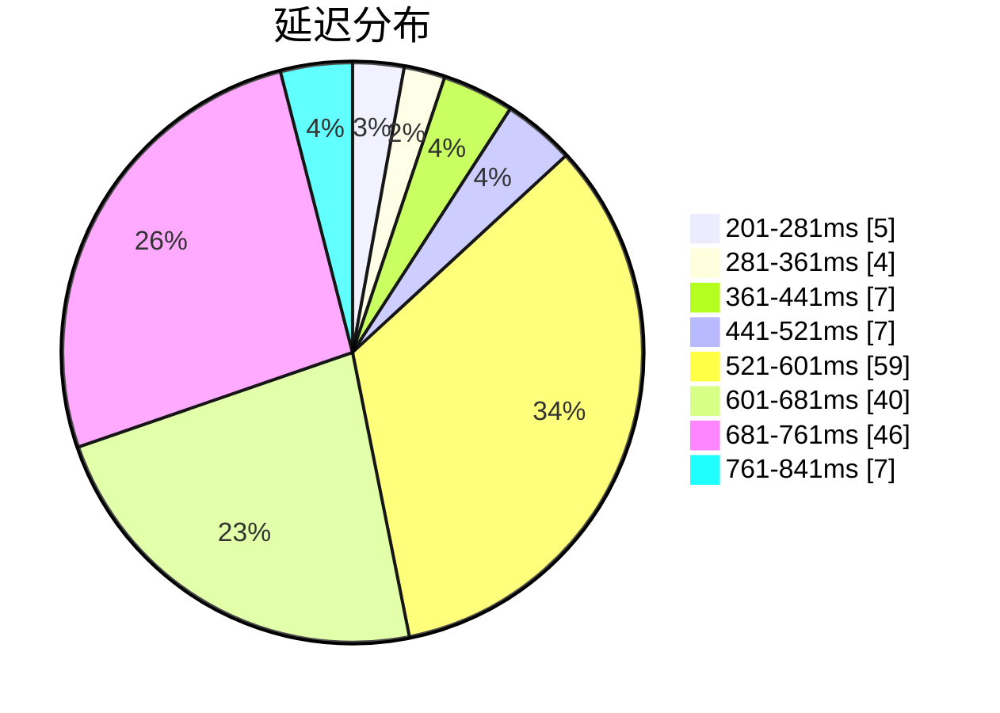
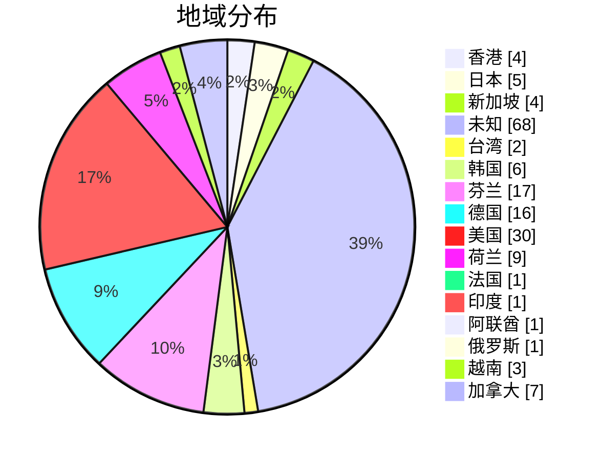
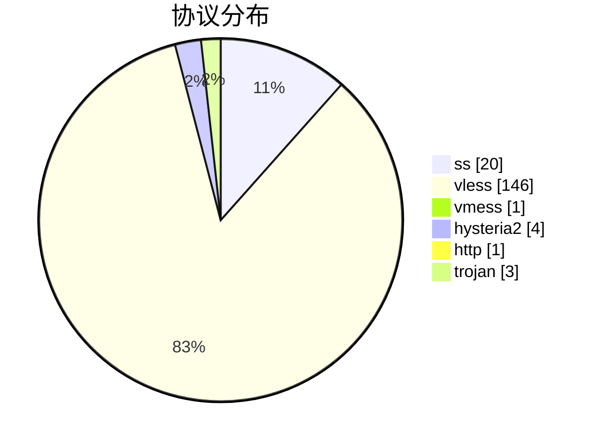

```mermaid
pie showData
title 延迟分布
"201-281ms" : 5
"281-361ms" : 4
"361-441ms" : 7
"441-521ms" : 7
"521-601ms" : 59
"601-681ms" : 40
"681-761ms" : 46
"761-841ms" : 7
```

```mermaid
pie showData
title 地域分布
"香港" : 4
"日本" : 5
"新加坡" : 4
"未知" : 68
"台湾" : 2
"韩国" : 6
"芬兰" : 17
"德国" : 16
"美国" : 30
"荷兰" : 9
"法国" : 1
"印度" : 1
"阿联酋" : 1
"俄罗斯" : 1
"越南" : 3
"加拿大" : 7
```

```mermaid
pie showData
title 协议分布
"ss" : 20
"vless" : 146
"vmess" : 1
"hysteria2" : 4
"http" : 1
"trojan" : 3
```