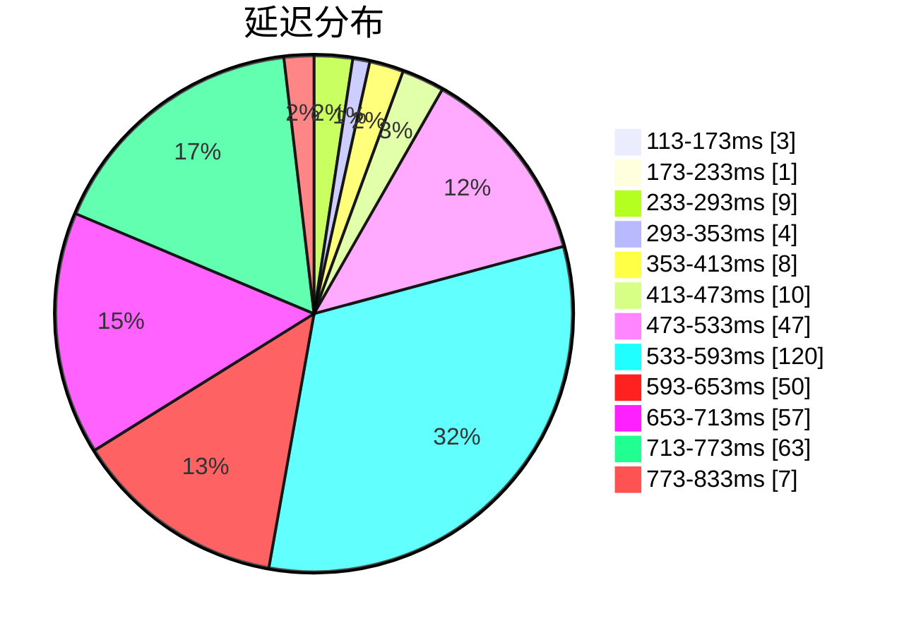
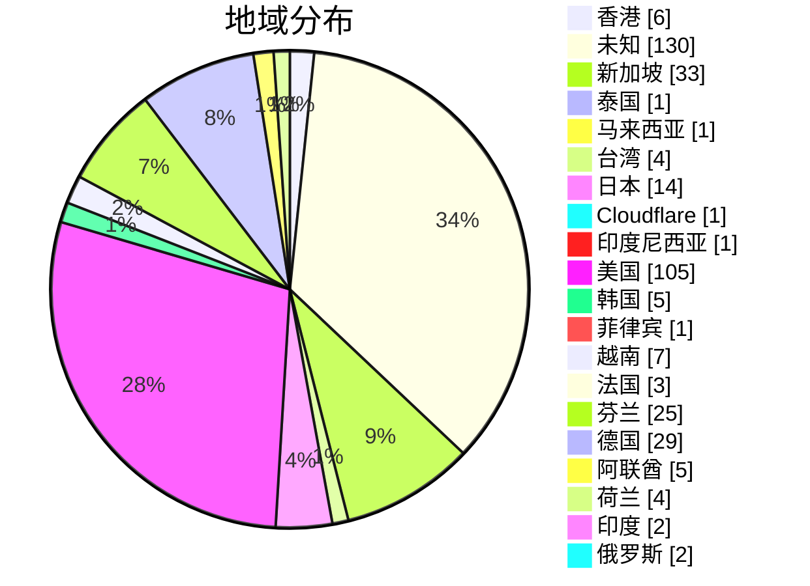
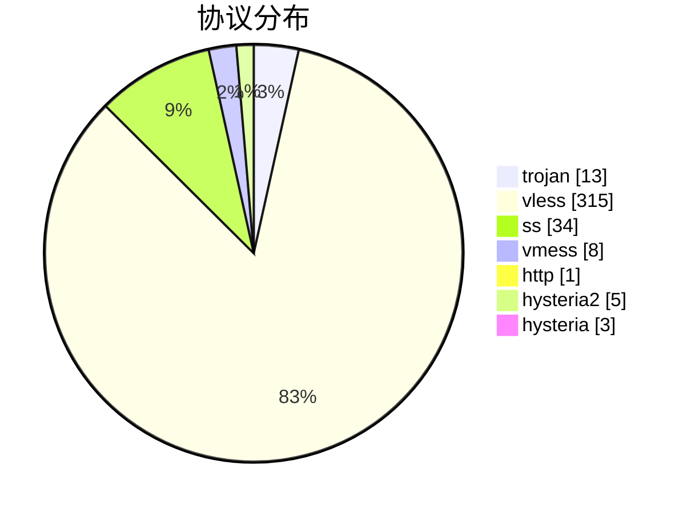

```mermaid
pie showData
title 延迟分布
"113-173ms" : 3
"173-233ms" : 1
"233-293ms" : 9
"293-353ms" : 4
"353-413ms" : 8
"413-473ms" : 10
"473-533ms" : 47
"533-593ms" : 120
"593-653ms" : 50
"653-713ms" : 57
"713-773ms" : 63
"773-833ms" : 7
```

```mermaid
pie showData
title 地域分布
"香港" : 6
"未知" : 130
"新加坡" : 33
"泰国" : 1
"马来西亚" : 1
"台湾" : 4
"日本" : 14
"Cloudflare" : 1
"印度尼西亚" : 1
"美国" : 105
"韩国" : 5
"菲律宾" : 1
"越南" : 7
"法国" : 3
"芬兰" : 25
"德国" : 29
"阿联酋" : 5
"荷兰" : 4
"印度" : 2
"俄罗斯" : 2
```

```mermaid
pie showData
title 协议分布
"trojan" : 13
"vless" : 315
"ss" : 34
"vmess" : 8
"http" : 1
"hysteria2" : 5
"hysteria" : 3
```