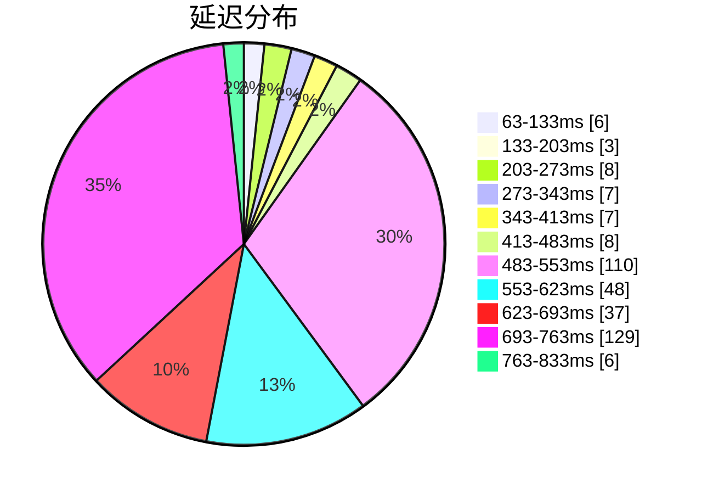
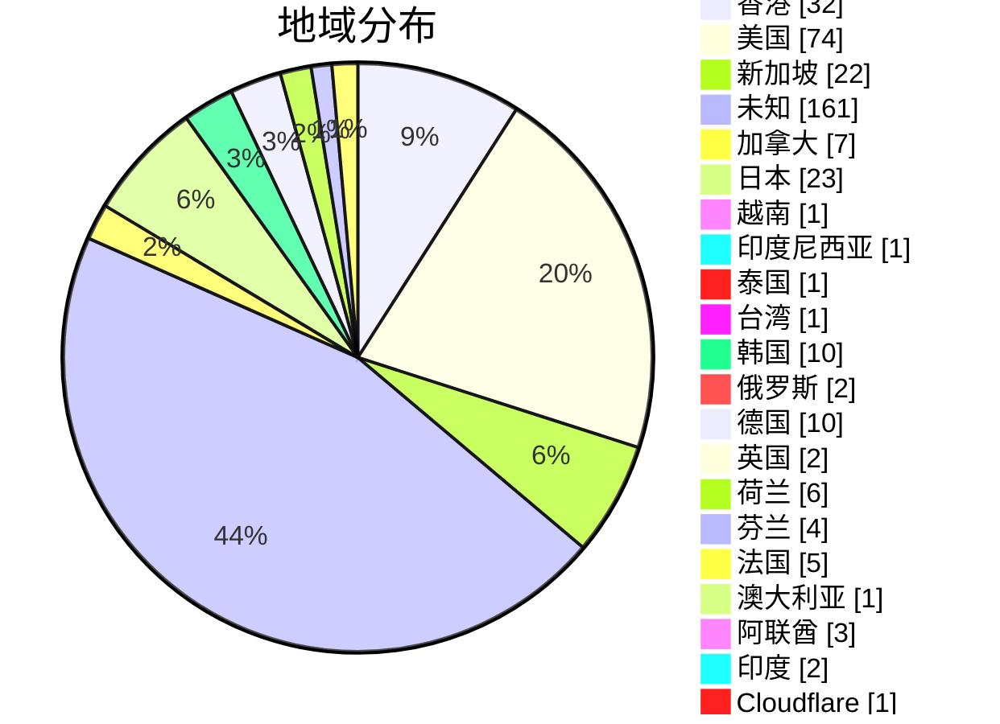
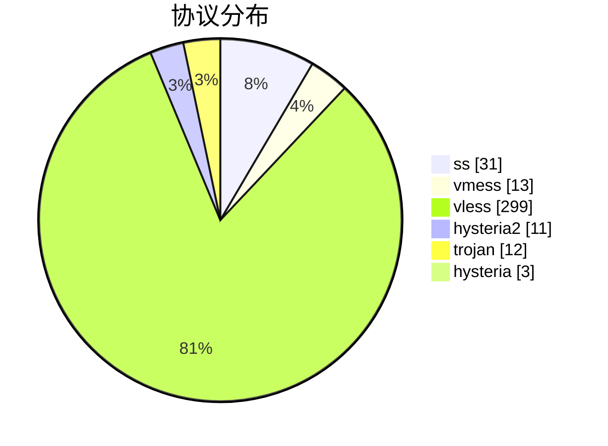

```mermaid
pie showData
title 延迟分布
"63-133ms" : 6
"133-203ms" : 3
"203-273ms" : 8
"273-343ms" : 7
"343-413ms" : 7
"413-483ms" : 8
"483-553ms" : 110
"553-623ms" : 48
"623-693ms" : 37
"693-763ms" : 129
"763-833ms" : 6
```

```mermaid
pie showData
title 地域分布
"香港" : 32
"美国" : 74
"新加坡" : 22
"未知" : 161
"加拿大" : 7
"日本" : 23
"越南" : 1
"印度尼西亚" : 1
"泰国" : 1
"台湾" : 1
"韩国" : 10
"俄罗斯" : 2
"德国" : 10
"英国" : 2
"荷兰" : 6
"芬兰" : 4
"法国" : 5
"澳大利亚" : 1
"阿联酋" : 3
"印度" : 2
"Cloudflare" : 1
```

```mermaid
pie showData
title 协议分布
"ss" : 31
"vmess" : 13
"vless" : 299
"hysteria2" : 11
"trojan" : 12
"hysteria" : 3
```