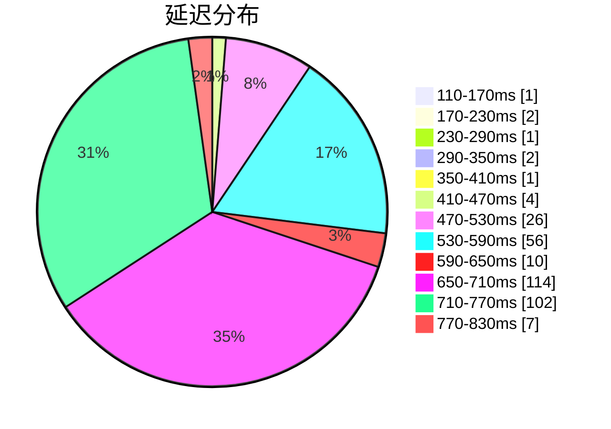
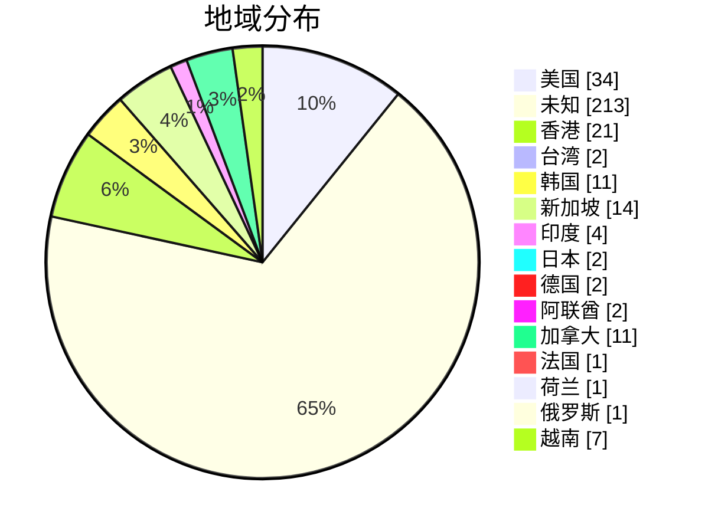
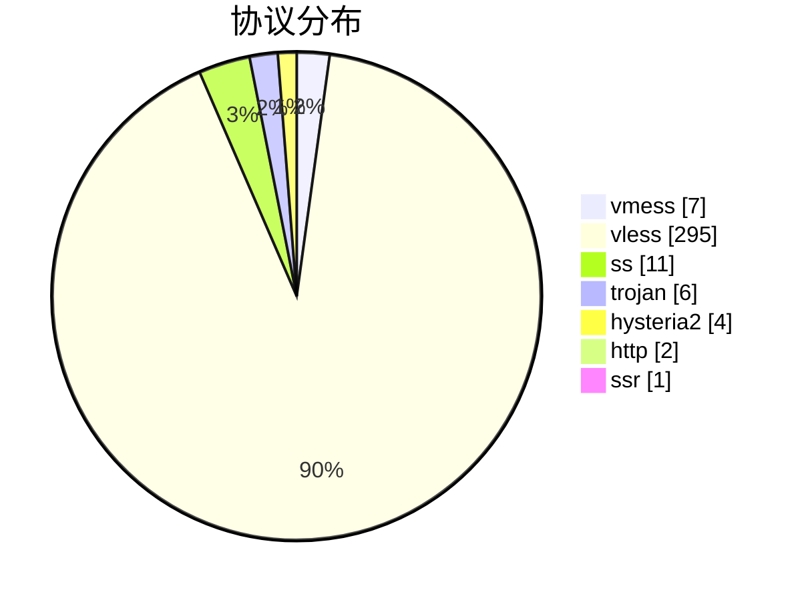

```mermaid
pie showData
title 延迟分布
"110-170ms" : 1
"170-230ms" : 2
"230-290ms" : 1
"290-350ms" : 2
"350-410ms" : 1
"410-470ms" : 4
"470-530ms" : 26
"530-590ms" : 56
"590-650ms" : 10
"650-710ms" : 114
"710-770ms" : 102
"770-830ms" : 7
```

```mermaid
pie showData
title 地域分布
"美国" : 34
"未知" : 213
"香港" : 21
"台湾" : 2
"韩国" : 11
"新加坡" : 14
"印度" : 4
"日本" : 2
"德国" : 2
"阿联酋" : 2
"加拿大" : 11
"法国" : 1
"荷兰" : 1
"俄罗斯" : 1
"越南" : 7
```

```mermaid
pie showData
title 协议分布
"vmess" : 7
"vless" : 295
"ss" : 11
"trojan" : 6
"hysteria2" : 4
"http" : 2
"ssr" : 1
```