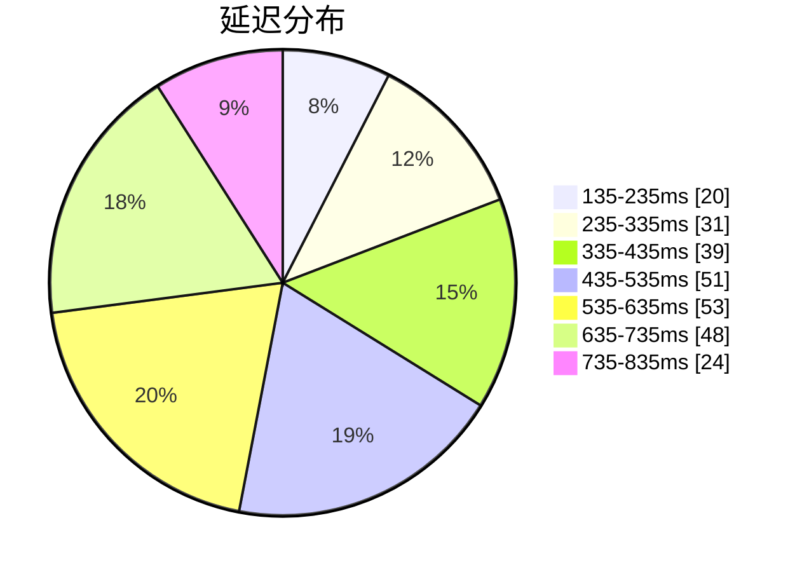
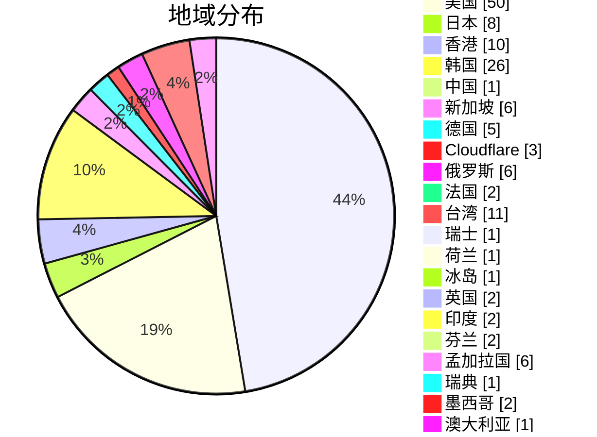
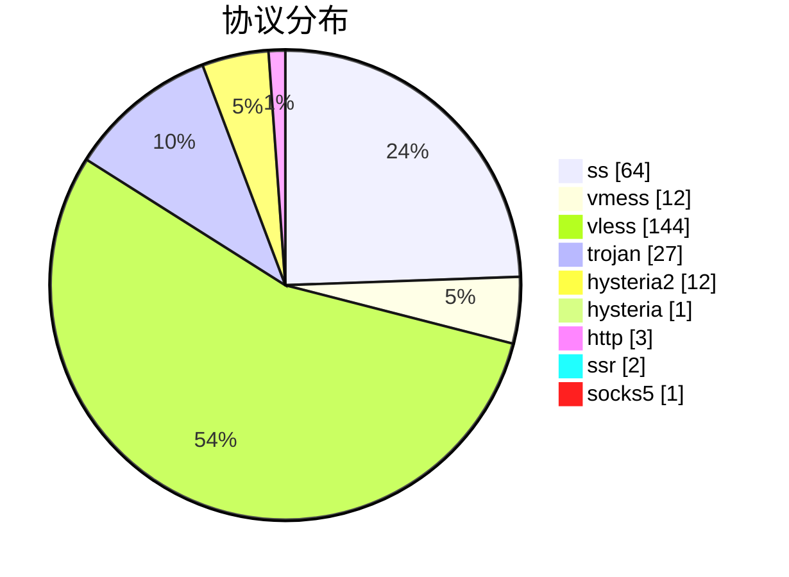

```mermaid
pie showData
title 延迟分布
"135-235ms" : 20
"235-335ms" : 31
"335-435ms" : 39
"435-535ms" : 51
"535-635ms" : 53
"635-735ms" : 48
"735-835ms" : 24
```

```mermaid
pie showData
title 地域分布
"未知" : 118
"美国" : 50
"日本" : 8
"香港" : 10
"韩国" : 26
"中国" : 1
"新加坡" : 6
"德国" : 5
"Cloudflare" : 3
"俄罗斯" : 6
"法国" : 2
"台湾" : 11
"瑞士" : 1
"荷兰" : 1
"冰岛" : 1
"英国" : 2
"印度" : 2
"芬兰" : 2
"孟加拉国" : 6
"瑞典" : 1
"墨西哥" : 2
"澳大利亚" : 1
"阿联酋" : 1
```

```mermaid
pie showData
title 协议分布
"ss" : 64
"vmess" : 12
"vless" : 144
"trojan" : 27
"hysteria2" : 12
"hysteria" : 1
"http" : 3
"ssr" : 2
"socks5" : 1
```