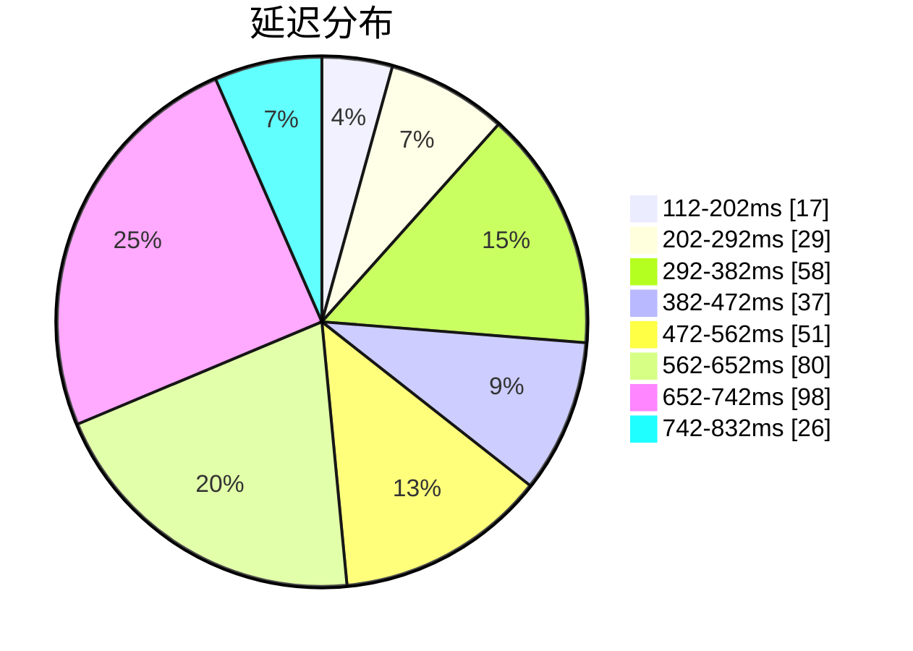
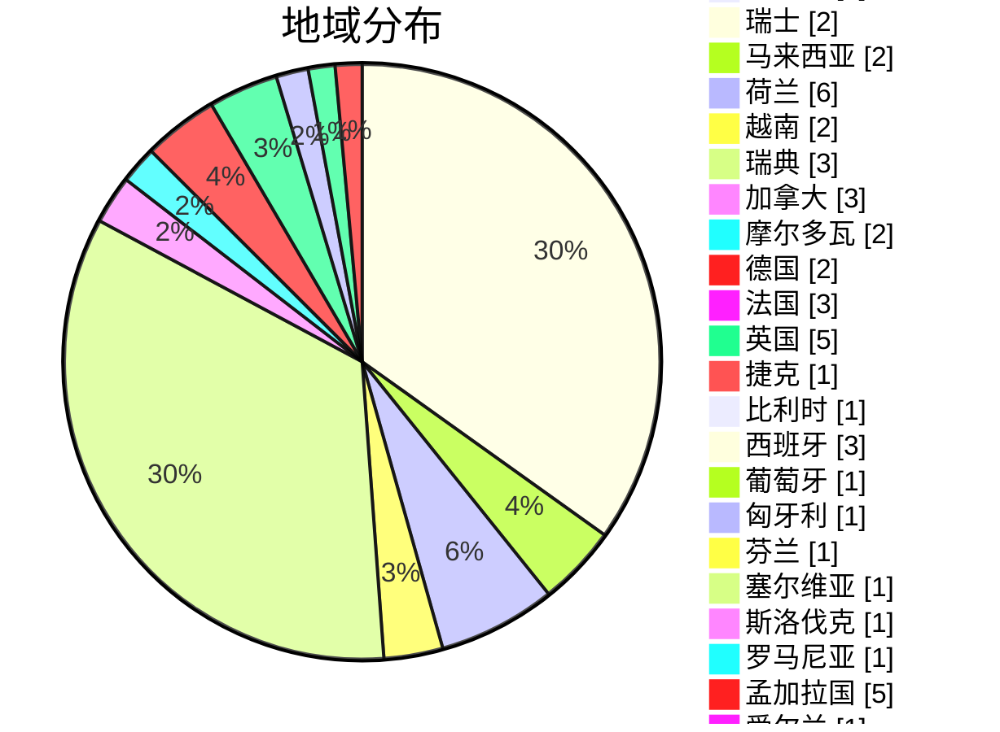
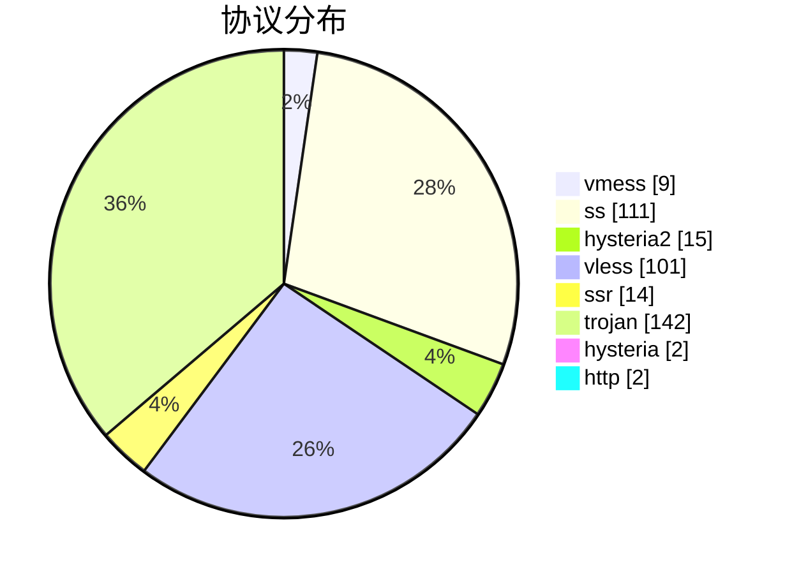

```mermaid
pie showData
title 延迟分布
"112-202ms" : 17
"202-292ms" : 29
"292-382ms" : 58
"382-472ms" : 37
"472-562ms" : 51
"562-652ms" : 80
"652-742ms" : 98
"742-832ms" : 26
```

```mermaid
pie showData
title 地域分布
"中国" : 3
"未知" : 120
"香港" : 15
"美国" : 22
"日本" : 11
"台湾" : 117
"新加坡" : 9
"Cloudflare" : 7
"波兰" : 14
"印度" : 2
"韩国" : 13
"俄罗斯" : 3
"菲律宾" : 1
"瑞士" : 2
"马来西亚" : 2
"荷兰" : 6
"越南" : 2
"瑞典" : 3
"加拿大" : 3
"摩尔多瓦" : 2
"德国" : 2
"法国" : 3
"英国" : 5
"捷克" : 1
"比利时" : 1
"西班牙" : 3
"葡萄牙" : 1
"匈牙利" : 1
"芬兰" : 1
"塞尔维亚" : 1
"斯洛伐克" : 1
"罗马尼亚" : 1
"孟加拉国" : 5
"爱尔兰" : 1
"丹麦" : 1
"爱沙尼亚" : 1
"奥地利" : 1
"冰岛" : 1
"挪威" : 1
"乌克兰" : 1
"土耳其" : 1
"哥伦比亚" : 1
"立陶宛" : 1
"拉脱维亚" : 1
"保加利亚" : 1
"希腊" : 1
```

```mermaid
pie showData
title 协议分布
"vmess" : 9
"ss" : 111
"hysteria2" : 15
"vless" : 101
"ssr" : 14
"trojan" : 142
"hysteria" : 2
"http" : 2
```