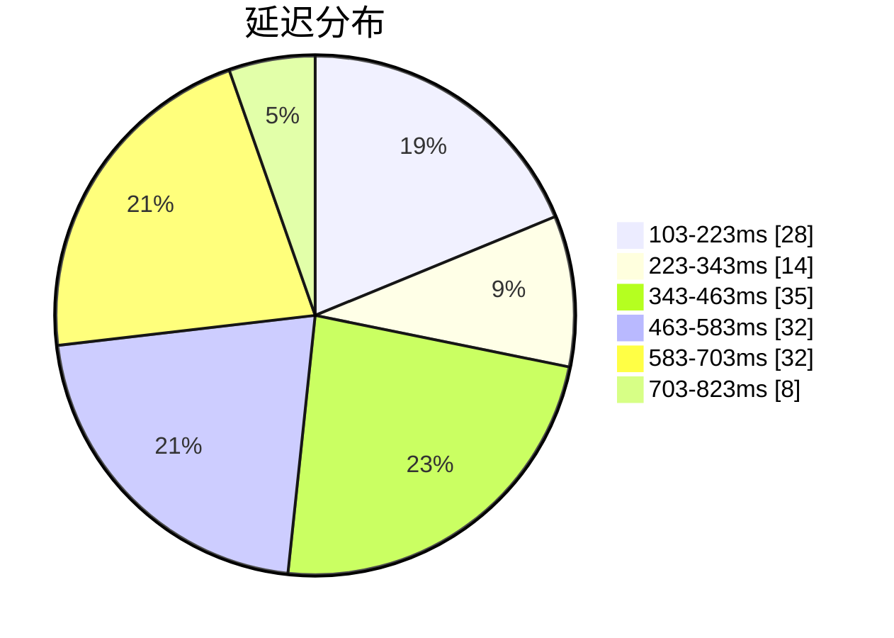
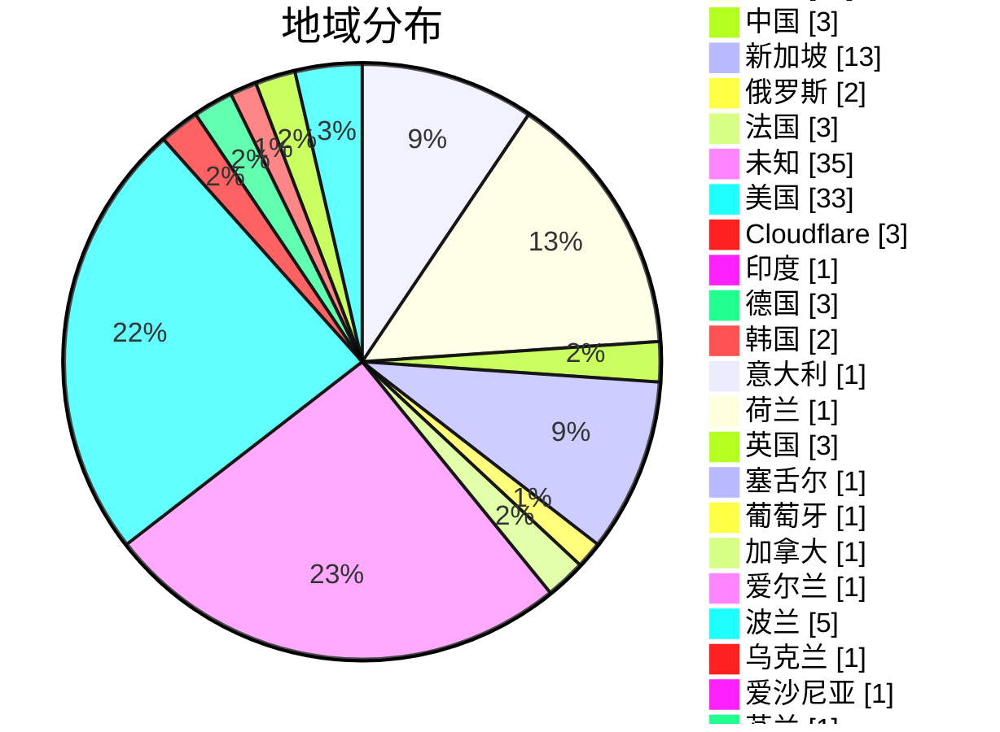
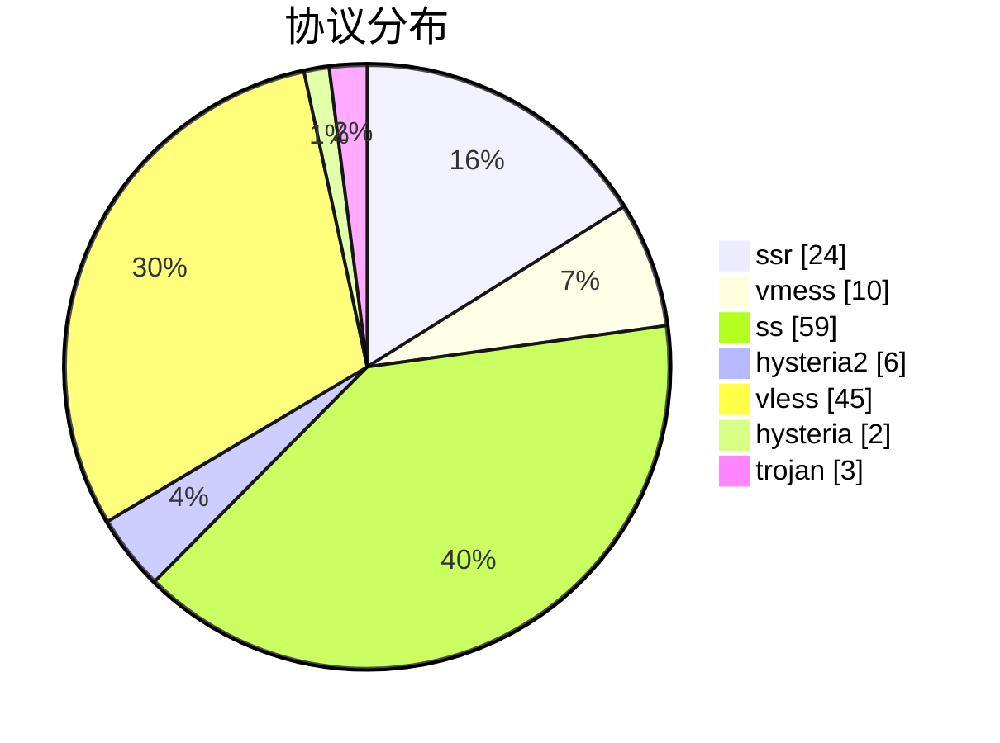

```mermaid
pie showData
title 延迟分布
"103-223ms" : 28
"223-343ms" : 14
"343-463ms" : 35
"463-583ms" : 32
"583-703ms" : 32
"703-823ms" : 8
```

```mermaid
pie showData
title 地域分布
"日本" : 13
"香港" : 20
"中国" : 3
"新加坡" : 13
"俄罗斯" : 2
"法国" : 3
"未知" : 35
"美国" : 33
"Cloudflare" : 3
"印度" : 1
"德国" : 3
"韩国" : 2
"意大利" : 1
"荷兰" : 1
"英国" : 3
"塞舌尔" : 1
"葡萄牙" : 1
"加拿大" : 1
"爱尔兰" : 1
"波兰" : 5
"乌克兰" : 1
"爱沙尼亚" : 1
"芬兰" : 1
"土耳其" : 1
```

```mermaid
pie showData
title 协议分布
"ssr" : 24
"vmess" : 10
"ss" : 59
"hysteria2" : 6
"vless" : 45
"hysteria" : 2
"trojan" : 3
```