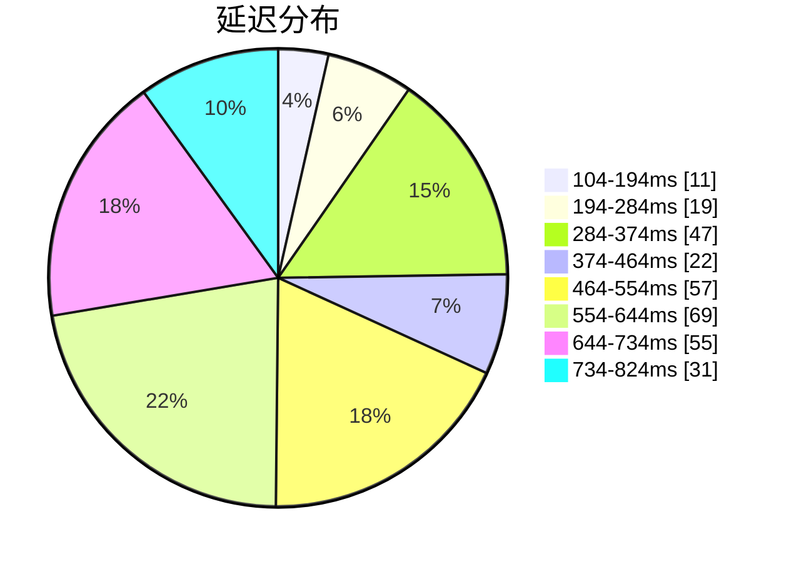
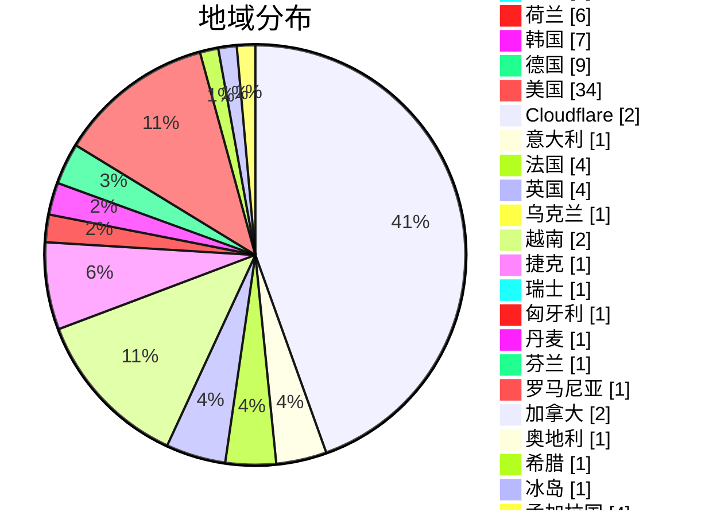
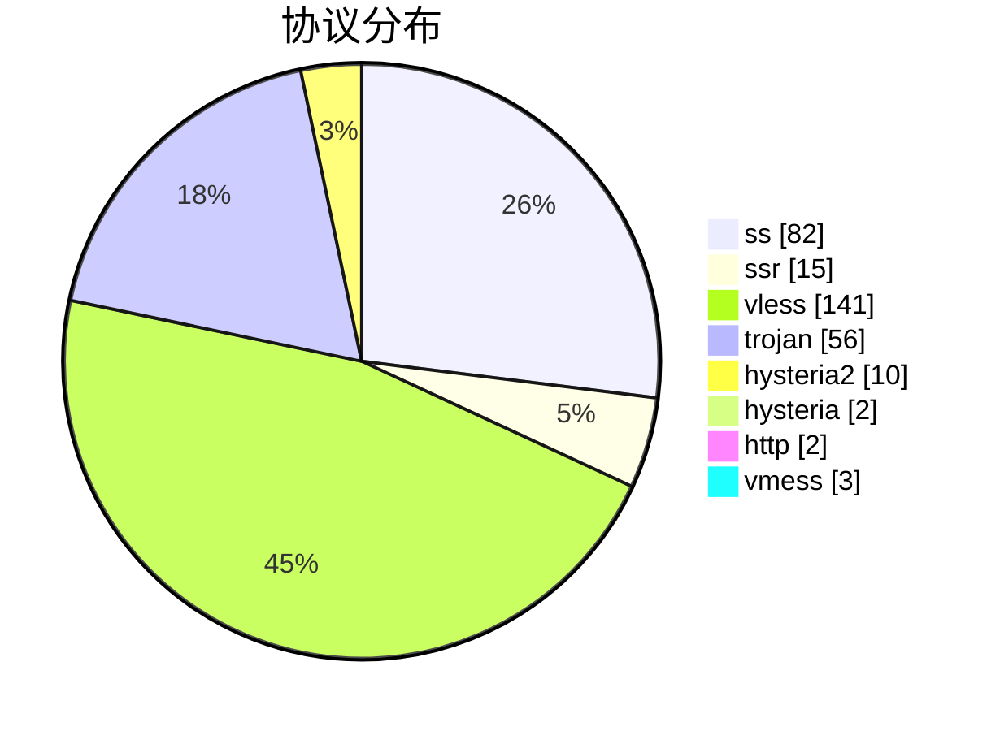

```mermaid
pie showData
title 延迟分布
"104-194ms" : 11
"194-284ms" : 19
"284-374ms" : 47
"374-464ms" : 22
"464-554ms" : 57
"554-644ms" : 69
"644-734ms" : 55
"734-824ms" : 31
```

```mermaid
pie showData
title 地域分布
"未知" : 126
"日本" : 11
"香港" : 11
"新加坡" : 13
"俄罗斯" : 2
"台湾" : 35
"波兰" : 19
"印度" : 2
"荷兰" : 6
"韩国" : 7
"德国" : 9
"美国" : 34
"Cloudflare" : 2
"意大利" : 1
"法国" : 4
"英国" : 4
"乌克兰" : 1
"越南" : 2
"捷克" : 1
"瑞士" : 1
"匈牙利" : 1
"丹麦" : 1
"芬兰" : 1
"罗马尼亚" : 1
"加拿大" : 2
"奥地利" : 1
"希腊" : 1
"冰岛" : 1
"孟加拉国" : 4
"拉脱维亚" : 1
"保加利亚" : 1
"阿联酋" : 1
"瑞典" : 1
"爱沙尼亚" : 1
"立陶宛" : 1
"土耳其" : 1
```

```mermaid
pie showData
title 协议分布
"ss" : 82
"ssr" : 15
"vless" : 141
"trojan" : 56
"hysteria2" : 10
"hysteria" : 2
"http" : 2
"vmess" : 3
```