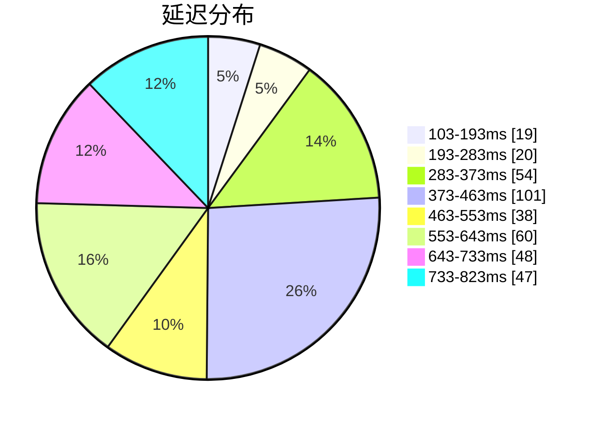
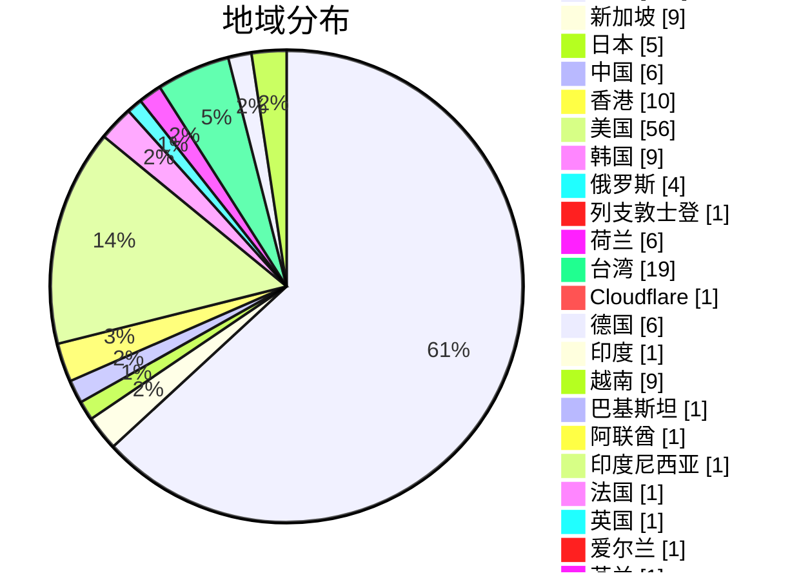
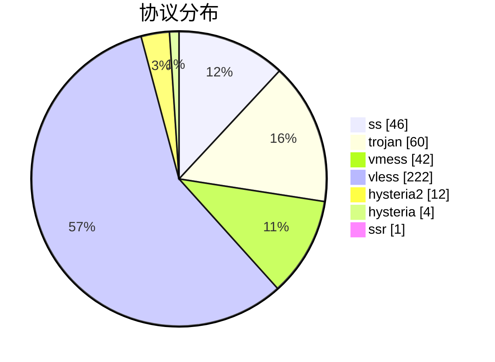

```mermaid
pie showData
title 延迟分布
"103-193ms" : 19
"193-283ms" : 20
"283-373ms" : 54
"373-463ms" : 101
"463-553ms" : 38
"553-643ms" : 60
"643-733ms" : 48
"733-823ms" : 47
```

```mermaid
pie showData
title 地域分布
"未知" : 238
"新加坡" : 9
"日本" : 5
"中国" : 6
"香港" : 10
"美国" : 56
"韩国" : 9
"俄罗斯" : 4
"列支敦士登" : 1
"荷兰" : 6
"台湾" : 19
"Cloudflare" : 1
"德国" : 6
"印度" : 1
"越南" : 9
"巴基斯坦" : 1
"阿联酋" : 1
"印度尼西亚" : 1
"法国" : 1
"英国" : 1
"爱尔兰" : 1
"芬兰" : 1
```

```mermaid
pie showData
title 协议分布
"ss" : 46
"trojan" : 60
"vmess" : 42
"vless" : 222
"hysteria2" : 12
"hysteria" : 4
"ssr" : 1
```