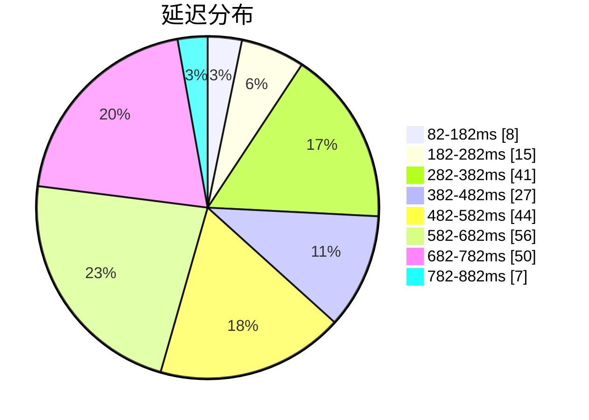
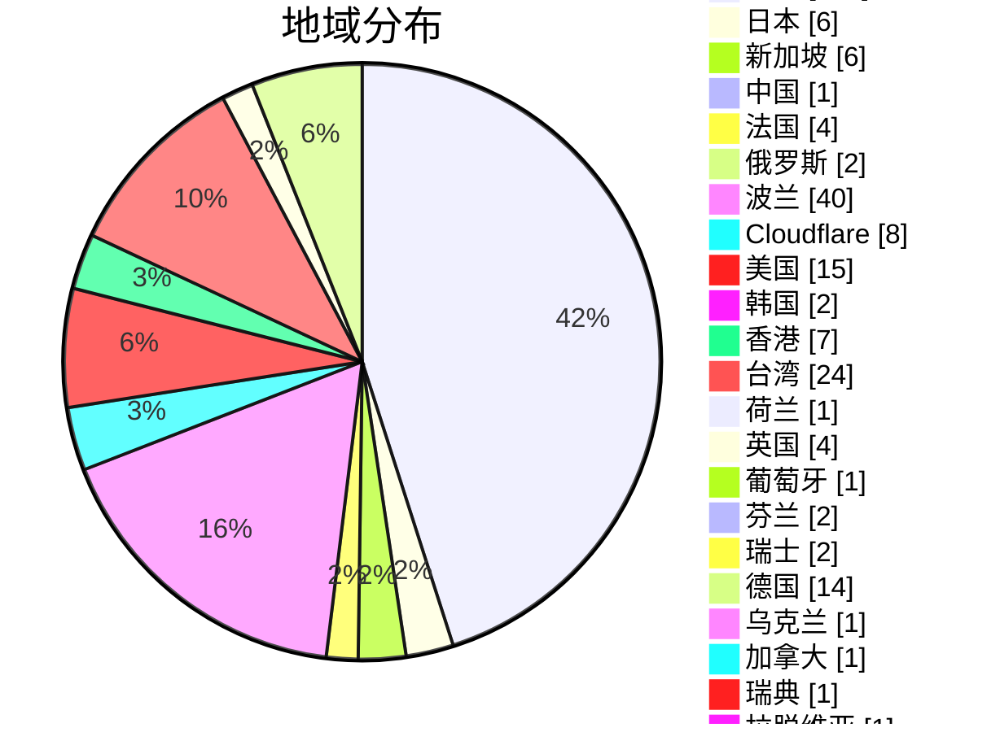
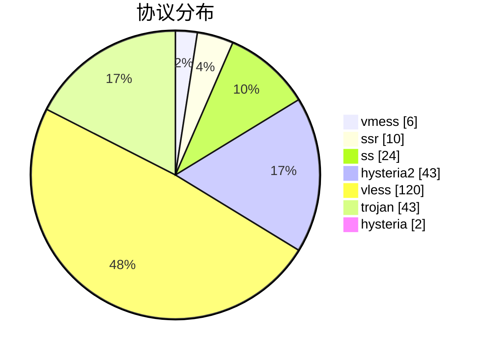

```mermaid
pie showData
title 延迟分布
"82-182ms" : 8
"182-282ms" : 15
"282-382ms" : 41
"382-482ms" : 27
"482-582ms" : 44
"582-682ms" : 56
"682-782ms" : 50
"782-882ms" : 7
```

```mermaid
pie showData
title 地域分布
"未知" : 105
"日本" : 6
"新加坡" : 6
"中国" : 1
"法国" : 4
"俄罗斯" : 2
"波兰" : 40
"Cloudflare" : 8
"美国" : 15
"韩国" : 2
"香港" : 7
"台湾" : 24
"荷兰" : 1
"英国" : 4
"葡萄牙" : 1
"芬兰" : 2
"瑞士" : 2
"德国" : 14
"乌克兰" : 1
"加拿大" : 1
"瑞典" : 1
"拉脱维亚" : 1
```

```mermaid
pie showData
title 协议分布
"vmess" : 6
"ssr" : 10
"ss" : 24
"hysteria2" : 43
"vless" : 120
"trojan" : 43
"hysteria" : 2
```