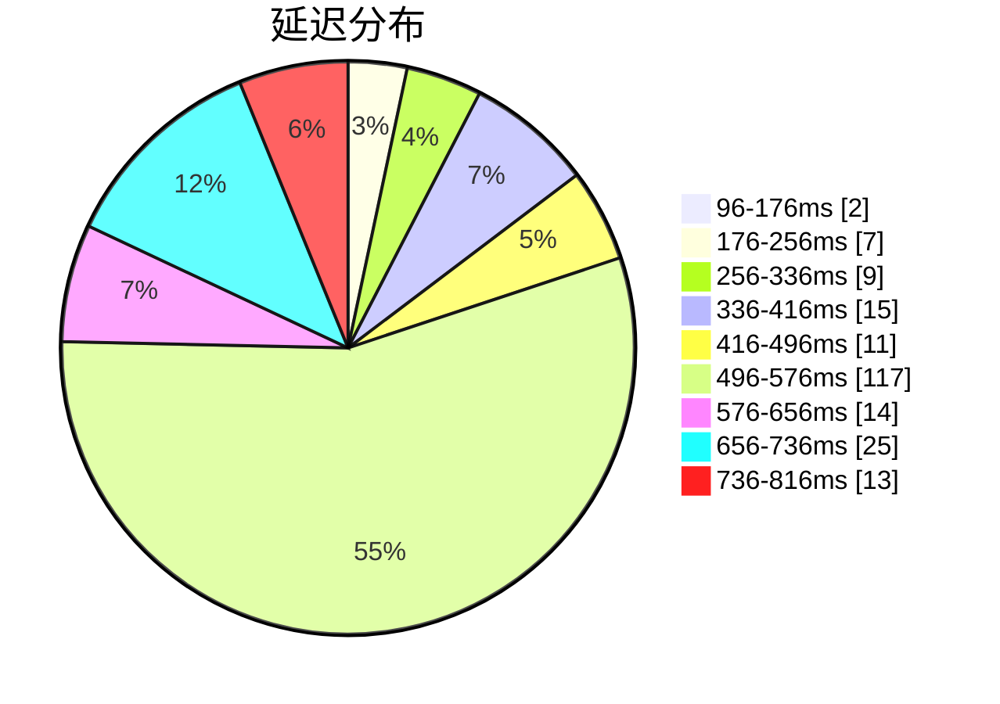
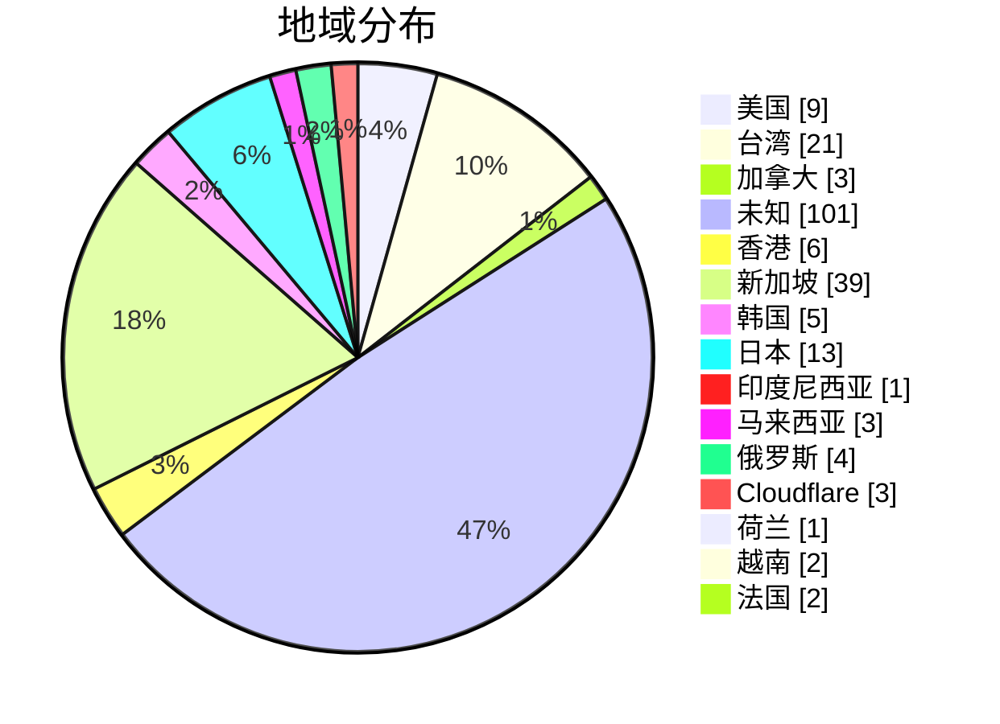
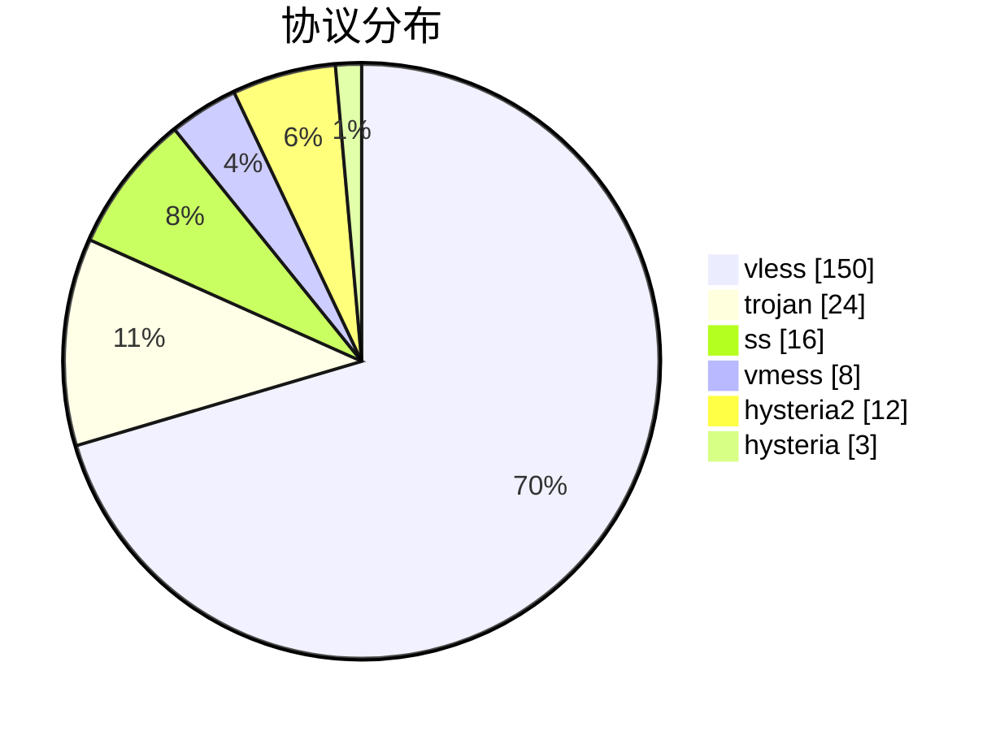

```mermaid
pie showData
title 延迟分布
"96-176ms" : 2
"176-256ms" : 7
"256-336ms" : 9
"336-416ms" : 15
"416-496ms" : 11
"496-576ms" : 117
"576-656ms" : 14
"656-736ms" : 25
"736-816ms" : 13
```

```mermaid
pie showData
title 地域分布
"美国" : 9
"台湾" : 21
"加拿大" : 3
"未知" : 101
"香港" : 6
"新加坡" : 39
"韩国" : 5
"日本" : 13
"印度尼西亚" : 1
"马来西亚" : 3
"俄罗斯" : 4
"Cloudflare" : 3
"荷兰" : 1
"越南" : 2
"法国" : 2
```

```mermaid
pie showData
title 协议分布
"vless" : 150
"trojan" : 24
"ss" : 16
"vmess" : 8
"hysteria2" : 12
"hysteria" : 3
```