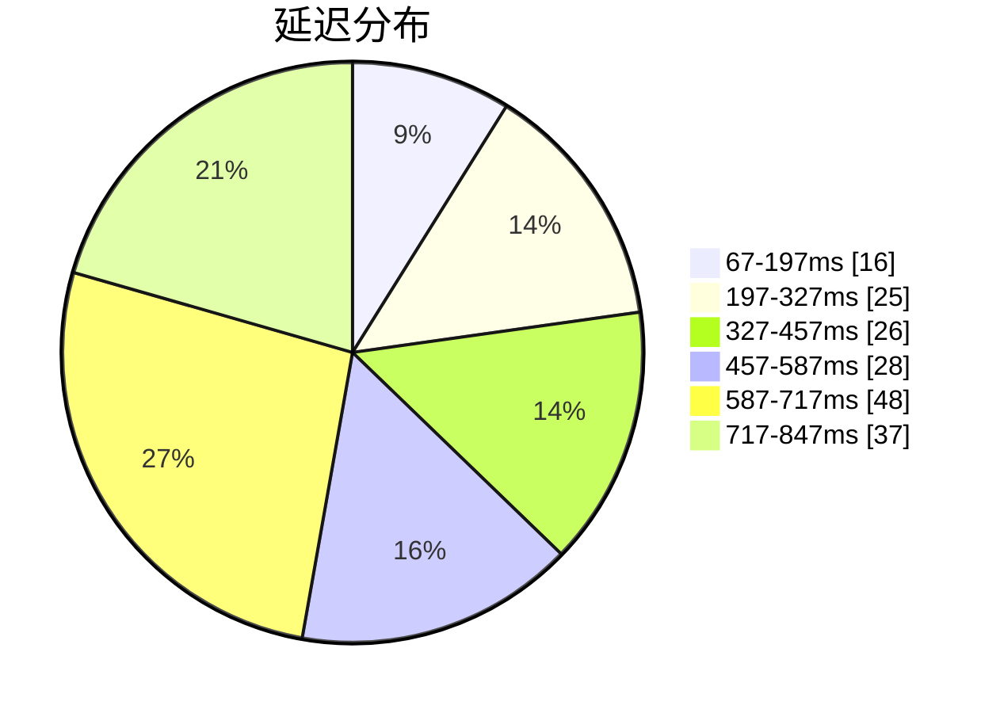
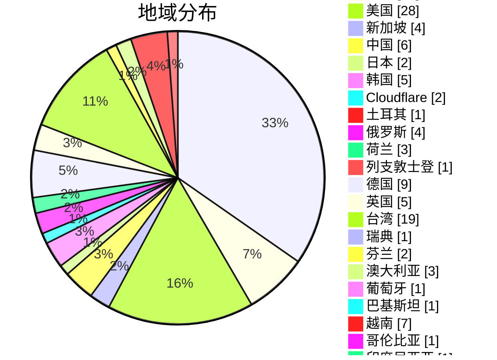
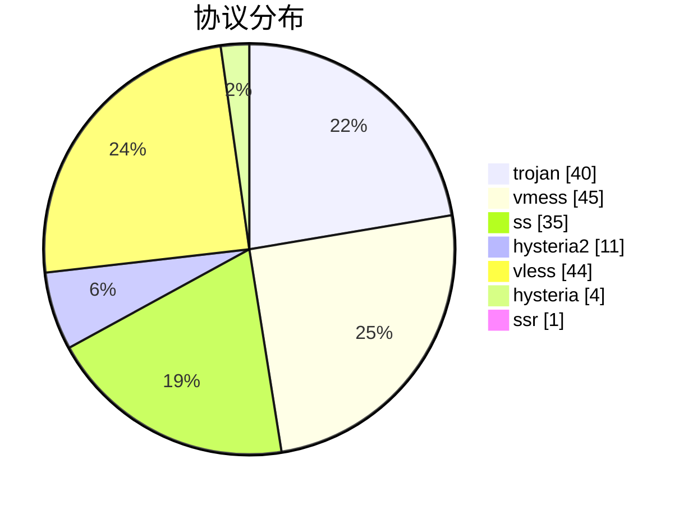

```mermaid
pie showData
title 延迟分布
"67-197ms" : 16
"197-327ms" : 25
"327-457ms" : 26
"457-587ms" : 28
"587-717ms" : 48
"717-847ms" : 37
```

```mermaid
pie showData
title 地域分布
"未知" : 60
"香港" : 12
"美国" : 28
"新加坡" : 4
"中国" : 6
"日本" : 2
"韩国" : 5
"Cloudflare" : 2
"土耳其" : 1
"俄罗斯" : 4
"荷兰" : 3
"列支敦士登" : 1
"德国" : 9
"英国" : 5
"台湾" : 19
"瑞典" : 1
"芬兰" : 2
"澳大利亚" : 3
"葡萄牙" : 1
"巴基斯坦" : 1
"越南" : 7
"哥伦比亚" : 1
"印度尼西亚" : 1
"法国" : 2
```

```mermaid
pie showData
title 协议分布
"trojan" : 40
"vmess" : 45
"ss" : 35
"hysteria2" : 11
"vless" : 44
"hysteria" : 4
"ssr" : 1
```