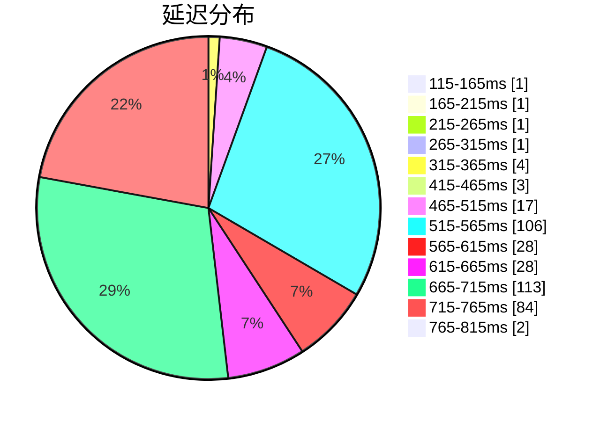
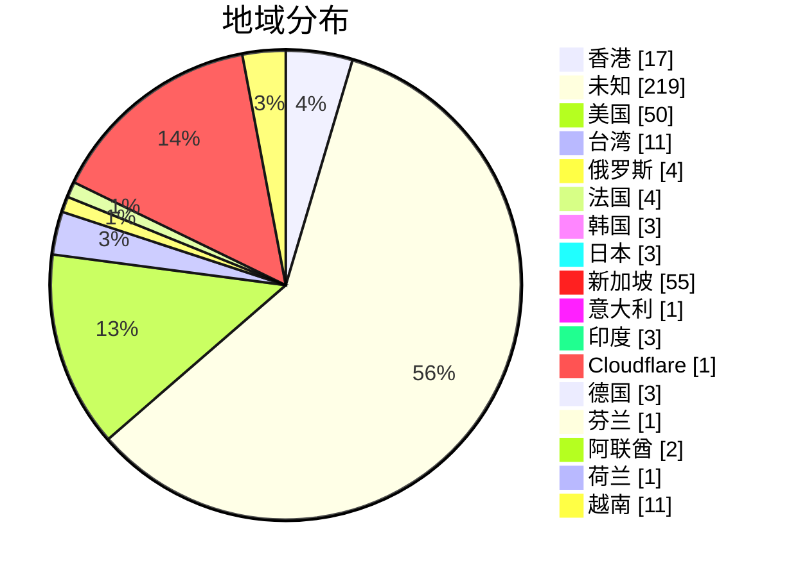
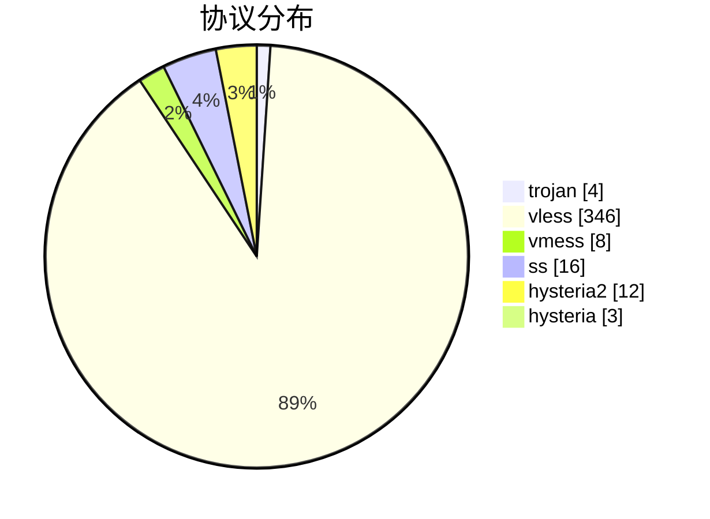

```mermaid
pie showData
title 延迟分布
"115-165ms" : 1
"165-215ms" : 1
"215-265ms" : 1
"265-315ms" : 1
"315-365ms" : 4
"415-465ms" : 3
"465-515ms" : 17
"515-565ms" : 106
"565-615ms" : 28
"615-665ms" : 28
"665-715ms" : 113
"715-765ms" : 84
"765-815ms" : 2
```

```mermaid
pie showData
title 地域分布
"香港" : 17
"未知" : 219
"美国" : 50
"台湾" : 11
"俄罗斯" : 4
"法国" : 4
"韩国" : 3
"日本" : 3
"新加坡" : 55
"意大利" : 1
"印度" : 3
"Cloudflare" : 1
"德国" : 3
"芬兰" : 1
"阿联酋" : 2
"荷兰" : 1
"越南" : 11
```

```mermaid
pie showData
title 协议分布
"trojan" : 4
"vless" : 346
"vmess" : 8
"ss" : 16
"hysteria2" : 12
"hysteria" : 3
```