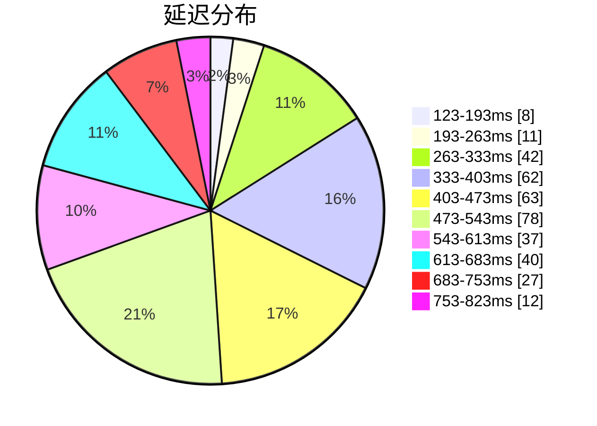
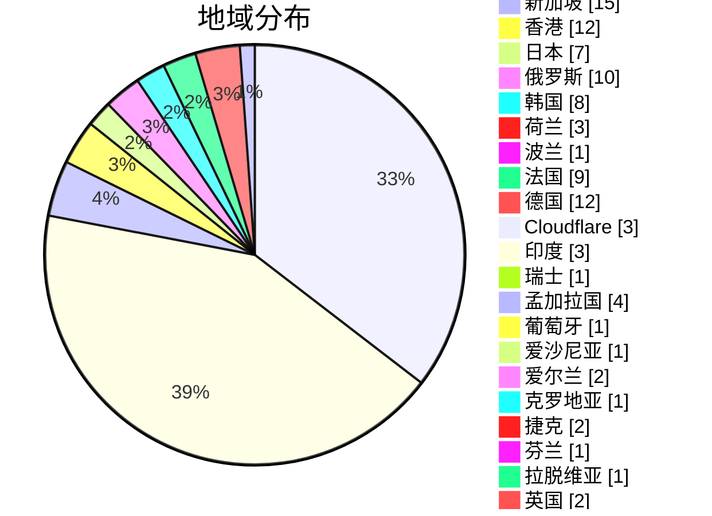
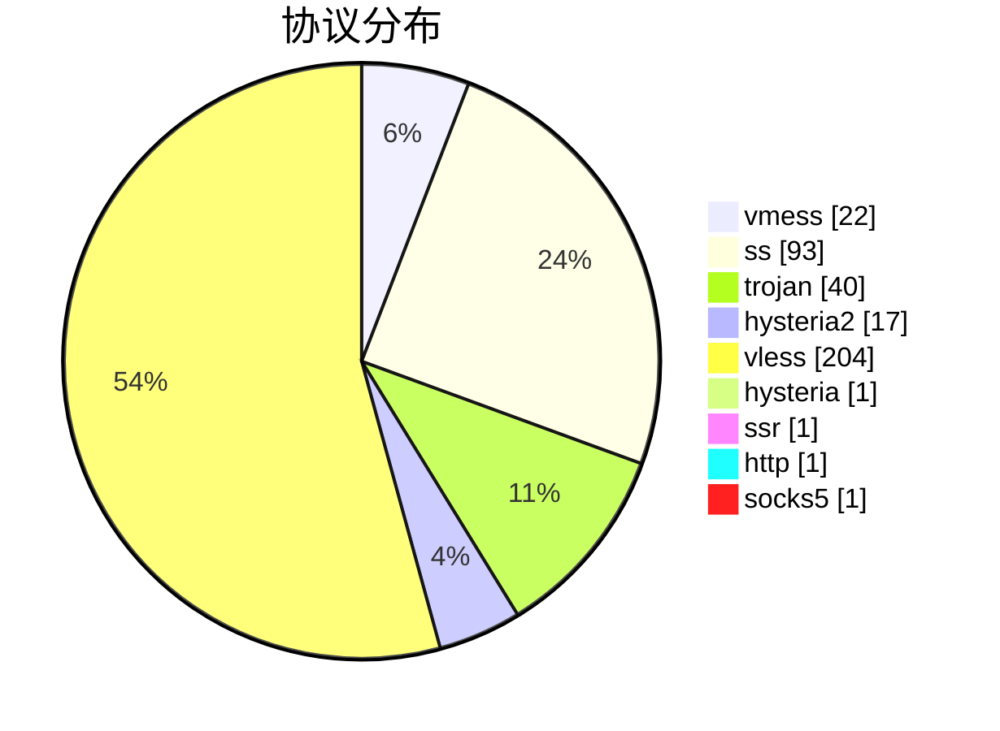

```mermaid
pie showData
title 延迟分布
"123-193ms" : 8
"193-263ms" : 11
"263-333ms" : 42
"333-403ms" : 62
"403-473ms" : 63
"473-543ms" : 78
"543-613ms" : 37
"613-683ms" : 40
"683-753ms" : 27
"753-823ms" : 12
```

```mermaid
pie showData
title 地域分布
"美国" : 124
"未知" : 149
"台湾" : 3
"新加坡" : 15
"香港" : 12
"日本" : 7
"俄罗斯" : 10
"韩国" : 8
"荷兰" : 3
"波兰" : 1
"法国" : 9
"德国" : 12
"Cloudflare" : 3
"印度" : 3
"瑞士" : 1
"孟加拉国" : 4
"葡萄牙" : 1
"爱沙尼亚" : 1
"爱尔兰" : 2
"克罗地亚" : 1
"捷克" : 2
"芬兰" : 1
"拉脱维亚" : 1
"英国" : 2
"哥斯达黎加" : 1
"墨西哥" : 2
"土耳其" : 2
```

```mermaid
pie showData
title 协议分布
"vmess" : 22
"ss" : 93
"trojan" : 40
"hysteria2" : 17
"vless" : 204
"hysteria" : 1
"ssr" : 1
"http" : 1
"socks5" : 1
```