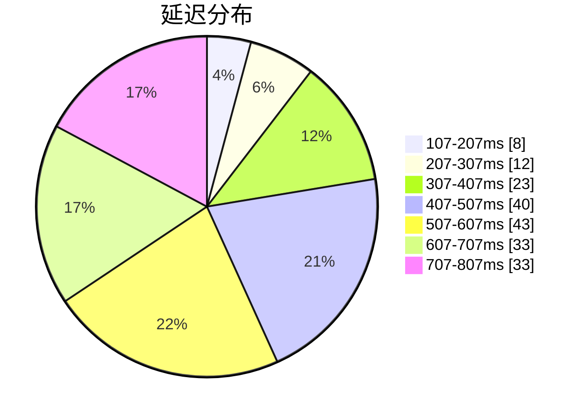
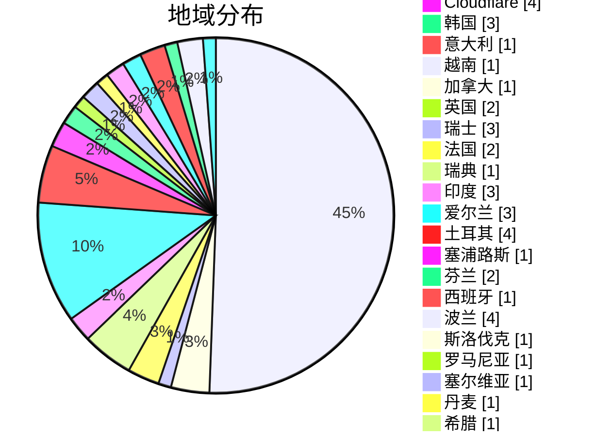
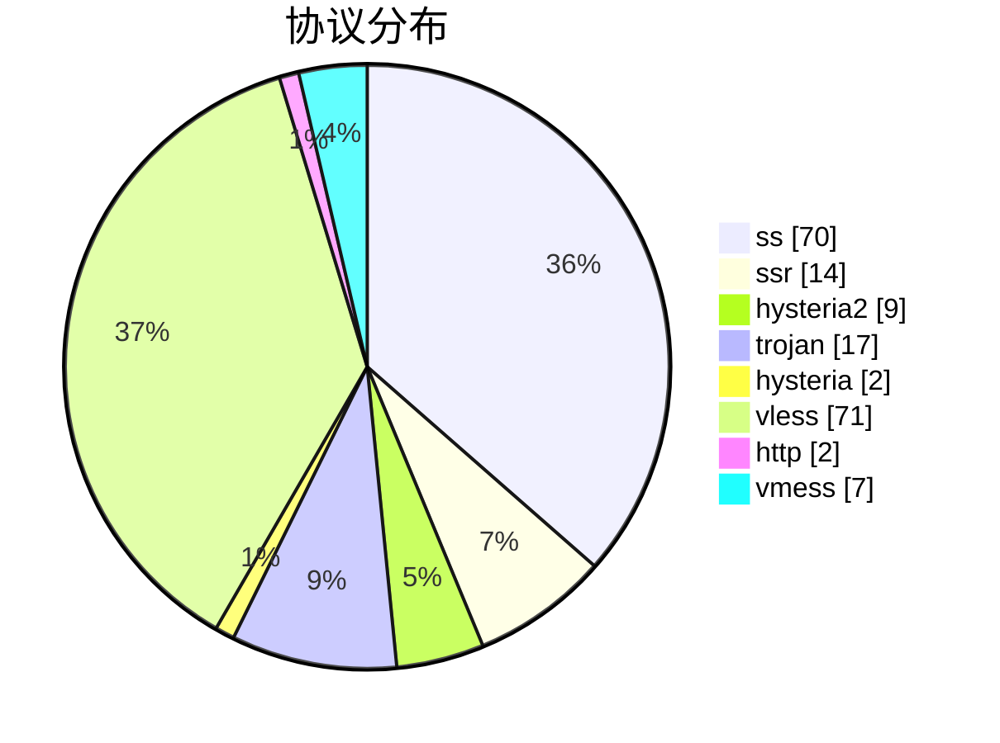

```mermaid
pie showData
title 延迟分布
"107-207ms" : 8
"207-307ms" : 12
"307-407ms" : 23
"407-507ms" : 40
"507-607ms" : 43
"607-707ms" : 33
"707-807ms" : 33
```

```mermaid
pie showData
title 地域分布
"未知" : 87
"日本" : 6
"新加坡" : 1
"俄罗斯" : 2
"香港" : 5
"台湾" : 8
"荷兰" : 4
"美国" : 19
"德国" : 9
"Cloudflare" : 4
"韩国" : 3
"意大利" : 1
"越南" : 1
"加拿大" : 1
"英国" : 2
"瑞士" : 3
"法国" : 2
"瑞典" : 1
"印度" : 3
"爱尔兰" : 3
"土耳其" : 4
"塞浦路斯" : 1
"芬兰" : 2
"西班牙" : 1
"波兰" : 4
"斯洛伐克" : 1
"罗马尼亚" : 1
"塞尔维亚" : 1
"丹麦" : 1
"希腊" : 1
"冰岛" : 1
"孟加拉国" : 2
"爱沙尼亚" : 1
"摩尔多瓦" : 1
"拉脱维亚" : 1
"葡萄牙" : 1
"乌克兰" : 1
"挪威" : 1
"立陶宛" : 1
```

```mermaid
pie showData
title 协议分布
"ss" : 70
"ssr" : 14
"hysteria2" : 9
"trojan" : 17
"hysteria" : 2
"vless" : 71
"http" : 2
"vmess" : 7
```