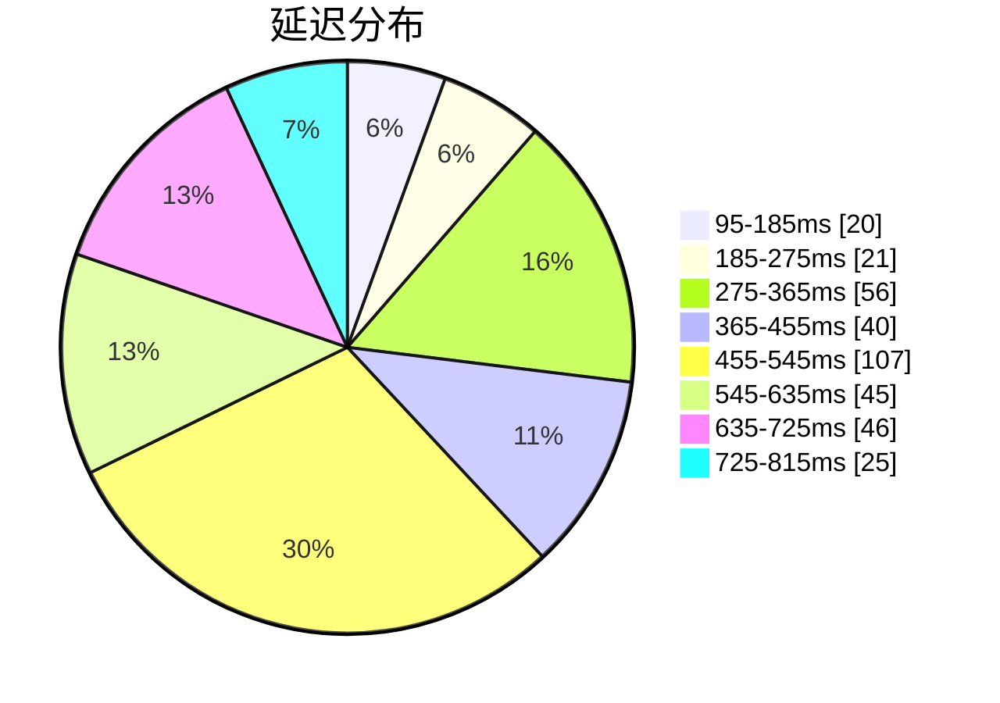
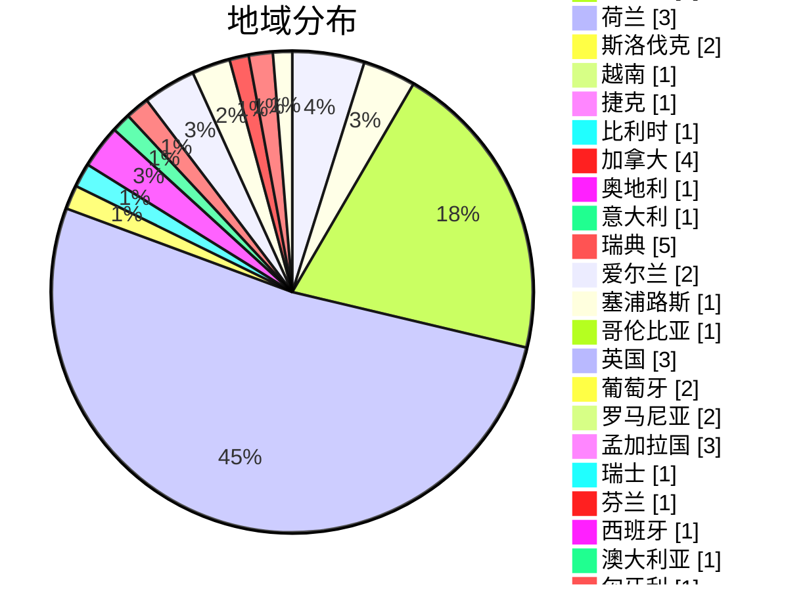
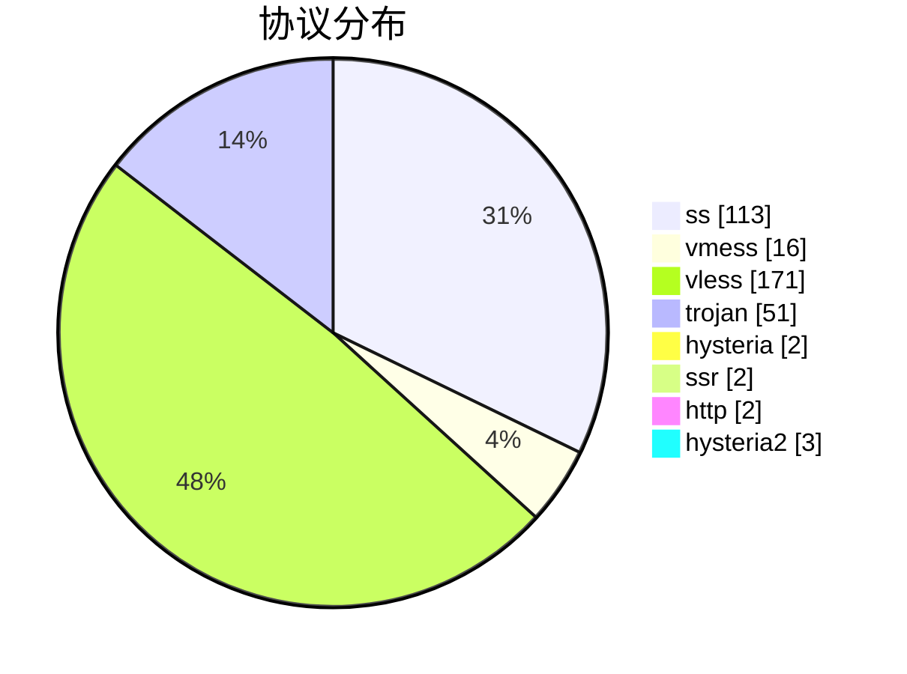

```mermaid
pie showData
title 延迟分布
"95-185ms" : 20
"185-275ms" : 21
"275-365ms" : 56
"365-455ms" : 40
"455-545ms" : 107
"545-635ms" : 45
"635-725ms" : 46
"725-815ms" : 25
```

```mermaid
pie showData
title 地域分布
"香港" : 15
"日本" : 11
"美国" : 63
"未知" : 161
"台湾" : 5
"中国" : 1
"马来西亚" : 2
"新加坡" : 5
"泰国" : 1
"韩国" : 9
"俄罗斯" : 4
"法国" : 5
"德国" : 11
"Cloudflare" : 8
"菲律宾" : 1
"荷兰" : 3
"斯洛伐克" : 2
"越南" : 1
"捷克" : 1
"比利时" : 1
"加拿大" : 4
"奥地利" : 1
"意大利" : 1
"瑞典" : 5
"爱尔兰" : 2
"塞浦路斯" : 1
"哥伦比亚" : 1
"英国" : 3
"葡萄牙" : 2
"罗马尼亚" : 2
"孟加拉国" : 3
"瑞士" : 1
"芬兰" : 1
"西班牙" : 1
"澳大利亚" : 1
"匈牙利" : 1
"波兰" : 1
"丹麦" : 2
"保加利亚" : 1
"墨西哥" : 1
"冰岛" : 1
"智利" : 1
"土耳其" : 2
"乌克兰" : 2
"拉脱维亚" : 1
"爱沙尼亚" : 1
"摩尔多瓦" : 1
"立陶宛" : 1
"挪威" : 1
"印度" : 4
```

```mermaid
pie showData
title 协议分布
"ss" : 113
"vmess" : 16
"vless" : 171
"trojan" : 51
"hysteria" : 2
"ssr" : 2
"http" : 2
"hysteria2" : 3
```