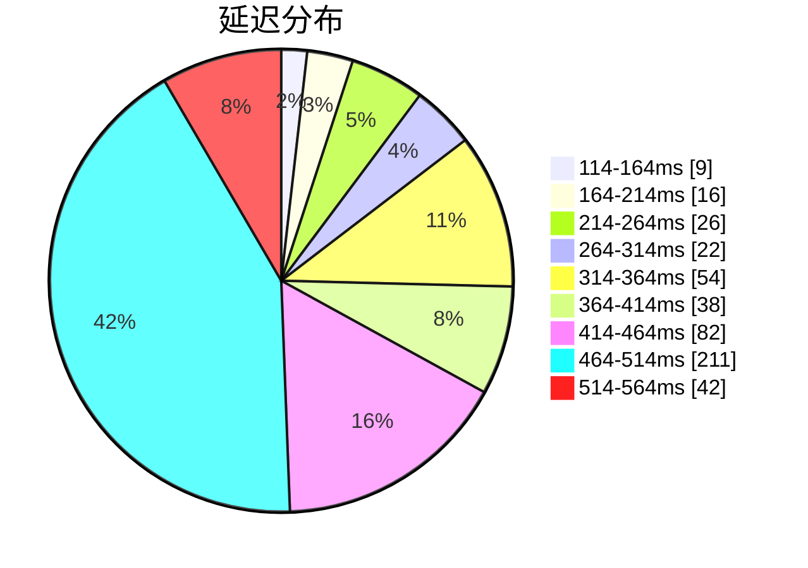
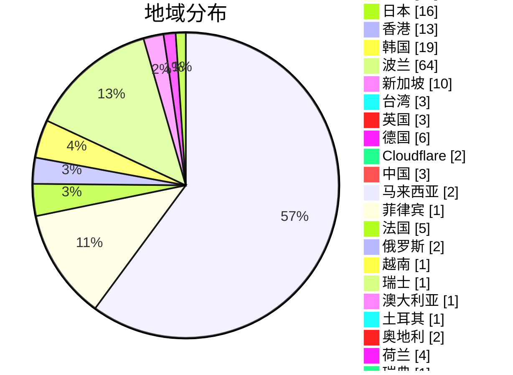
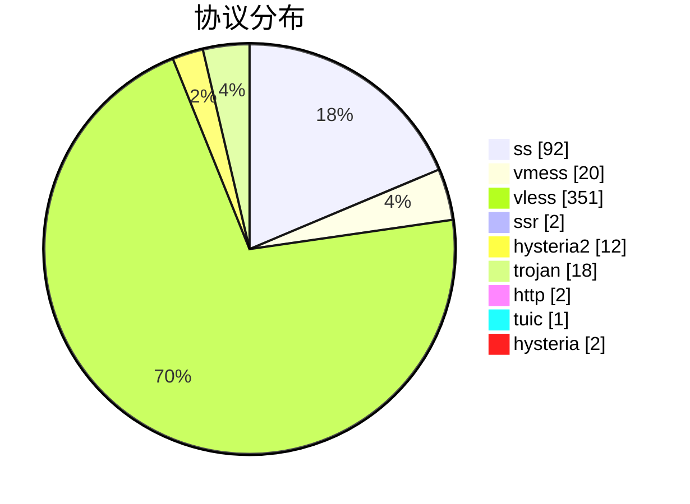

```mermaid
pie showData
title 延迟分布
"114-164ms" : 9
"164-214ms" : 16
"214-264ms" : 26
"264-314ms" : 22
"314-364ms" : 54
"364-414ms" : 38
"414-464ms" : 82
"464-514ms" : 211
"514-564ms" : 42
```

```mermaid
pie showData
title 地域分布
"未知" : 283
"美国" : 55
"日本" : 16
"香港" : 13
"韩国" : 19
"波兰" : 64
"新加坡" : 10
"台湾" : 3
"英国" : 3
"德国" : 6
"Cloudflare" : 2
"中国" : 3
"马来西亚" : 2
"菲律宾" : 1
"法国" : 5
"俄罗斯" : 2
"越南" : 1
"瑞士" : 1
"澳大利亚" : 1
"土耳其" : 1
"奥地利" : 2
"荷兰" : 4
"瑞典" : 1
"爱尔兰" : 2
```

```mermaid
pie showData
title 协议分布
"ss" : 92
"vmess" : 20
"vless" : 351
"ssr" : 2
"hysteria2" : 12
"trojan" : 18
"http" : 2
"tuic" : 1
"hysteria" : 2
```