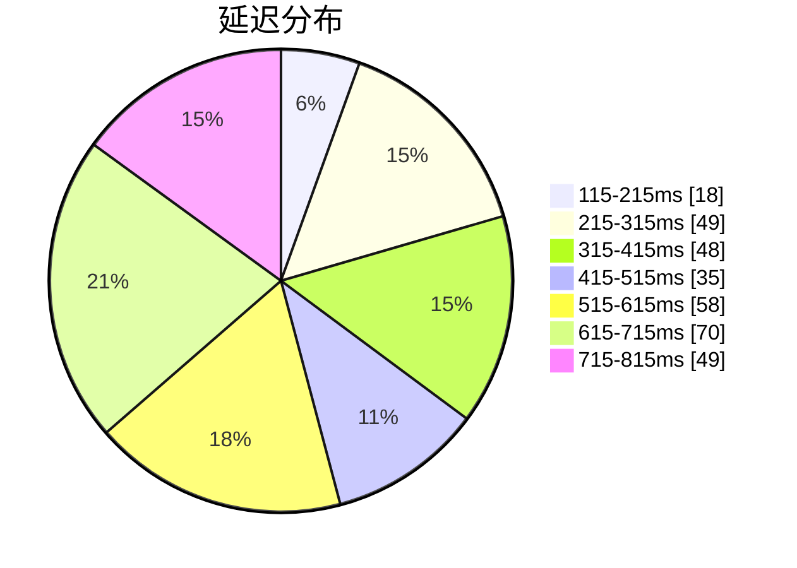
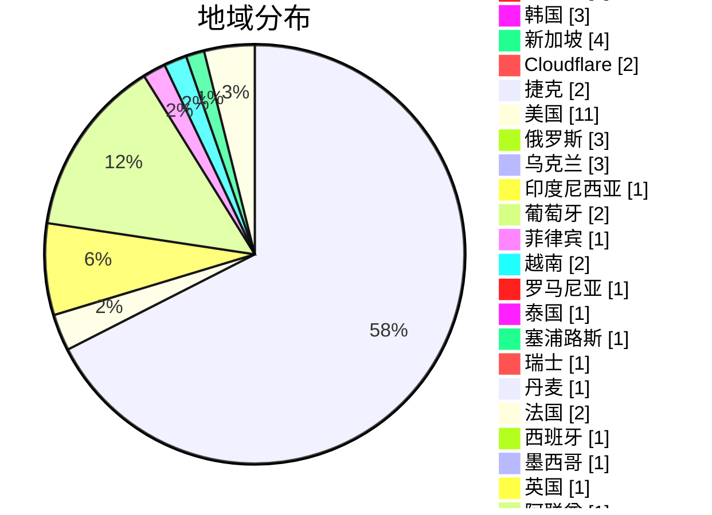
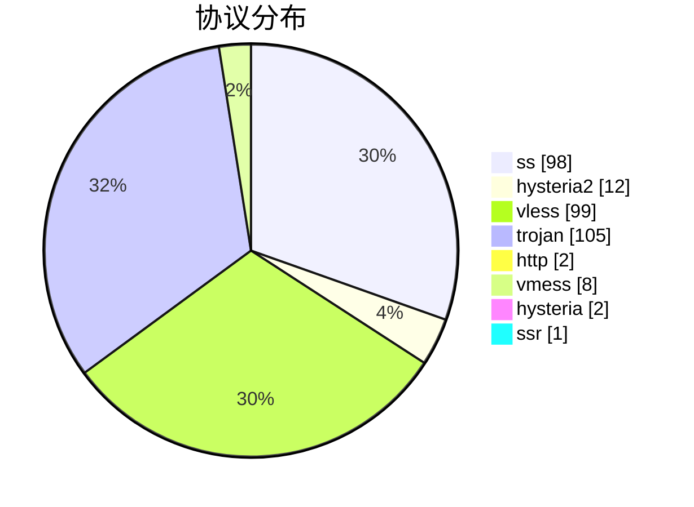

```mermaid
pie showData
title 延迟分布
"115-215ms" : 18
"215-315ms" : 49
"315-415ms" : 48
"415-515ms" : 35
"515-615ms" : 58
"615-715ms" : 70
"715-815ms" : 49
```

```mermaid
pie showData
title 地域分布
"未知" : 191
"香港" : 8
"中国" : 1
"日本" : 3
"波兰" : 20
"台湾" : 39
"德国" : 5
"荷兰" : 5
"加拿大" : 2
"韩国" : 3
"新加坡" : 4
"Cloudflare" : 2
"捷克" : 2
"美国" : 11
"俄罗斯" : 3
"乌克兰" : 3
"印度尼西亚" : 1
"葡萄牙" : 2
"菲律宾" : 1
"越南" : 2
"罗马尼亚" : 1
"泰国" : 1
"塞浦路斯" : 1
"瑞士" : 1
"丹麦" : 1
"法国" : 2
"西班牙" : 1
"墨西哥" : 1
"英国" : 1
"阿联酋" : 1
"芬兰" : 1
"阿曼" : 1
"爱沙尼亚" : 1
"立陶宛" : 1
"摩尔多瓦" : 1
"拉脱维亚" : 1
"希腊" : 1
"孟加拉国" : 1
```

```mermaid
pie showData
title 协议分布
"ss" : 98
"hysteria2" : 12
"vless" : 99
"trojan" : 105
"http" : 2
"vmess" : 8
"hysteria" : 2
"ssr" : 1
```