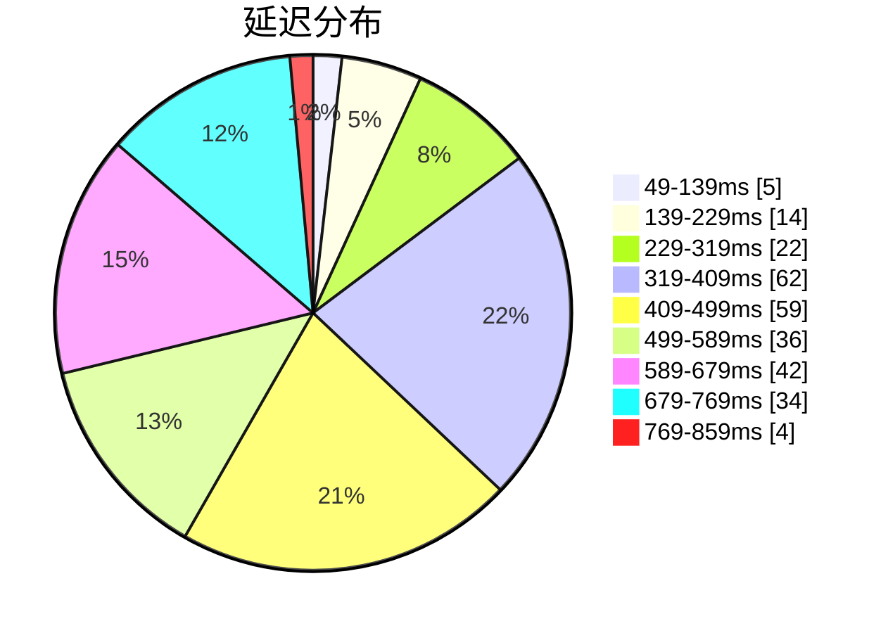
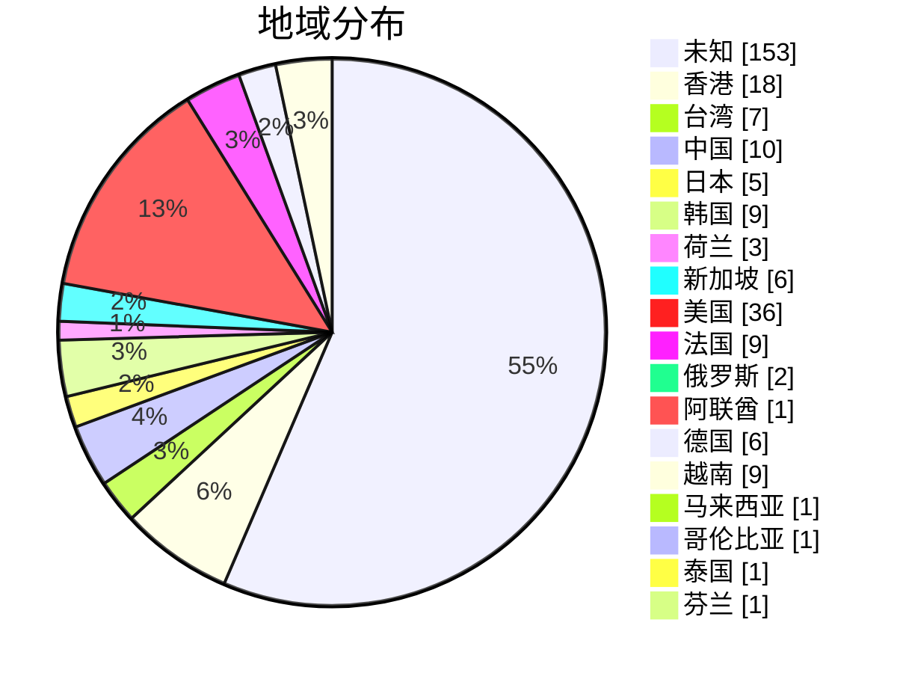
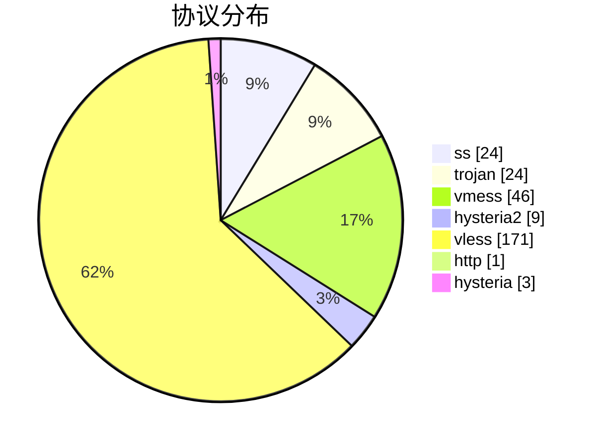

```mermaid
pie showData
title 延迟分布
"49-139ms" : 5
"139-229ms" : 14
"229-319ms" : 22
"319-409ms" : 62
"409-499ms" : 59
"499-589ms" : 36
"589-679ms" : 42
"679-769ms" : 34
"769-859ms" : 4
```

```mermaid
pie showData
title 地域分布
"未知" : 153
"香港" : 18
"台湾" : 7
"中国" : 10
"日本" : 5
"韩国" : 9
"荷兰" : 3
"新加坡" : 6
"美国" : 36
"法国" : 9
"俄罗斯" : 2
"阿联酋" : 1
"德国" : 6
"越南" : 9
"马来西亚" : 1
"哥伦比亚" : 1
"泰国" : 1
"芬兰" : 1
```

```mermaid
pie showData
title 协议分布
"ss" : 24
"trojan" : 24
"vmess" : 46
"hysteria2" : 9
"vless" : 171
"http" : 1
"hysteria" : 3
```