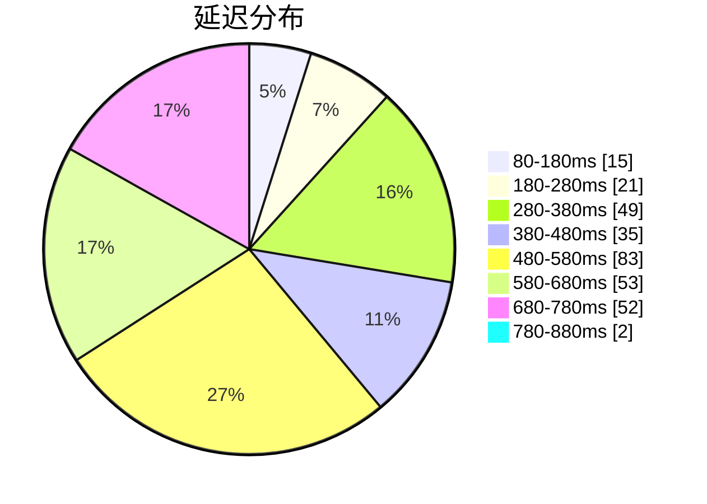
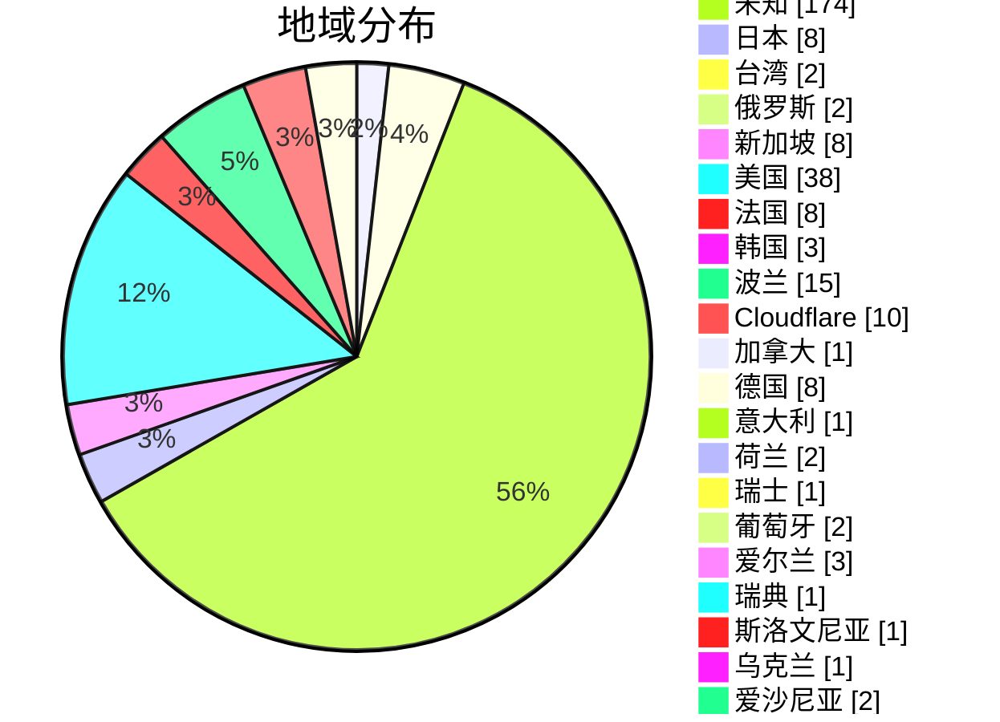
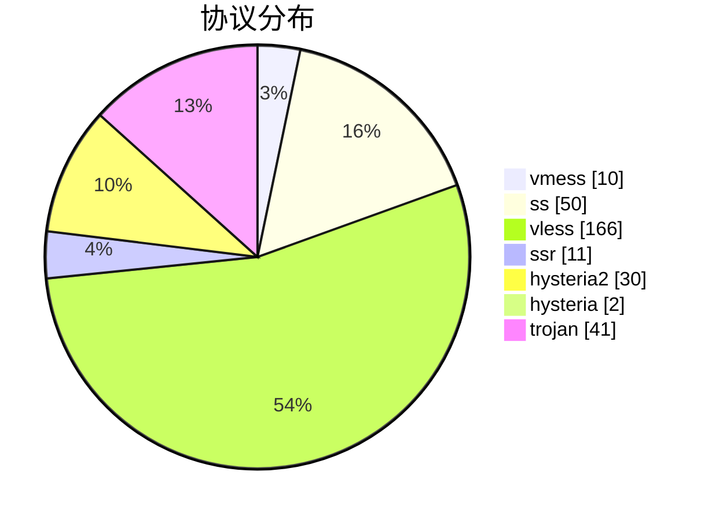

```mermaid
pie showData
title 延迟分布
"80-180ms" : 15
"180-280ms" : 21
"280-380ms" : 49
"380-480ms" : 35
"480-580ms" : 83
"580-680ms" : 53
"680-780ms" : 52
"780-880ms" : 2
```

```mermaid
pie showData
title 地域分布
"中国" : 5
"香港" : 12
"未知" : 174
"日本" : 8
"台湾" : 2
"俄罗斯" : 2
"新加坡" : 8
"美国" : 38
"法国" : 8
"韩国" : 3
"波兰" : 15
"Cloudflare" : 10
"加拿大" : 1
"德国" : 8
"意大利" : 1
"荷兰" : 2
"瑞士" : 1
"葡萄牙" : 2
"爱尔兰" : 3
"瑞典" : 1
"斯洛文尼亚" : 1
"乌克兰" : 1
"爱沙尼亚" : 2
"土耳其" : 1
"丹麦" : 1
```

```mermaid
pie showData
title 协议分布
"vmess" : 10
"ss" : 50
"vless" : 166
"ssr" : 11
"hysteria2" : 30
"hysteria" : 2
"trojan" : 41
```