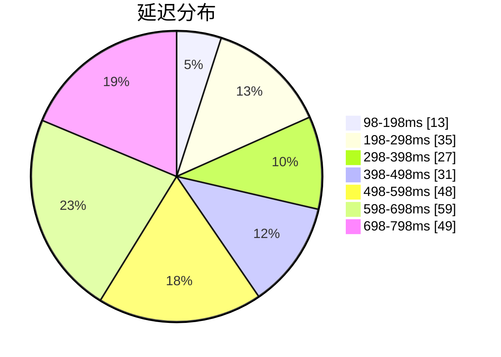
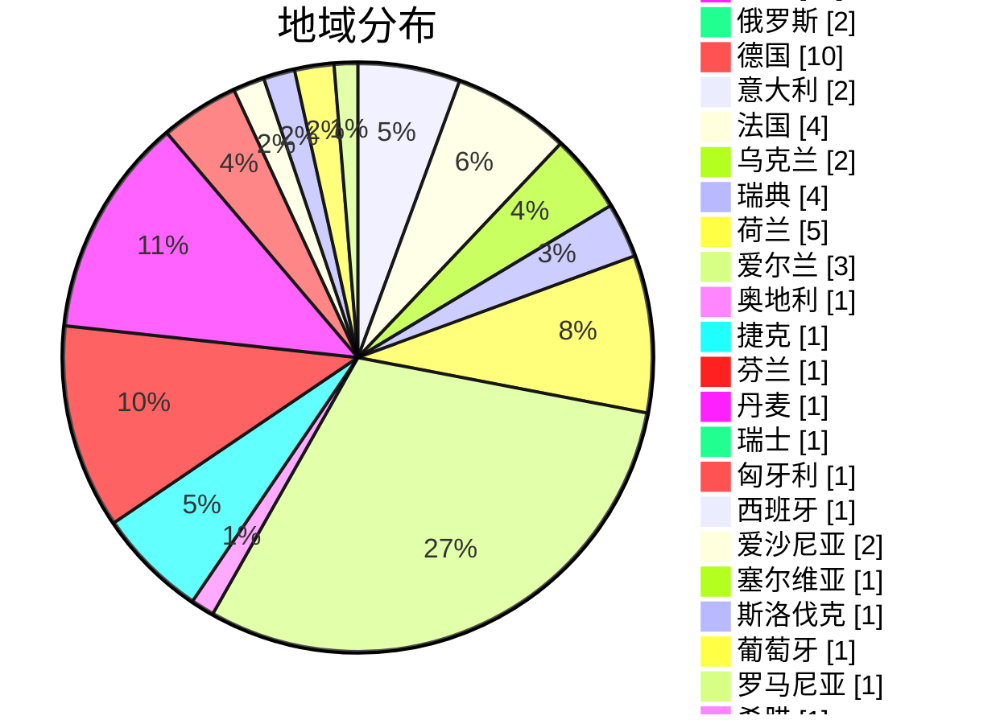
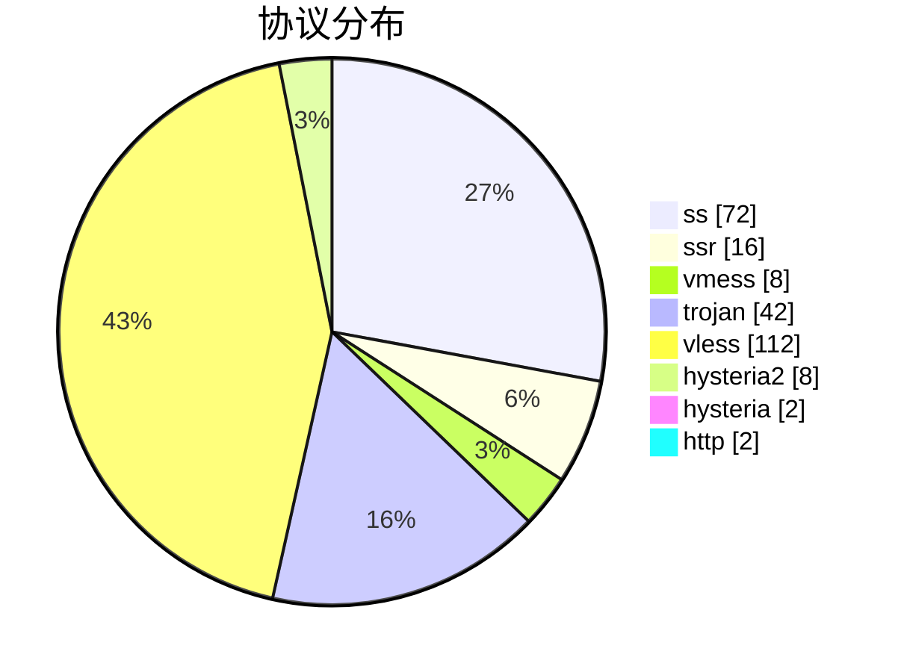

```mermaid
pie showData
title 延迟分布
"98-198ms" : 13
"198-298ms" : 35
"298-398ms" : 27
"398-498ms" : 31
"498-598ms" : 48
"598-698ms" : 59
"698-798ms" : 49
```

```mermaid
pie showData
title 地域分布
"香港" : 13
"日本" : 15
"新加坡" : 10
"英国" : 7
"台湾" : 20
"未知" : 70
"Cloudflare" : 3
"韩国" : 14
"波兰" : 26
"美国" : 28
"俄罗斯" : 2
"德国" : 10
"意大利" : 2
"法国" : 4
"乌克兰" : 2
"瑞典" : 4
"荷兰" : 5
"爱尔兰" : 3
"奥地利" : 1
"捷克" : 1
"芬兰" : 1
"丹麦" : 1
"瑞士" : 1
"匈牙利" : 1
"西班牙" : 1
"爱沙尼亚" : 2
"塞尔维亚" : 1
"斯洛伐克" : 1
"葡萄牙" : 1
"罗马尼亚" : 1
"希腊" : 1
"阿联酋" : 1
"冰岛" : 1
"保加利亚" : 1
"哈萨克斯坦" : 1
"哥伦比亚" : 2
"拉脱维亚" : 1
"立陶宛" : 1
"挪威" : 1
"土耳其" : 1
```

```mermaid
pie showData
title 协议分布
"ss" : 72
"ssr" : 16
"vmess" : 8
"trojan" : 42
"vless" : 112
"hysteria2" : 8
"hysteria" : 2
"http" : 2
```