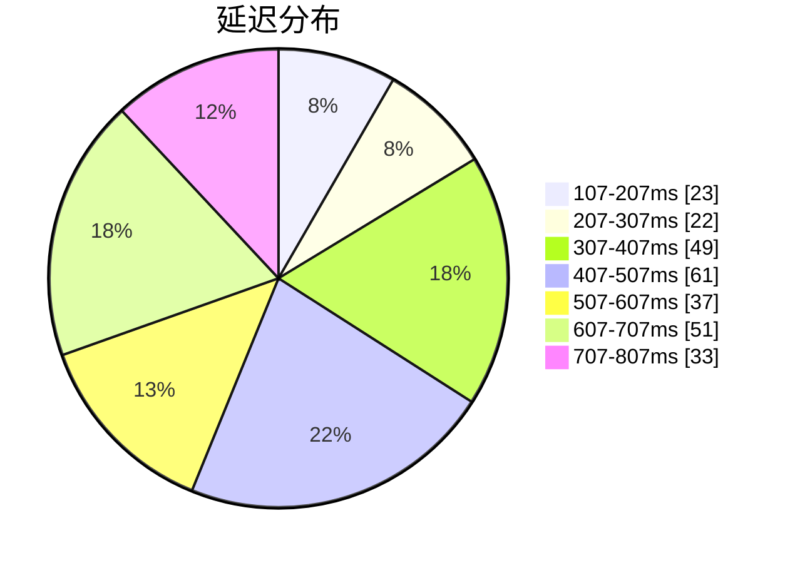
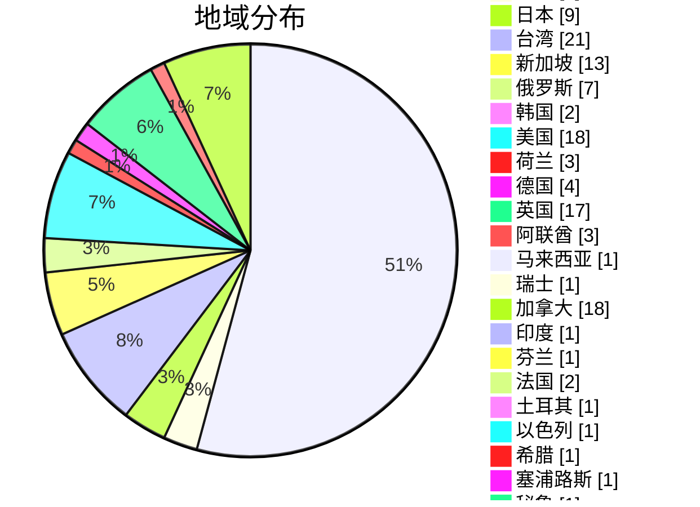
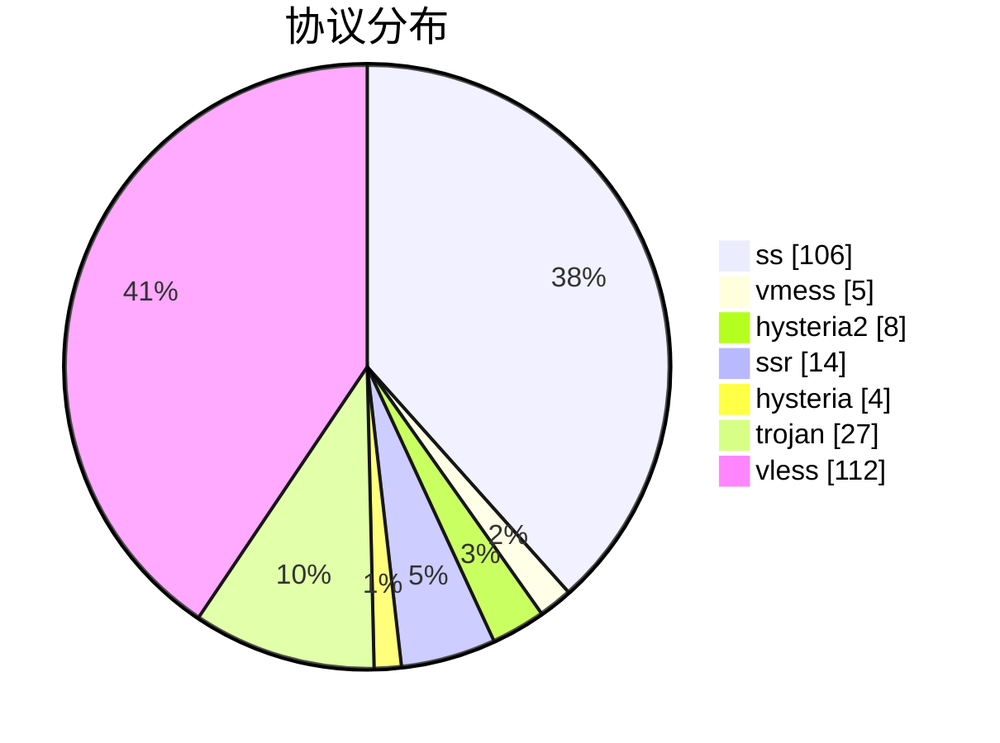

```mermaid
pie showData
title 延迟分布
"107-207ms" : 23
"207-307ms" : 22
"307-407ms" : 49
"407-507ms" : 61
"507-607ms" : 37
"607-707ms" : 51
"707-807ms" : 33
```

```mermaid
pie showData
title 地域分布
"未知" : 142
"香港" : 7
"日本" : 9
"台湾" : 21
"新加坡" : 13
"俄罗斯" : 7
"韩国" : 2
"美国" : 18
"荷兰" : 3
"德国" : 4
"英国" : 17
"阿联酋" : 3
"马来西亚" : 1
"瑞士" : 1
"加拿大" : 18
"印度" : 1
"芬兰" : 1
"法国" : 2
"土耳其" : 1
"以色列" : 1
"希腊" : 1
"塞浦路斯" : 1
"秘鲁" : 1
"印度尼西亚" : 1
```

```mermaid
pie showData
title 协议分布
"ss" : 106
"vmess" : 5
"hysteria2" : 8
"ssr" : 14
"hysteria" : 4
"trojan" : 27
"vless" : 112
```