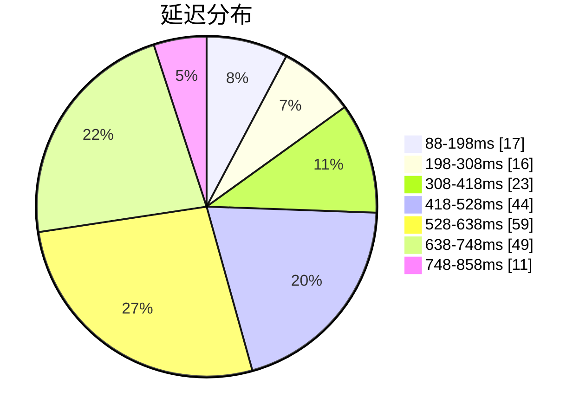
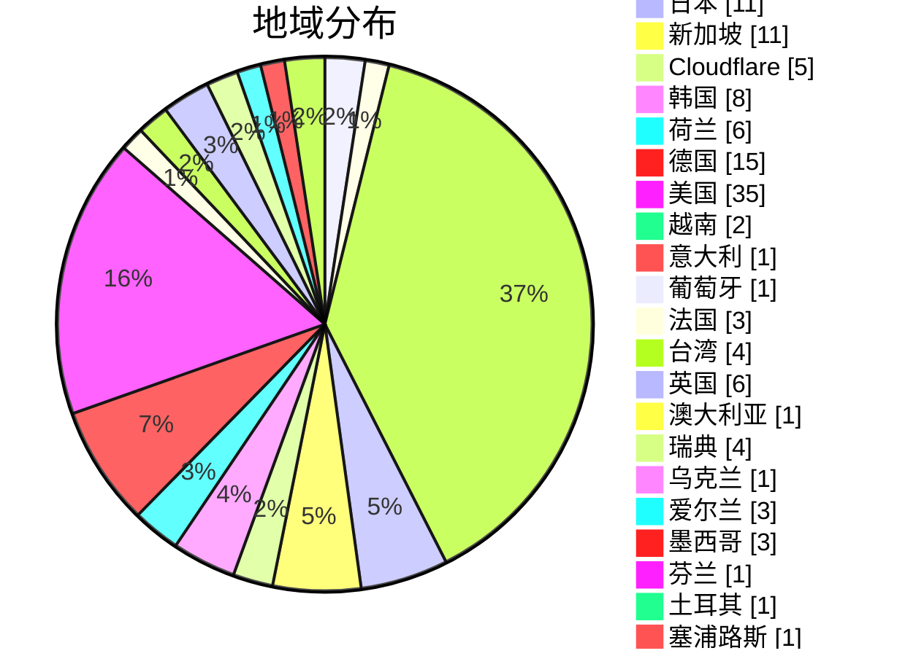
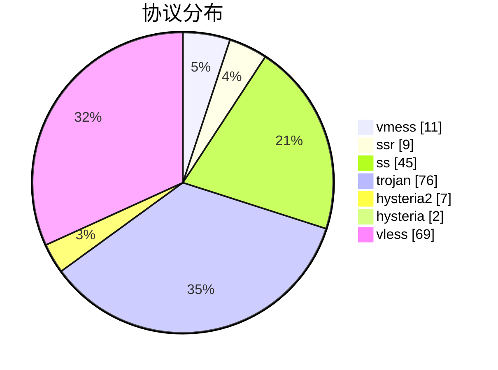

```mermaid
pie showData
title 延迟分布
"88-198ms" : 17
"198-308ms" : 16
"308-418ms" : 23
"418-528ms" : 44
"528-638ms" : 59
"638-748ms" : 49
"748-858ms" : 11
```

```mermaid
pie showData
title 地域分布
"中国" : 5
"香港" : 3
"未知" : 80
"日本" : 11
"新加坡" : 11
"Cloudflare" : 5
"韩国" : 8
"荷兰" : 6
"德国" : 15
"美国" : 35
"越南" : 2
"意大利" : 1
"葡萄牙" : 1
"法国" : 3
"台湾" : 4
"英国" : 6
"澳大利亚" : 1
"瑞典" : 4
"乌克兰" : 1
"爱尔兰" : 3
"墨西哥" : 3
"芬兰" : 1
"土耳其" : 1
"塞浦路斯" : 1
"加拿大" : 2
"捷克" : 1
"印度" : 5
```

```mermaid
pie showData
title 协议分布
"vmess" : 11
"ssr" : 9
"ss" : 45
"trojan" : 76
"hysteria2" : 7
"hysteria" : 2
"vless" : 69
```