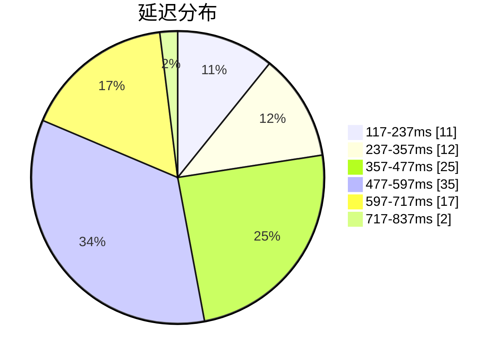
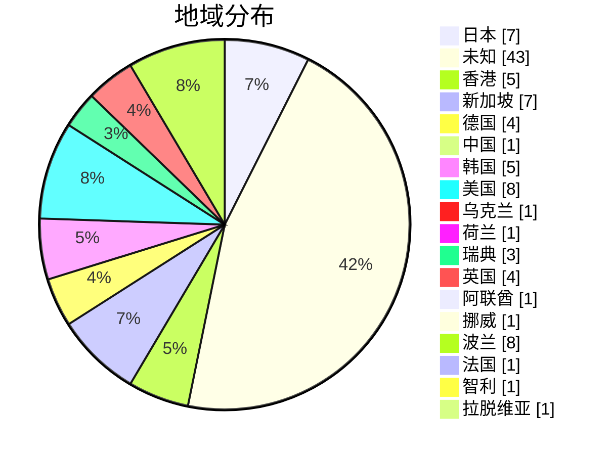
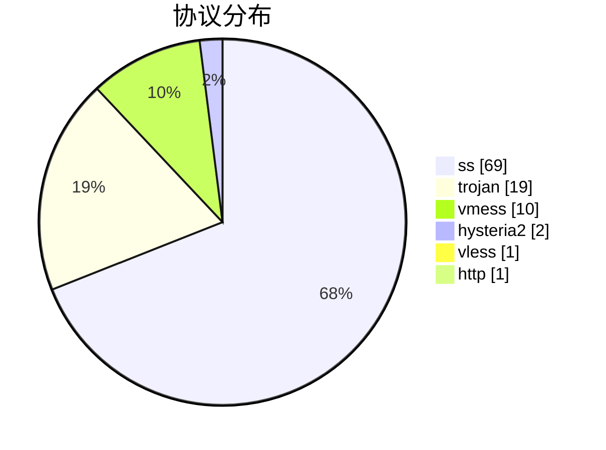

```mermaid
pie showData
title 延迟分布
"117-237ms" : 11
"237-357ms" : 12
"357-477ms" : 25
"477-597ms" : 35
"597-717ms" : 17
"717-837ms" : 2
```

```mermaid
pie showData
title 地域分布
"日本" : 7
"未知" : 43
"香港" : 5
"新加坡" : 7
"德国" : 4
"中国" : 1
"韩国" : 5
"美国" : 8
"乌克兰" : 1
"荷兰" : 1
"瑞典" : 3
"英国" : 4
"阿联酋" : 1
"挪威" : 1
"波兰" : 8
"法国" : 1
"智利" : 1
"拉脱维亚" : 1
```

```mermaid
pie showData
title 协议分布
"ss" : 69
"trojan" : 19
"vmess" : 10
"hysteria2" : 2
"vless" : 1
"http" : 1
```