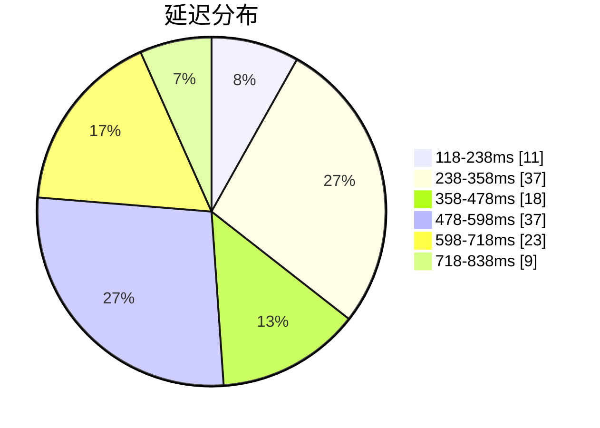
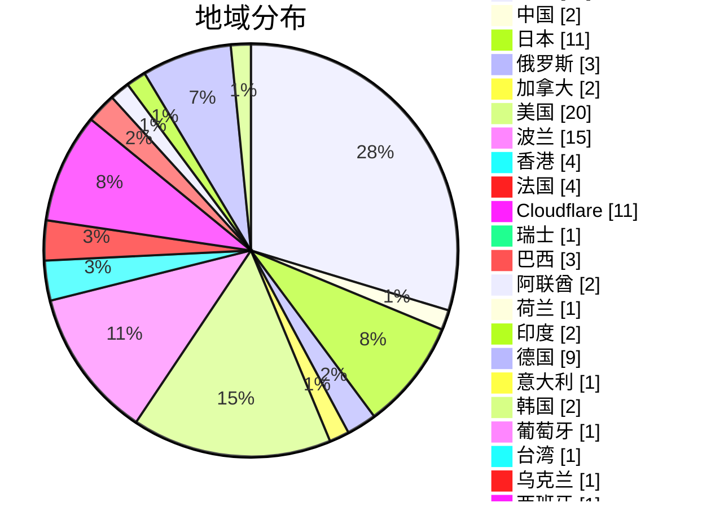
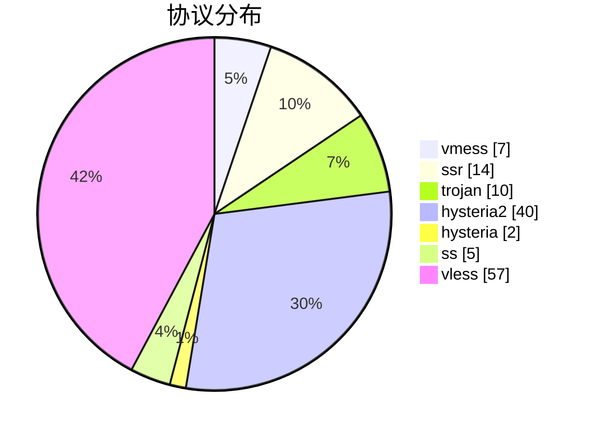

```mermaid
pie showData
title 延迟分布
"118-238ms" : 11
"238-358ms" : 37
"358-478ms" : 18
"478-598ms" : 37
"598-718ms" : 23
"718-838ms" : 9
```

```mermaid
pie showData
title 地域分布
"未知" : 38
"中国" : 2
"日本" : 11
"俄罗斯" : 3
"加拿大" : 2
"美国" : 20
"波兰" : 15
"香港" : 4
"法国" : 4
"Cloudflare" : 11
"瑞士" : 1
"巴西" : 3
"阿联酋" : 2
"荷兰" : 1
"印度" : 2
"德国" : 9
"意大利" : 1
"韩国" : 2
"葡萄牙" : 1
"台湾" : 1
"乌克兰" : 1
"西班牙" : 1
```

```mermaid
pie showData
title 协议分布
"vmess" : 7
"ssr" : 14
"trojan" : 10
"hysteria2" : 40
"hysteria" : 2
"ss" : 5
"vless" : 57
```