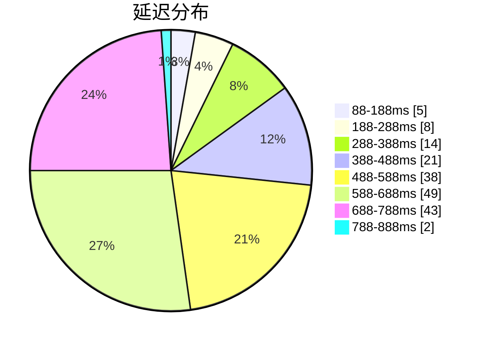
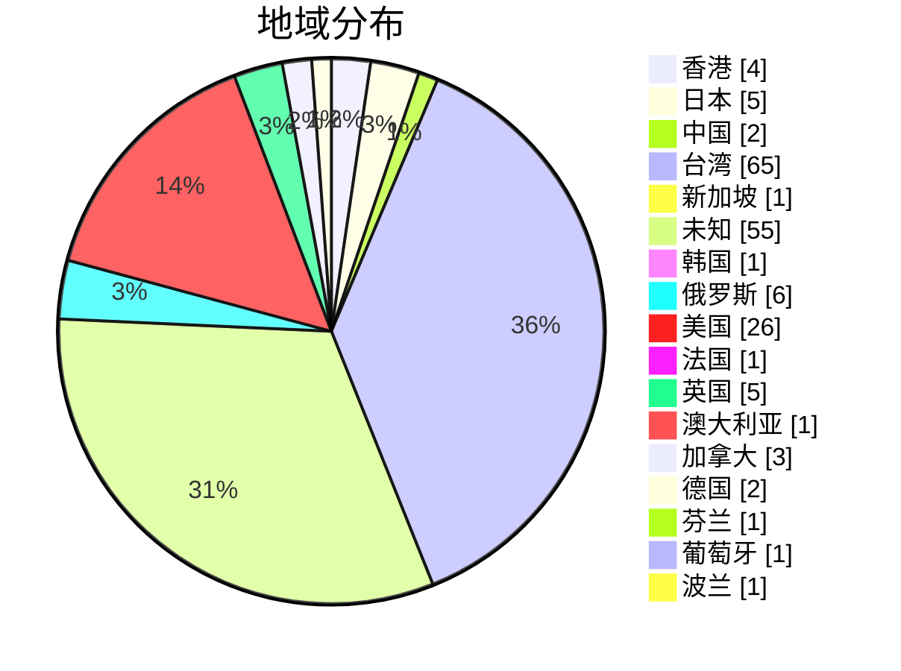
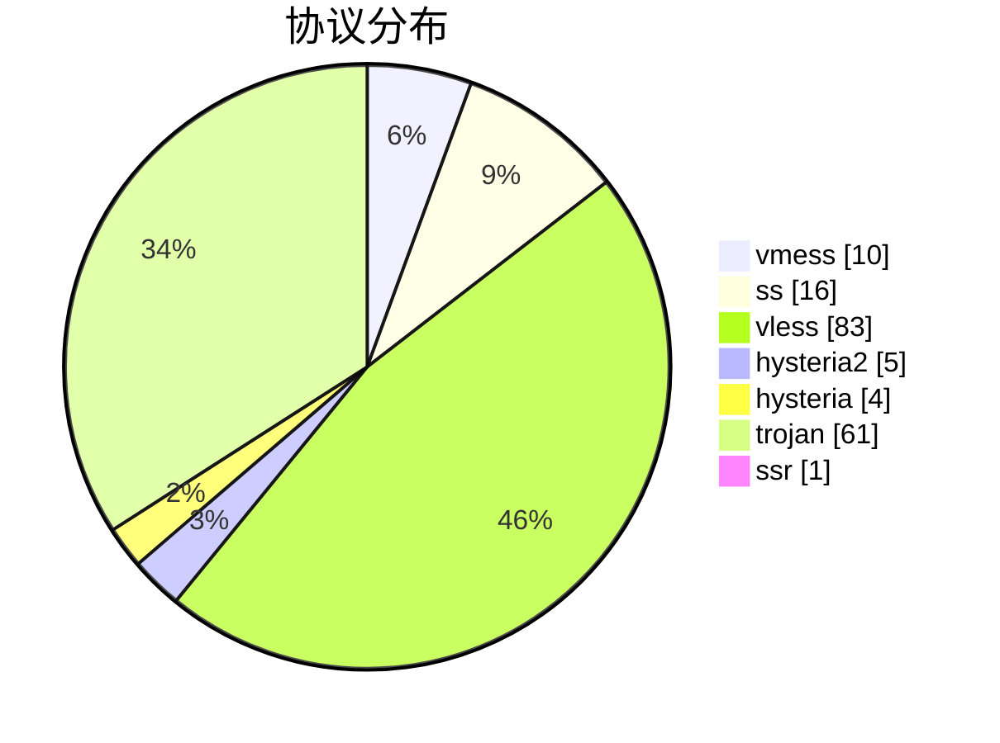

```mermaid
pie showData
title 延迟分布
"88-188ms" : 5
"188-288ms" : 8
"288-388ms" : 14
"388-488ms" : 21
"488-588ms" : 38
"588-688ms" : 49
"688-788ms" : 43
"788-888ms" : 2
```

```mermaid
pie showData
title 地域分布
"香港" : 4
"日本" : 5
"中国" : 2
"台湾" : 65
"新加坡" : 1
"未知" : 55
"韩国" : 1
"俄罗斯" : 6
"美国" : 26
"法国" : 1
"英国" : 5
"澳大利亚" : 1
"加拿大" : 3
"德国" : 2
"芬兰" : 1
"葡萄牙" : 1
"波兰" : 1
```

```mermaid
pie showData
title 协议分布
"vmess" : 10
"ss" : 16
"vless" : 83
"hysteria2" : 5
"hysteria" : 4
"trojan" : 61
"ssr" : 1
```