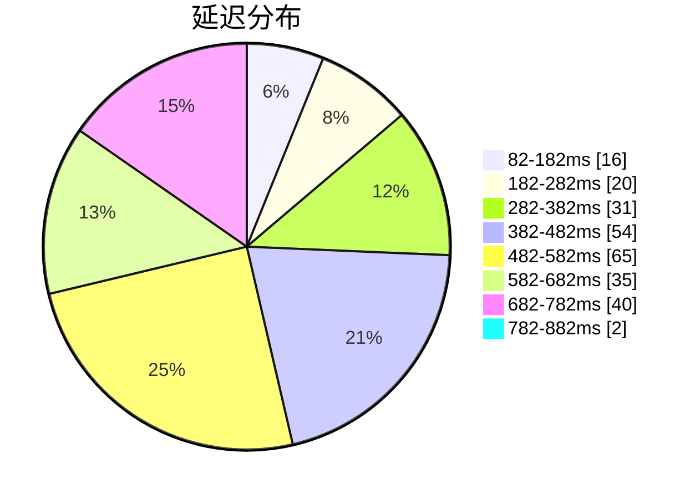
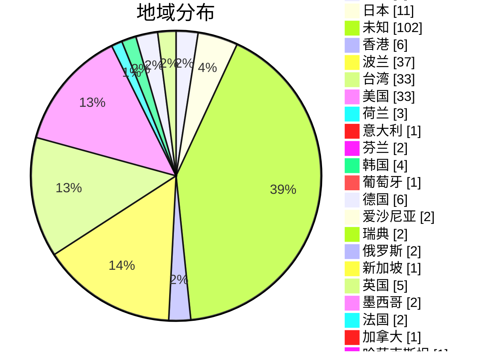
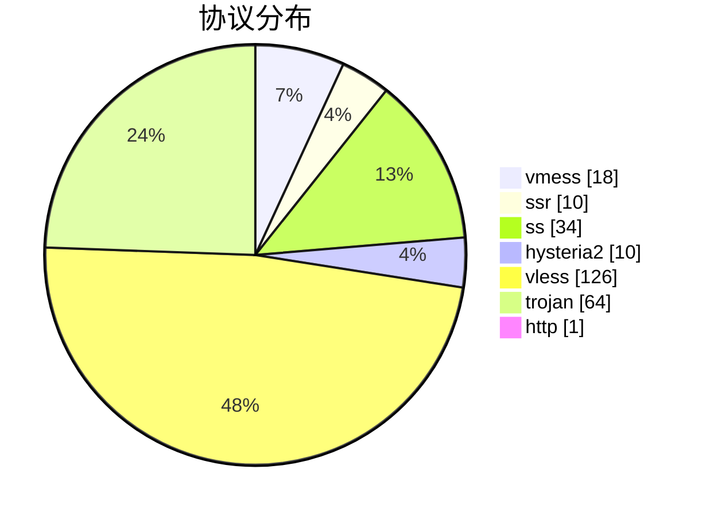

```mermaid
pie showData
title 延迟分布
"82-182ms" : 16
"182-282ms" : 20
"282-382ms" : 31
"382-482ms" : 54
"482-582ms" : 65
"582-682ms" : 35
"682-782ms" : 40
"782-882ms" : 2
```

```mermaid
pie showData
title 地域分布
"中国" : 6
"日本" : 11
"未知" : 102
"香港" : 6
"波兰" : 37
"台湾" : 33
"美国" : 33
"荷兰" : 3
"意大利" : 1
"芬兰" : 2
"韩国" : 4
"葡萄牙" : 1
"德国" : 6
"爱沙尼亚" : 2
"瑞典" : 2
"俄罗斯" : 2
"新加坡" : 1
"英国" : 5
"墨西哥" : 2
"法国" : 2
"加拿大" : 1
"哈萨克斯坦" : 1
```

```mermaid
pie showData
title 协议分布
"vmess" : 18
"ssr" : 10
"ss" : 34
"hysteria2" : 10
"vless" : 126
"trojan" : 64
"http" : 1
```