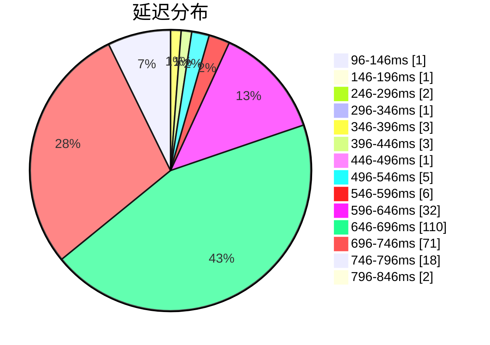
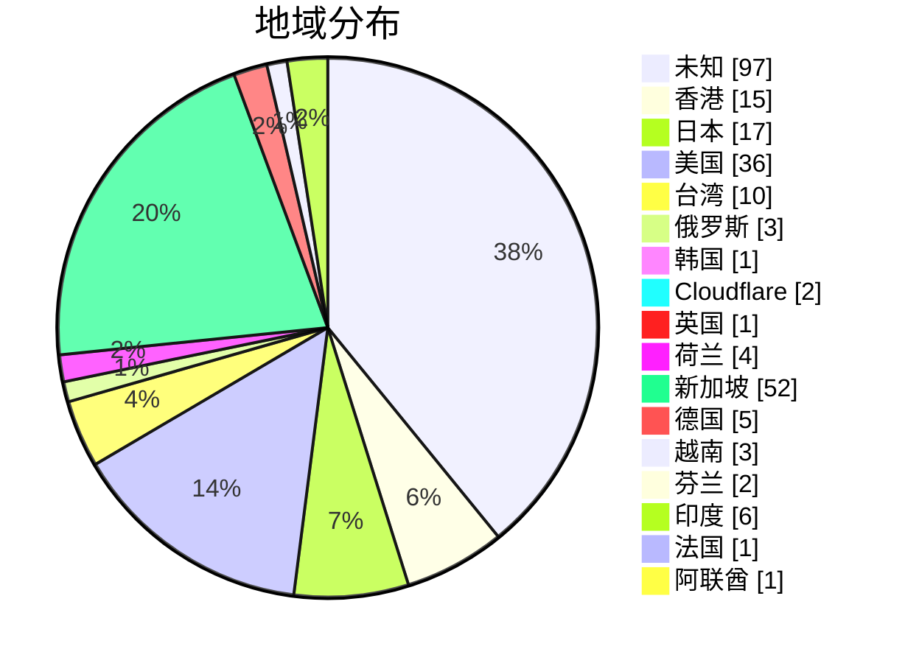
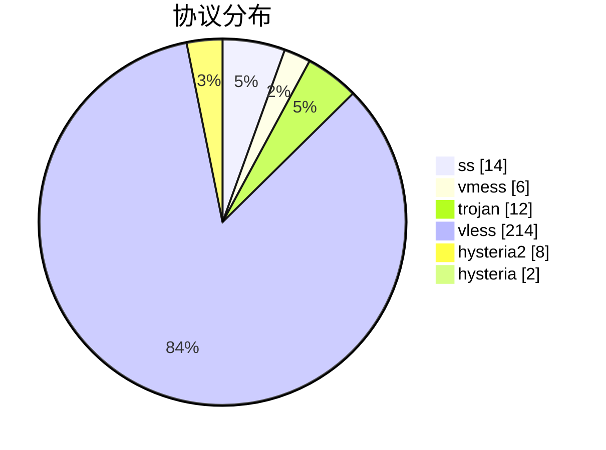

```mermaid
pie showData
title 延迟分布
"96-146ms" : 1
"146-196ms" : 1
"246-296ms" : 2
"296-346ms" : 1
"346-396ms" : 3
"396-446ms" : 3
"446-496ms" : 1
"496-546ms" : 5
"546-596ms" : 6
"596-646ms" : 32
"646-696ms" : 110
"696-746ms" : 71
"746-796ms" : 18
"796-846ms" : 2
```

```mermaid
pie showData
title 地域分布
"未知" : 97
"香港" : 15
"日本" : 17
"美国" : 36
"台湾" : 10
"俄罗斯" : 3
"韩国" : 1
"Cloudflare" : 2
"英国" : 1
"荷兰" : 4
"新加坡" : 52
"德国" : 5
"越南" : 3
"芬兰" : 2
"印度" : 6
"法国" : 1
"阿联酋" : 1
```

```mermaid
pie showData
title 协议分布
"ss" : 14
"vmess" : 6
"trojan" : 12
"vless" : 214
"hysteria2" : 8
"hysteria" : 2
```