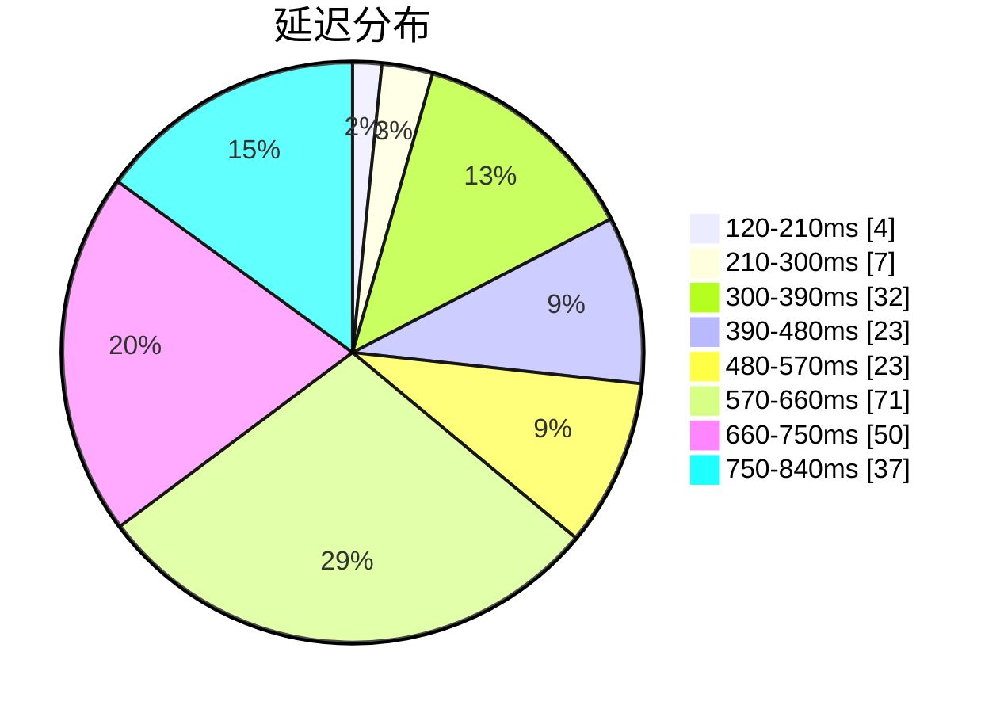
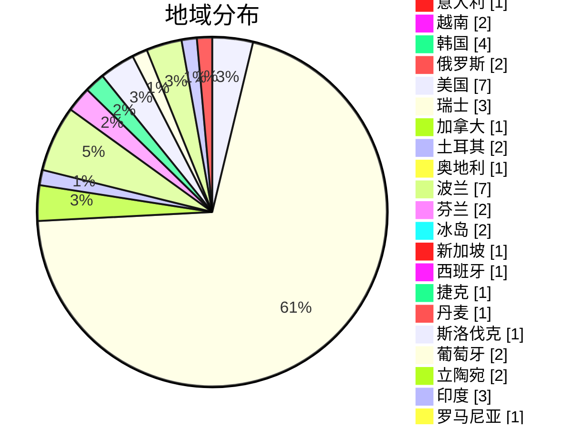
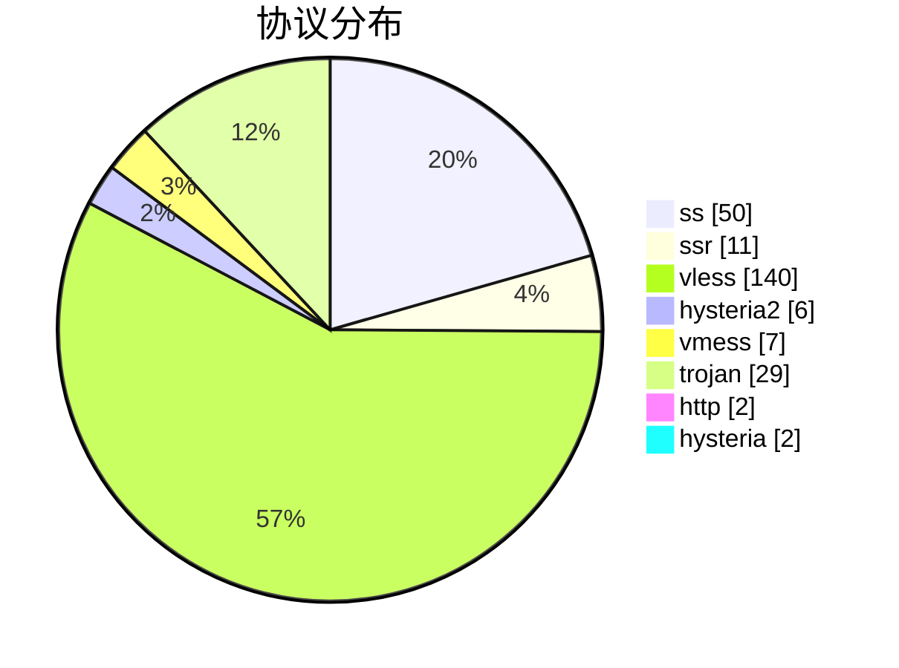

```mermaid
pie showData
title 延迟分布
"120-210ms" : 4
"210-300ms" : 7
"300-390ms" : 32
"390-480ms" : 23
"480-570ms" : 23
"570-660ms" : 71
"660-750ms" : 50
"750-840ms" : 37
```

```mermaid
pie showData
title 地域分布
"日本" : 8
"未知" : 150
"香港" : 7
"荷兰" : 3
"Cloudflare" : 2
"台湾" : 13
"德国" : 5
"法国" : 1
"意大利" : 1
"越南" : 2
"韩国" : 4
"俄罗斯" : 2
"美国" : 7
"瑞士" : 3
"加拿大" : 1
"土耳其" : 2
"奥地利" : 1
"波兰" : 7
"芬兰" : 2
"冰岛" : 2
"新加坡" : 1
"西班牙" : 1
"捷克" : 1
"丹麦" : 1
"斯洛伐克" : 1
"葡萄牙" : 2
"立陶宛" : 2
"印度" : 3
"罗马尼亚" : 1
"英国" : 2
"乌克兰" : 1
"爱尔兰" : 1
"孟加拉国" : 3
"爱沙尼亚" : 1
"摩尔多瓦" : 1
"挪威" : 1
"保加利亚" : 1
```

```mermaid
pie showData
title 协议分布
"ss" : 50
"ssr" : 11
"vless" : 140
"hysteria2" : 6
"vmess" : 7
"trojan" : 29
"http" : 2
"hysteria" : 2
```