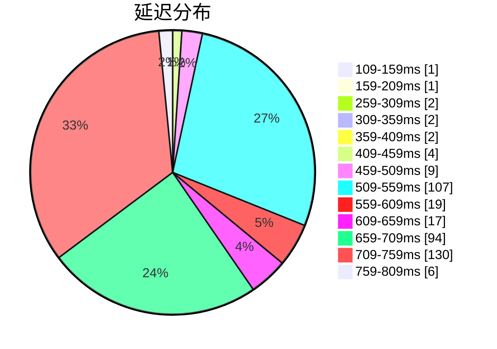
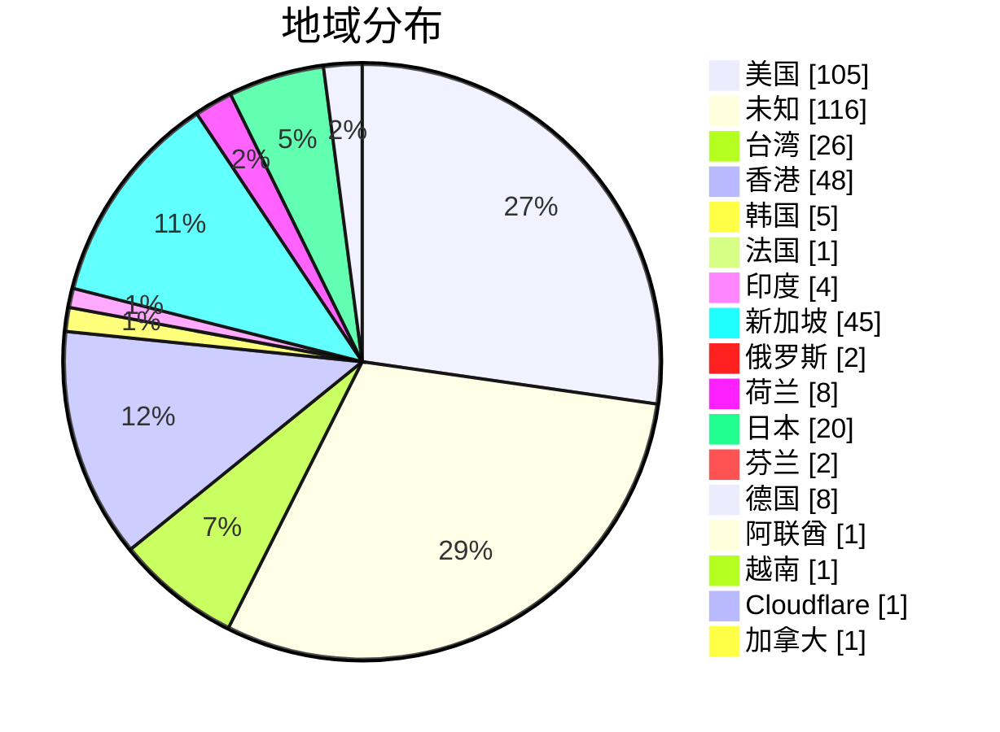
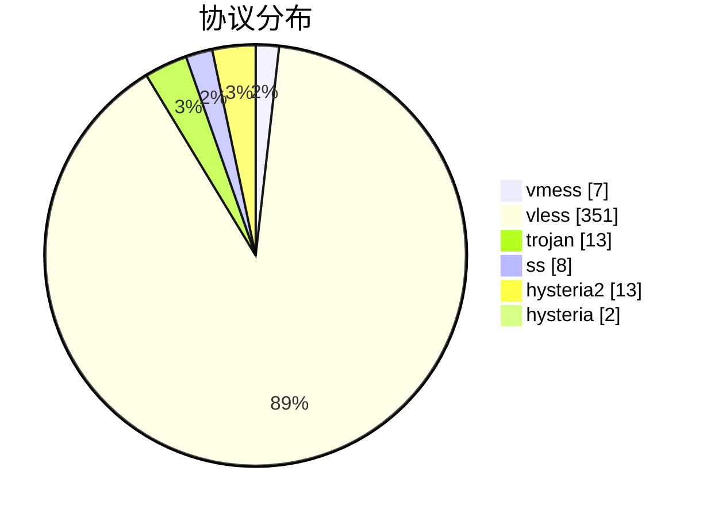

```mermaid
pie showData
title 延迟分布
"109-159ms" : 1
"159-209ms" : 1
"259-309ms" : 2
"309-359ms" : 2
"359-409ms" : 2
"409-459ms" : 4
"459-509ms" : 9
"509-559ms" : 107
"559-609ms" : 19
"609-659ms" : 17
"659-709ms" : 94
"709-759ms" : 130
"759-809ms" : 6
```

```mermaid
pie showData
title 地域分布
"美国" : 105
"未知" : 116
"台湾" : 26
"香港" : 48
"韩国" : 5
"法国" : 1
"印度" : 4
"新加坡" : 45
"俄罗斯" : 2
"荷兰" : 8
"日本" : 20
"芬兰" : 2
"德国" : 8
"阿联酋" : 1
"越南" : 1
"Cloudflare" : 1
"加拿大" : 1
```

```mermaid
pie showData
title 协议分布
"vmess" : 7
"vless" : 351
"trojan" : 13
"ss" : 8
"hysteria2" : 13
"hysteria" : 2
```