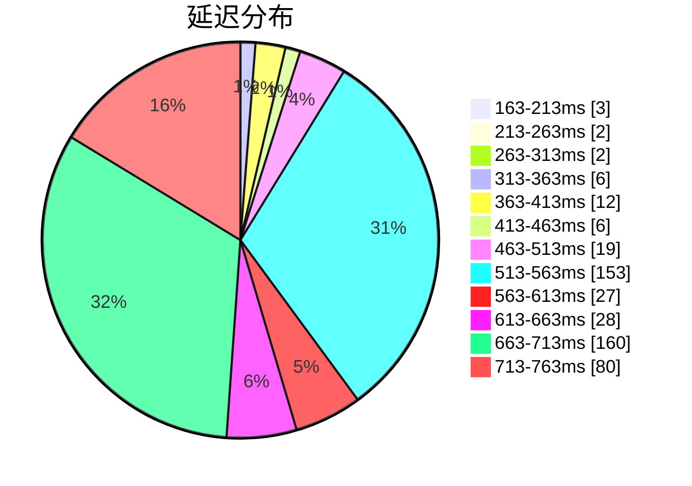
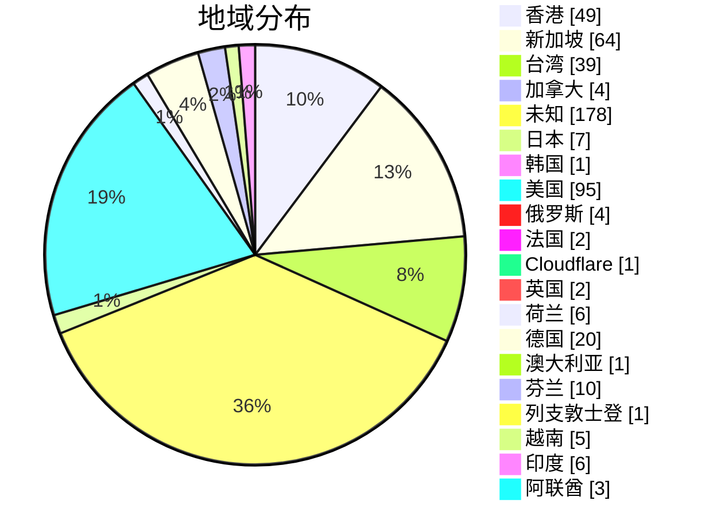
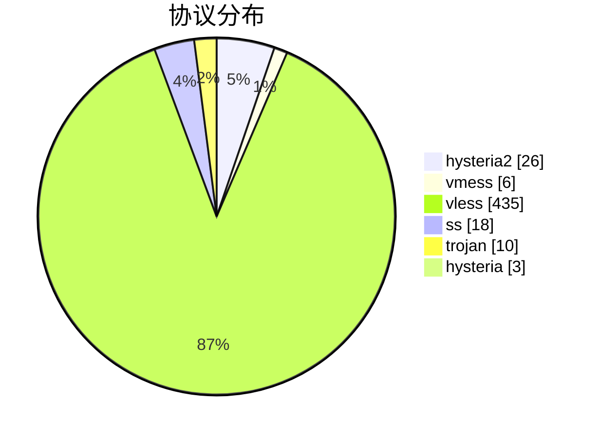

```mermaid
pie showData
title 延迟分布
"163-213ms" : 3
"213-263ms" : 2
"263-313ms" : 2
"313-363ms" : 6
"363-413ms" : 12
"413-463ms" : 6
"463-513ms" : 19
"513-563ms" : 153
"563-613ms" : 27
"613-663ms" : 28
"663-713ms" : 160
"713-763ms" : 80
```

```mermaid
pie showData
title 地域分布
"香港" : 49
"新加坡" : 64
"台湾" : 39
"加拿大" : 4
"未知" : 178
"日本" : 7
"韩国" : 1
"美国" : 95
"俄罗斯" : 4
"法国" : 2
"Cloudflare" : 1
"英国" : 2
"荷兰" : 6
"德国" : 20
"澳大利亚" : 1
"芬兰" : 10
"列支敦士登" : 1
"越南" : 5
"印度" : 6
"阿联酋" : 3
```

```mermaid
pie showData
title 协议分布
"hysteria2" : 26
"vmess" : 6
"vless" : 435
"ss" : 18
"trojan" : 10
"hysteria" : 3
```