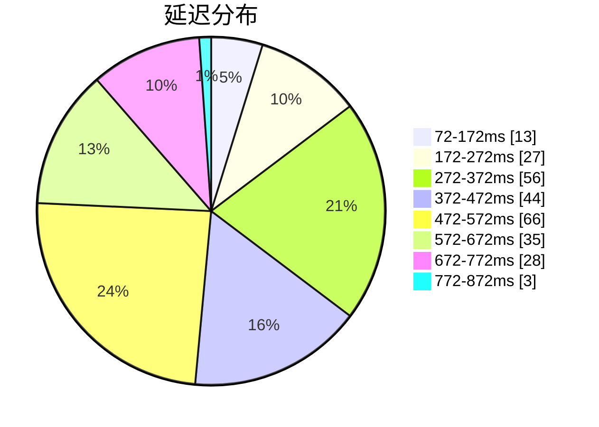
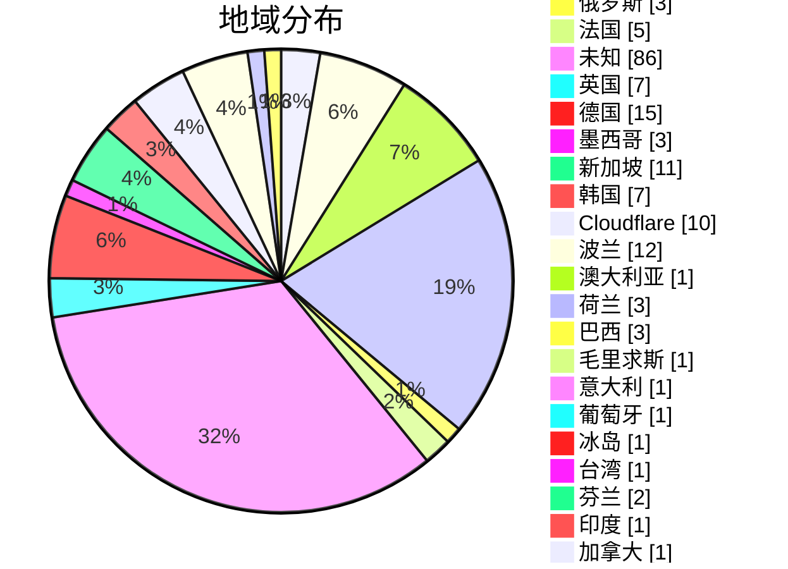
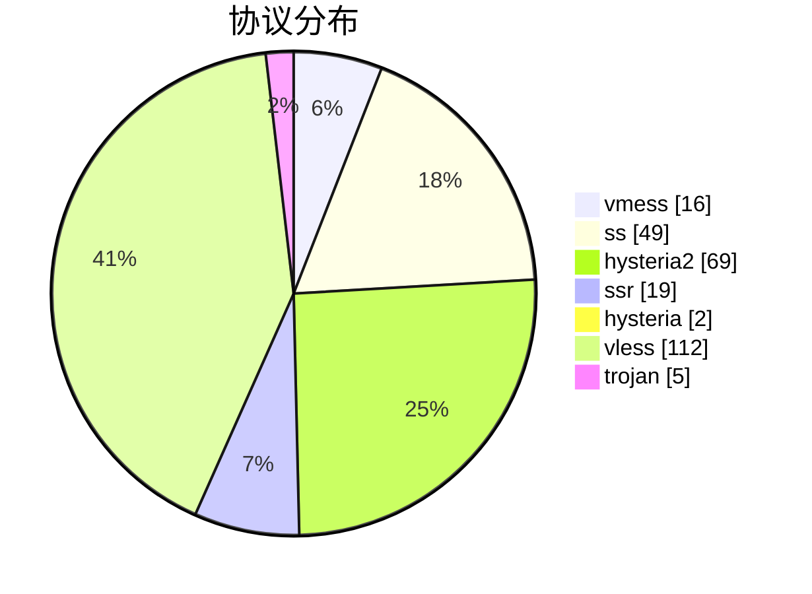

```mermaid
pie showData
title 延迟分布
"72-172ms" : 13
"172-272ms" : 27
"272-372ms" : 56
"372-472ms" : 44
"472-572ms" : 66
"572-672ms" : 35
"672-772ms" : 28
"772-872ms" : 3
```

```mermaid
pie showData
title 地域分布
"中国" : 7
"日本" : 16
"香港" : 19
"美国" : 51
"俄罗斯" : 3
"法国" : 5
"未知" : 86
"英国" : 7
"德国" : 15
"墨西哥" : 3
"新加坡" : 11
"韩国" : 7
"Cloudflare" : 10
"波兰" : 12
"澳大利亚" : 1
"荷兰" : 3
"巴西" : 3
"毛里求斯" : 1
"意大利" : 1
"葡萄牙" : 1
"冰岛" : 1
"台湾" : 1
"芬兰" : 2
"印度" : 1
"加拿大" : 1
"爱尔兰" : 1
"爱沙尼亚" : 1
"哥伦比亚" : 1
"乌克兰" : 1
```

```mermaid
pie showData
title 协议分布
"vmess" : 16
"ss" : 49
"hysteria2" : 69
"ssr" : 19
"hysteria" : 2
"vless" : 112
"trojan" : 5
```