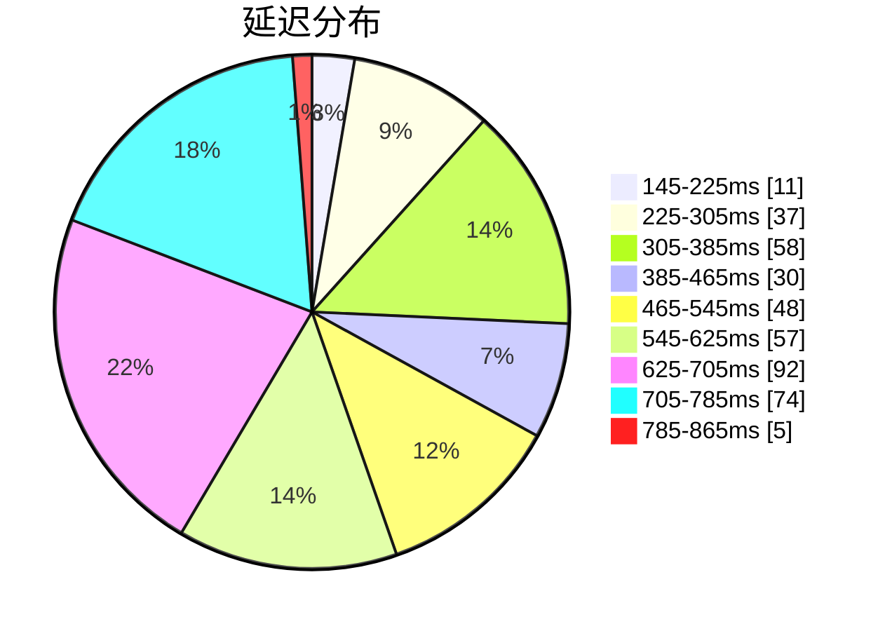
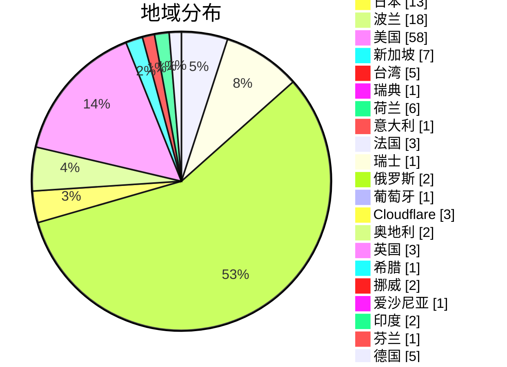
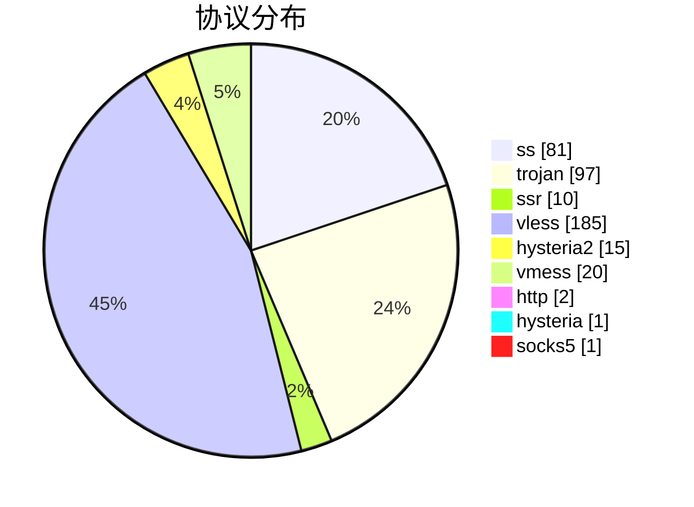

```mermaid
pie showData
title 延迟分布
"145-225ms" : 11
"225-305ms" : 37
"305-385ms" : 58
"385-465ms" : 30
"465-545ms" : 48
"545-625ms" : 57
"625-705ms" : 92
"705-785ms" : 74
"785-865ms" : 5
```

```mermaid
pie showData
title 地域分布
"香港" : 19
"韩国" : 32
"未知" : 217
"印度尼西亚" : 1
"日本" : 13
"波兰" : 18
"美国" : 58
"新加坡" : 7
"台湾" : 5
"瑞典" : 1
"荷兰" : 6
"意大利" : 1
"法国" : 3
"瑞士" : 1
"俄罗斯" : 2
"葡萄牙" : 1
"Cloudflare" : 3
"奥地利" : 2
"英国" : 3
"希腊" : 1
"挪威" : 2
"爱沙尼亚" : 1
"印度" : 2
"芬兰" : 1
"德国" : 5
"加拿大" : 3
"孟加拉国" : 2
"冰岛" : 1
"摩尔多瓦" : 1
```

```mermaid
pie showData
title 协议分布
"ss" : 81
"trojan" : 97
"ssr" : 10
"vless" : 185
"hysteria2" : 15
"vmess" : 20
"http" : 2
"hysteria" : 1
"socks5" : 1
```