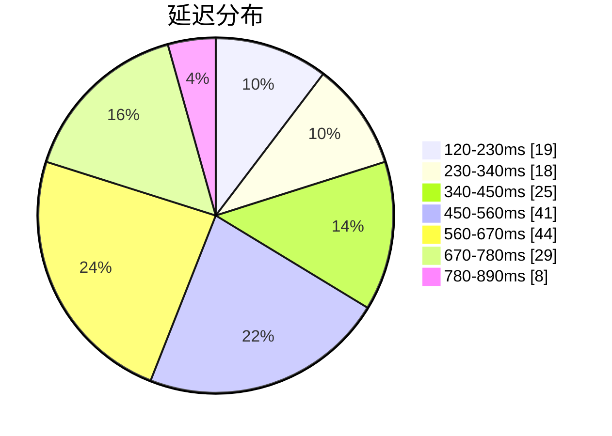
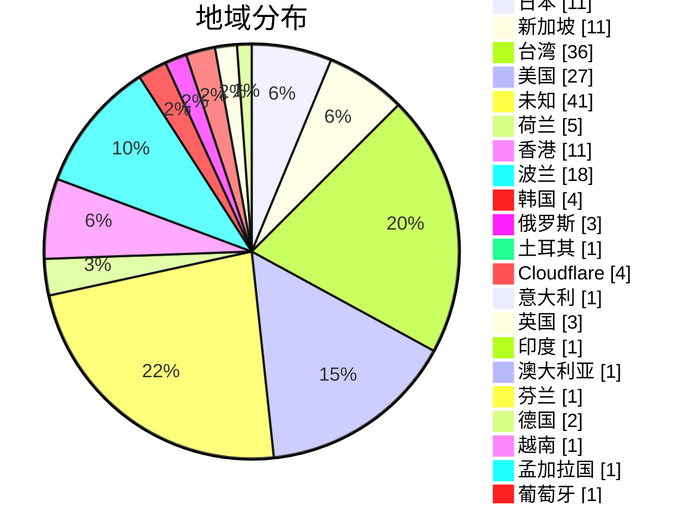
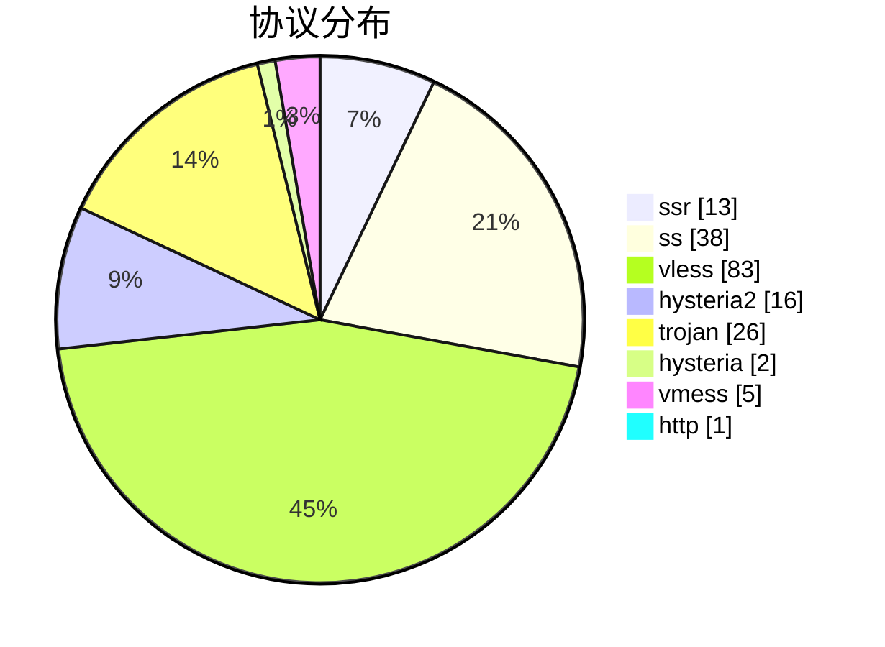

```mermaid
pie showData
title 延迟分布
"120-230ms" : 19
"230-340ms" : 18
"340-450ms" : 25
"450-560ms" : 41
"560-670ms" : 44
"670-780ms" : 29
"780-890ms" : 8
```

```mermaid
pie showData
title 地域分布
"日本" : 11
"新加坡" : 11
"台湾" : 36
"美国" : 27
"未知" : 41
"荷兰" : 5
"香港" : 11
"波兰" : 18
"韩国" : 4
"俄罗斯" : 3
"土耳其" : 1
"Cloudflare" : 4
"意大利" : 1
"英国" : 3
"印度" : 1
"澳大利亚" : 1
"芬兰" : 1
"德国" : 2
"越南" : 1
"孟加拉国" : 1
"葡萄牙" : 1
```

```mermaid
pie showData
title 协议分布
"ssr" : 13
"ss" : 38
"vless" : 83
"hysteria2" : 16
"trojan" : 26
"hysteria" : 2
"vmess" : 5
"http" : 1
```