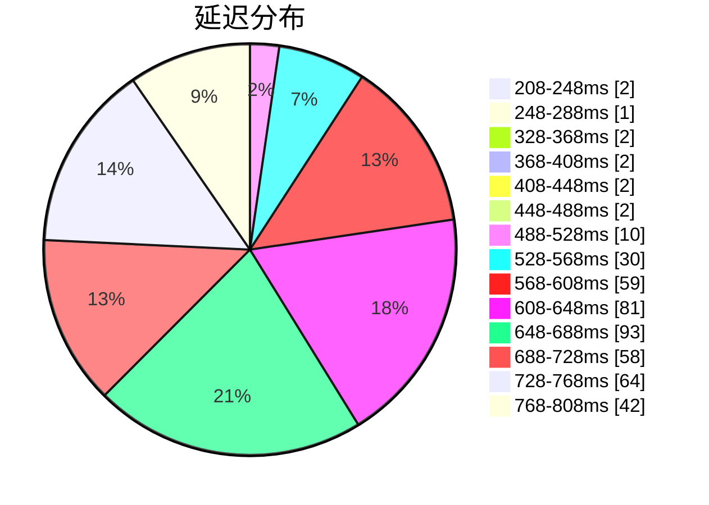
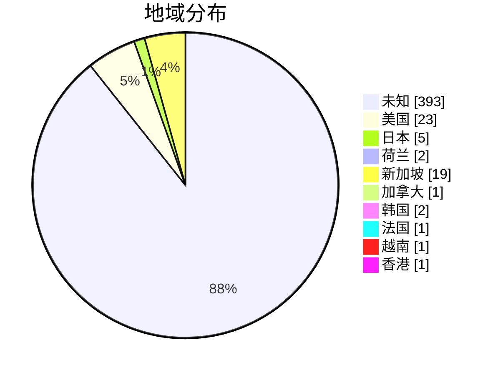
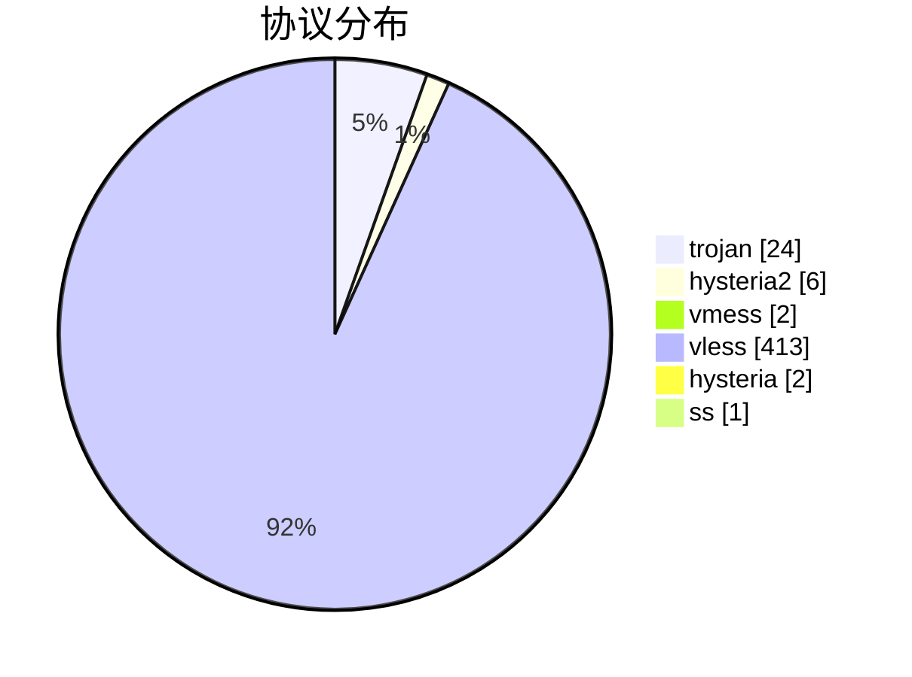

```mermaid
pie showData
title 延迟分布
"208-248ms" : 2
"248-288ms" : 1
"328-368ms" : 2
"368-408ms" : 2
"408-448ms" : 2
"448-488ms" : 2
"488-528ms" : 10
"528-568ms" : 30
"568-608ms" : 59
"608-648ms" : 81
"648-688ms" : 93
"688-728ms" : 58
"728-768ms" : 64
"768-808ms" : 42
```

```mermaid
pie showData
title 地域分布
"未知" : 393
"美国" : 23
"日本" : 5
"荷兰" : 2
"新加坡" : 19
"加拿大" : 1
"韩国" : 2
"法国" : 1
"越南" : 1
"香港" : 1
```

```mermaid
pie showData
title 协议分布
"trojan" : 24
"hysteria2" : 6
"vmess" : 2
"vless" : 413
"hysteria" : 2
"ss" : 1
```