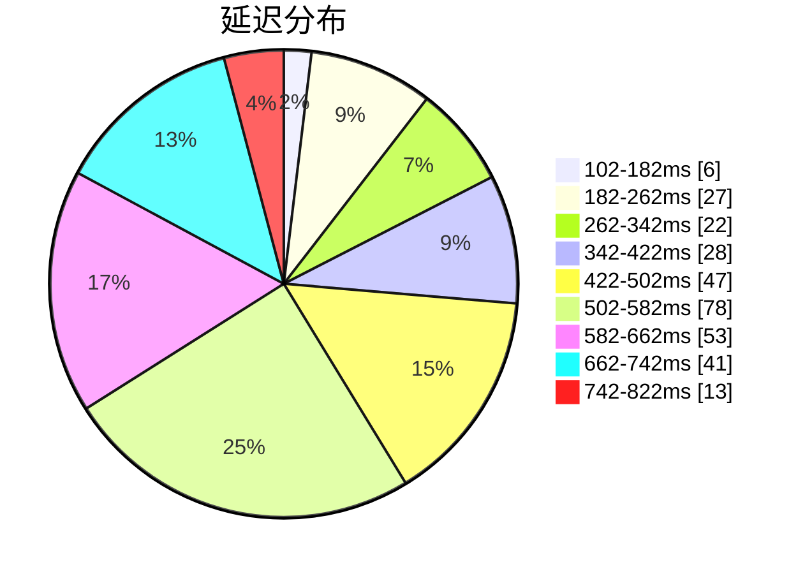
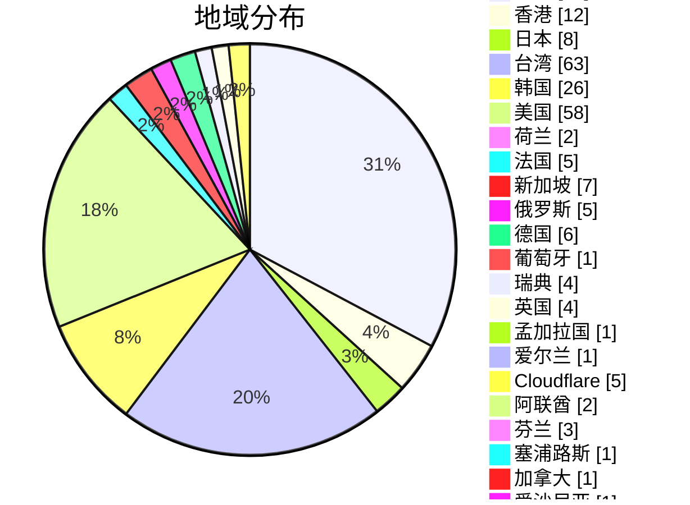
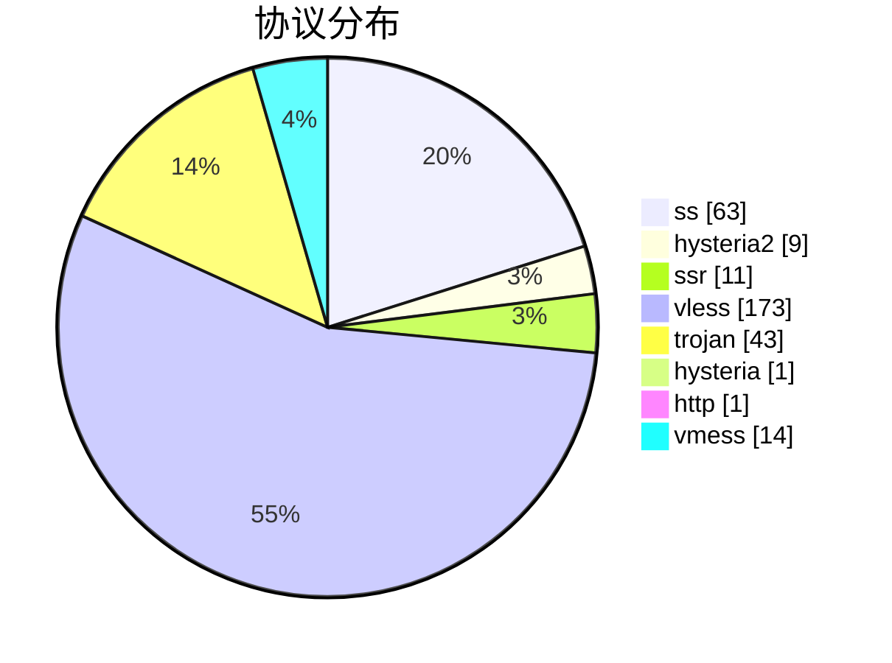

```mermaid
pie showData
title 延迟分布
"102-182ms" : 6
"182-262ms" : 27
"262-342ms" : 22
"342-422ms" : 28
"422-502ms" : 47
"502-582ms" : 78
"582-662ms" : 53
"662-742ms" : 41
"742-822ms" : 13
```

```mermaid
pie showData
title 地域分布
"未知" : 99
"香港" : 12
"日本" : 8
"台湾" : 63
"韩国" : 26
"美国" : 58
"荷兰" : 2
"法国" : 5
"新加坡" : 7
"俄罗斯" : 5
"德国" : 6
"葡萄牙" : 1
"瑞典" : 4
"英国" : 4
"孟加拉国" : 1
"爱尔兰" : 1
"Cloudflare" : 5
"阿联酋" : 2
"芬兰" : 3
"塞浦路斯" : 1
"加拿大" : 1
"爱沙尼亚" : 1
```

```mermaid
pie showData
title 协议分布
"ss" : 63
"hysteria2" : 9
"ssr" : 11
"vless" : 173
"trojan" : 43
"hysteria" : 1
"http" : 1
"vmess" : 14
```