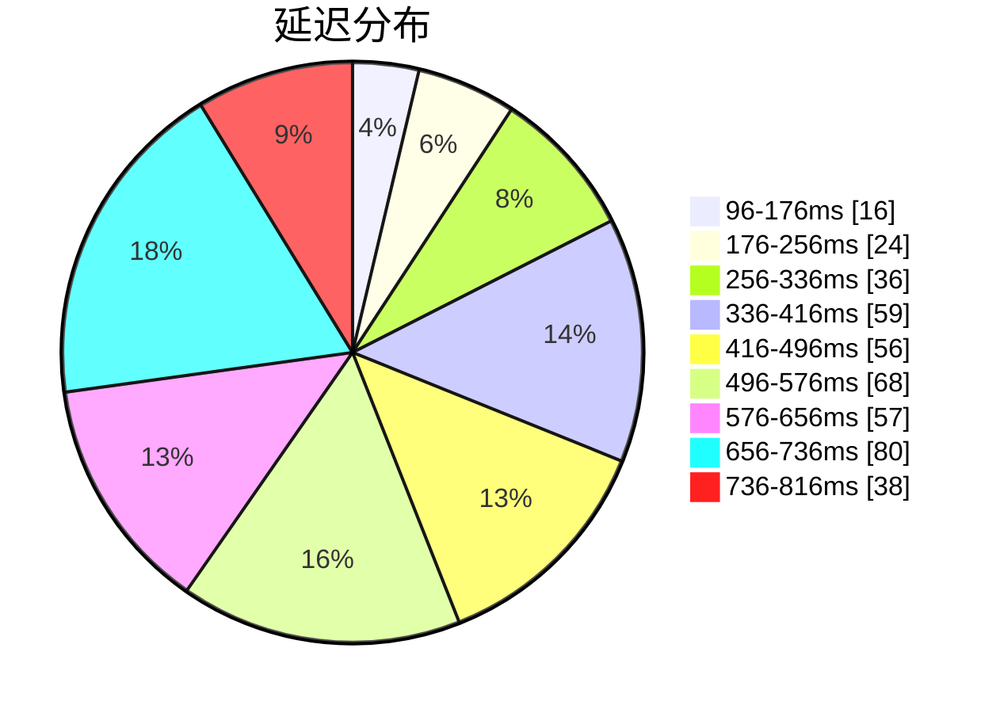
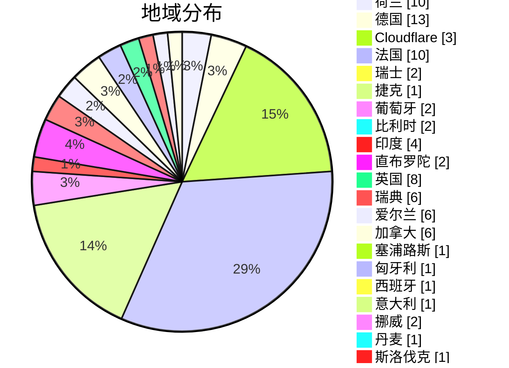
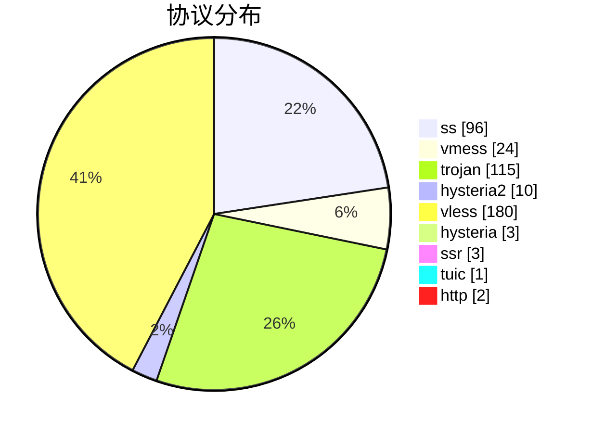

```mermaid
pie showData
title 延迟分布
"96-176ms" : 16
"176-256ms" : 24
"256-336ms" : 36
"336-416ms" : 59
"416-496ms" : 56
"496-576ms" : 68
"576-656ms" : 57
"656-736ms" : 80
"736-816ms" : 38
```

```mermaid
pie showData
title 地域分布
"香港" : 12
"日本" : 15
"美国" : 65
"未知" : 126
"印度尼西亚" : 2
"台湾" : 61
"新加坡" : 14
"中国" : 3
"俄罗斯" : 6
"波兰" : 16
"希腊" : 4
"韩国" : 11
"荷兰" : 10
"德国" : 13
"Cloudflare" : 3
"法国" : 10
"瑞士" : 2
"捷克" : 1
"葡萄牙" : 2
"比利时" : 2
"印度" : 4
"直布罗陀" : 2
"英国" : 8
"瑞典" : 6
"爱尔兰" : 6
"加拿大" : 6
"塞浦路斯" : 1
"匈牙利" : 1
"西班牙" : 1
"意大利" : 1
"挪威" : 2
"丹麦" : 1
"斯洛伐克" : 1
"芬兰" : 3
"罗马尼亚" : 1
"保加利亚" : 1
"乌克兰" : 1
"爱沙尼亚" : 2
"拉脱维亚" : 1
"智利" : 1
"土耳其" : 1
"墨西哥" : 1
"摩尔多瓦" : 1
"立陶宛" : 1
"孟加拉国" : 2
```

```mermaid
pie showData
title 协议分布
"ss" : 96
"vmess" : 24
"trojan" : 115
"hysteria2" : 10
"vless" : 180
"hysteria" : 3
"ssr" : 3
"tuic" : 1
"http" : 2
```