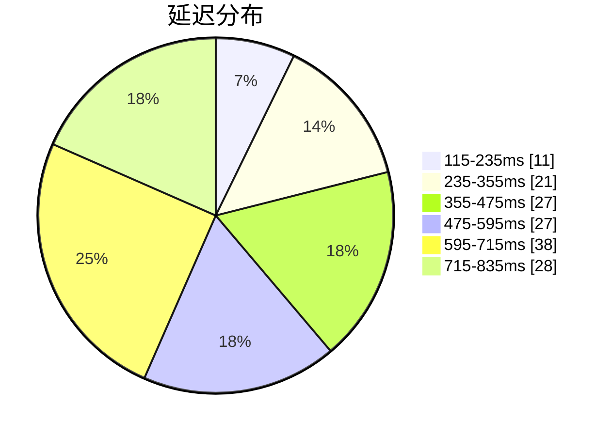
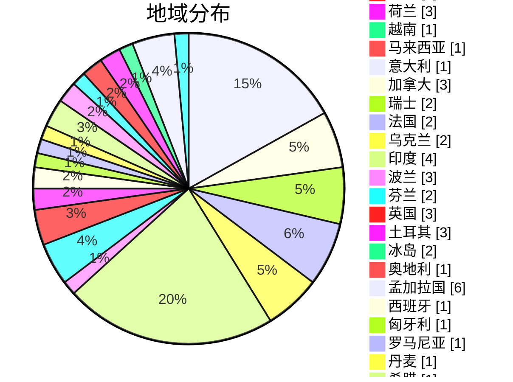
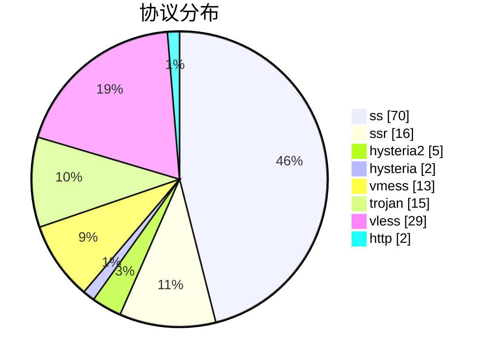

```mermaid
pie showData
title 延迟分布
"115-235ms" : 11
"235-355ms" : 21
"355-475ms" : 27
"475-595ms" : 27
"595-715ms" : 38
"715-835ms" : 28
```

```mermaid
pie showData
title 地域分布
"未知" : 23
"日本" : 8
"香港" : 8
"新加坡" : 9
"台湾" : 8
"美国" : 30
"俄罗斯" : 2
"韩国" : 6
"德国" : 5
"荷兰" : 3
"越南" : 1
"马来西亚" : 1
"意大利" : 1
"加拿大" : 3
"瑞士" : 2
"法国" : 2
"乌克兰" : 2
"印度" : 4
"波兰" : 3
"芬兰" : 2
"英国" : 3
"土耳其" : 3
"冰岛" : 2
"奥地利" : 1
"孟加拉国" : 6
"西班牙" : 1
"匈牙利" : 1
"罗马尼亚" : 1
"丹麦" : 1
"希腊" : 1
"爱尔兰" : 1
"爱沙尼亚" : 2
"保加利亚" : 1
"摩尔多瓦" : 1
"立陶宛" : 1
"拉脱维亚" : 1
"厄瓜多尔" : 1
"挪威" : 1
```

```mermaid
pie showData
title 协议分布
"ss" : 70
"ssr" : 16
"hysteria2" : 5
"hysteria" : 2
"vmess" : 13
"trojan" : 15
"vless" : 29
"http" : 2
```