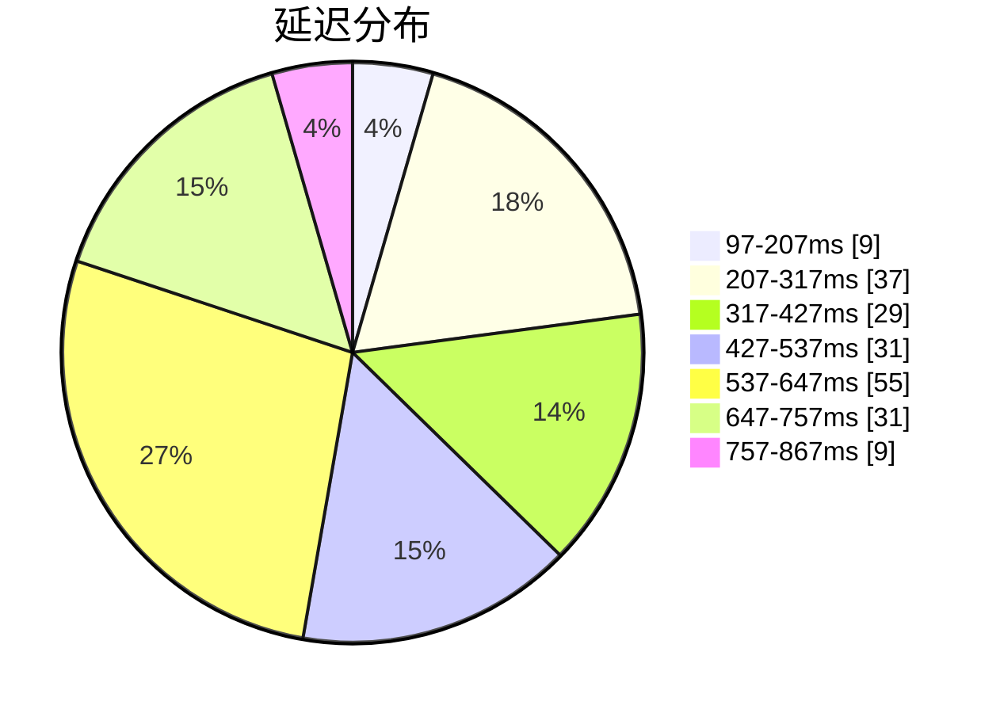
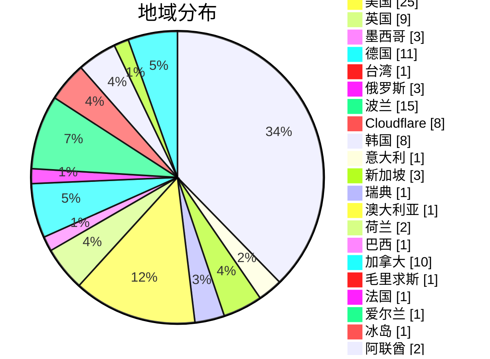
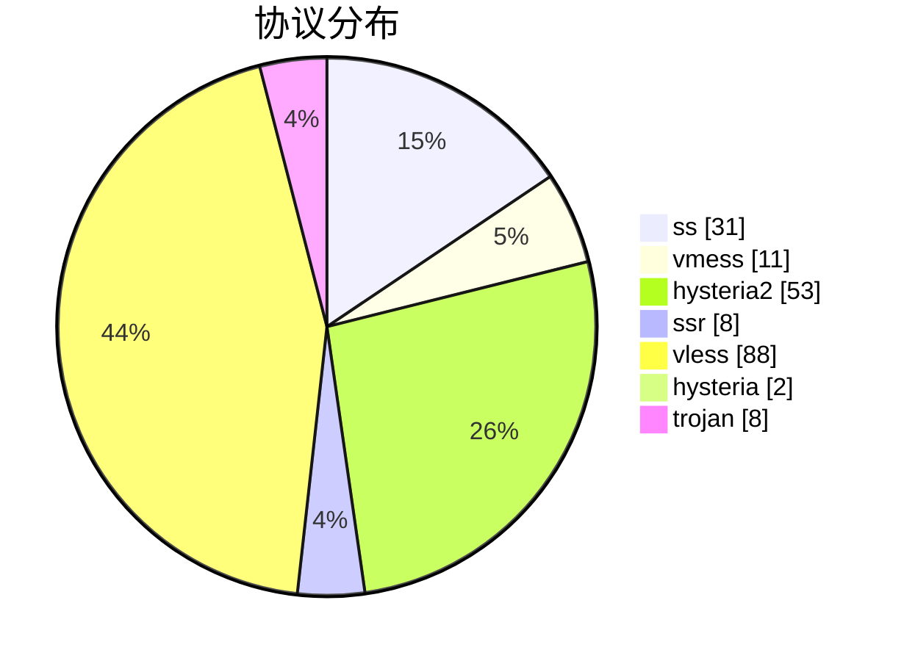

```mermaid
pie showData
title 延迟分布
"97-207ms" : 9
"207-317ms" : 37
"317-427ms" : 29
"427-537ms" : 31
"537-647ms" : 55
"647-757ms" : 31
"757-867ms" : 9
```

```mermaid
pie showData
title 地域分布
"未知" : 69
"中国" : 5
"日本" : 8
"香港" : 6
"美国" : 25
"英国" : 9
"墨西哥" : 3
"德国" : 11
"台湾" : 1
"俄罗斯" : 3
"波兰" : 15
"Cloudflare" : 8
"韩国" : 8
"意大利" : 1
"新加坡" : 3
"瑞典" : 1
"澳大利亚" : 1
"荷兰" : 2
"巴西" : 1
"加拿大" : 10
"毛里求斯" : 1
"法国" : 1
"爱尔兰" : 1
"冰岛" : 1
"阿联酋" : 2
"爱沙尼亚" : 1
"哥伦比亚" : 1
"乌克兰" : 1
"芬兰" : 2
```

```mermaid
pie showData
title 协议分布
"ss" : 31
"vmess" : 11
"hysteria2" : 53
"ssr" : 8
"vless" : 88
"hysteria" : 2
"trojan" : 8
```