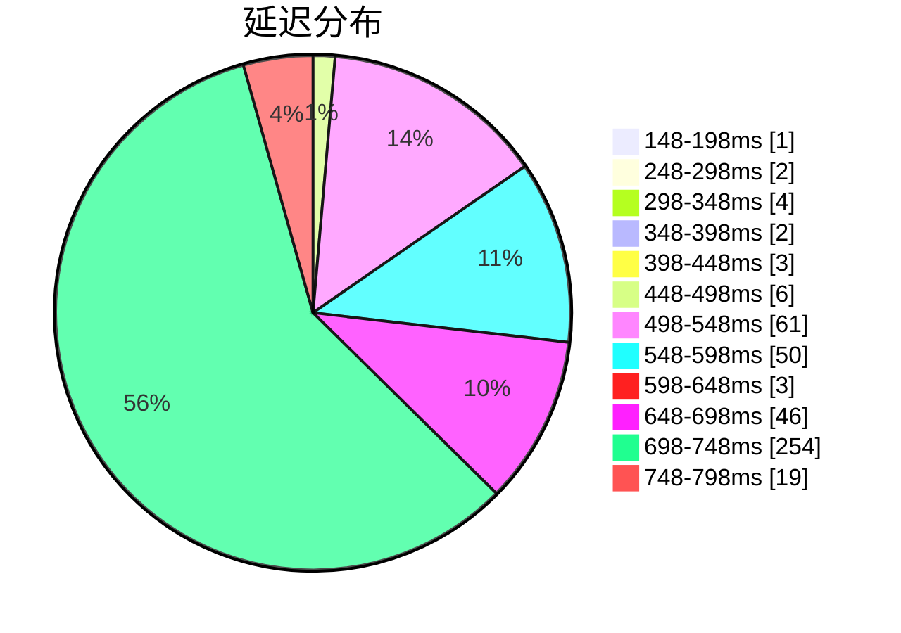
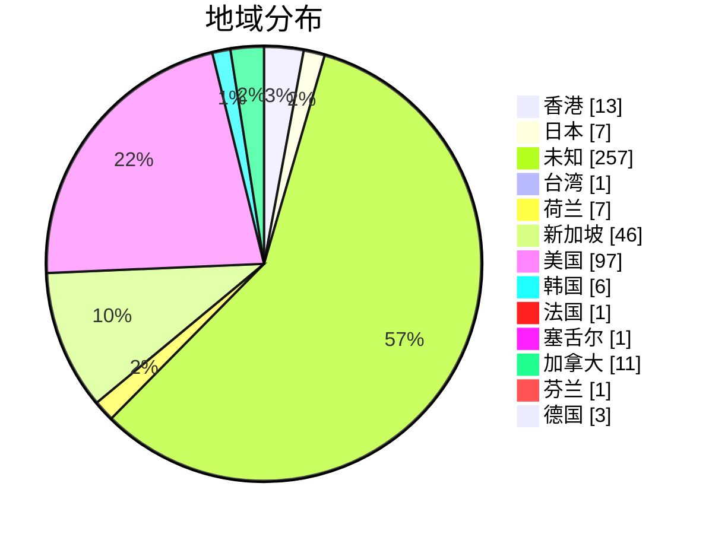
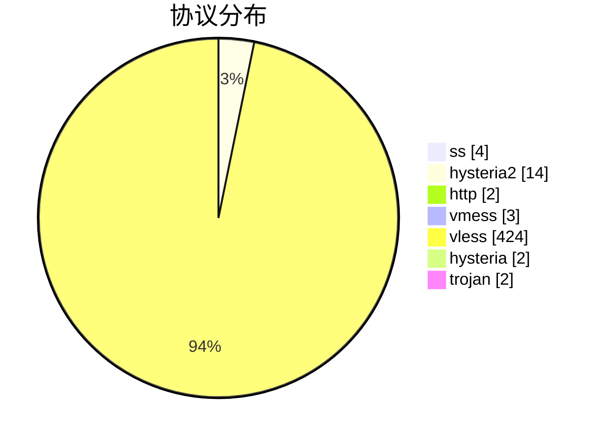

```mermaid
pie showData
title 延迟分布
"148-198ms" : 1
"248-298ms" : 2
"298-348ms" : 4
"348-398ms" : 2
"398-448ms" : 3
"448-498ms" : 6
"498-548ms" : 61
"548-598ms" : 50
"598-648ms" : 3
"648-698ms" : 46
"698-748ms" : 254
"748-798ms" : 19
```

```mermaid
pie showData
title 地域分布
"香港" : 13
"日本" : 7
"未知" : 257
"台湾" : 1
"荷兰" : 7
"新加坡" : 46
"美国" : 97
"韩国" : 6
"法国" : 1
"塞舌尔" : 1
"加拿大" : 11
"芬兰" : 1
"德国" : 3
```

```mermaid
pie showData
title 协议分布
"ss" : 4
"hysteria2" : 14
"http" : 2
"vmess" : 3
"vless" : 424
"hysteria" : 2
"trojan" : 2
```