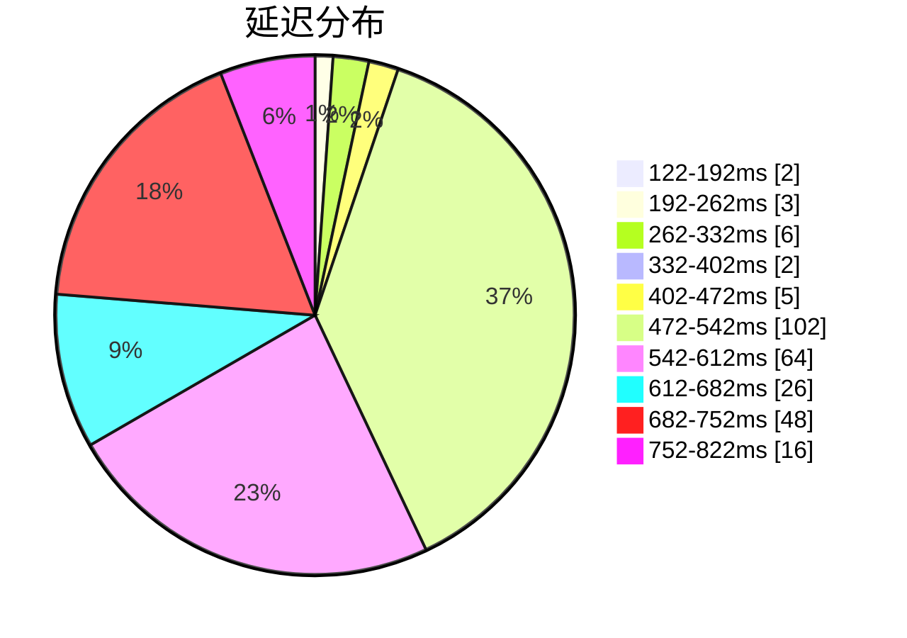
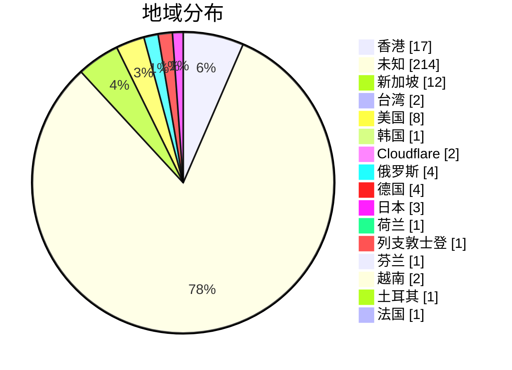
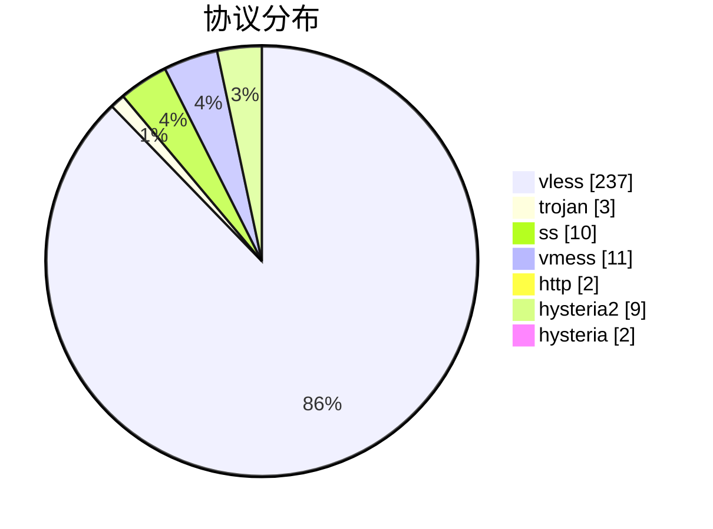

```mermaid
pie showData
title 延迟分布
"122-192ms" : 2
"192-262ms" : 3
"262-332ms" : 6
"332-402ms" : 2
"402-472ms" : 5
"472-542ms" : 102
"542-612ms" : 64
"612-682ms" : 26
"682-752ms" : 48
"752-822ms" : 16
```

```mermaid
pie showData
title 地域分布
"香港" : 17
"未知" : 214
"新加坡" : 12
"台湾" : 2
"美国" : 8
"韩国" : 1
"Cloudflare" : 2
"俄罗斯" : 4
"德国" : 4
"日本" : 3
"荷兰" : 1
"列支敦士登" : 1
"芬兰" : 1
"越南" : 2
"土耳其" : 1
"法国" : 1
```

```mermaid
pie showData
title 协议分布
"vless" : 237
"trojan" : 3
"ss" : 10
"vmess" : 11
"http" : 2
"hysteria2" : 9
"hysteria" : 2
```